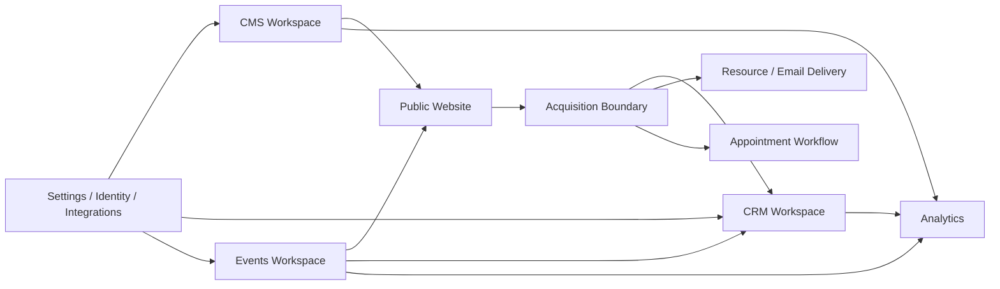

# 01 — PRODUCT ARCHITECTURE AND SITEMAP

## 1. Product model

SPIMAR Control should be structured as one authenticated application with six operational workspaces:

1. Overview
2. CRM
3. Events
4. CMS
5. Analytics
6. Settings

Notifications, tasks, command search and user controls remain global.



---

## 2. Architectural layers

### Layer A — Public experience

The public site contains:

- homepage and B2B conversion story
- exhibitor pages
- event pages
- visitor pages
- offers
- resources
- articles
- case studies
- testimonials
- forms
- brochure download
- appointment booking

This layer reads only approved and published content.

### Layer B — Acquisition boundary

All public submissions pass through a controlled acquisition layer.

Responsibilities:

- validate form version
- validate locale
- capture consent
- attach event, offer, resource and campaign context
- create an idempotency key
- deduplicate contact and organization
- create or link a lead
- enqueue integrations
- return an opaque public reference

### Layer C — Operational application

The admin manages:

- content
- sales
- events
- people
- tasks
- evidence
- reporting
- settings

### Layer D — Domain services

Provider-neutral services should sit between the UI and Supabase.

Recommended service boundaries:

- `IdentityService`
- `ContentService`
- `MediaService`
- `PublishingService`
- `EventService`
- `LeadService`
- `OrganizationService`
- `AppointmentService`
- `TaskService`
- `AnalyticsService`
- `AuditService`
- `IntegrationService`

The UI must not depend directly on Supabase response shapes.

---

## 3. Next.js route architecture

Recommended App Router structure:

```text
app/
  [locale]/
    layout.tsx

    (public)/
      page.tsx
      salons/
      exposer/
      ressources/
      etudes-de-cas/
      visiteurs/
      contact/

    (auth)/
      auth/
        login/
        forgot-password/
        reset-password/
        invite/
        verify/
        mfa/

    (admin)/
      admin/
        layout.tsx
        page.tsx

        activity/
        tasks/
        notifications/

        crm/
          leads/
          leads/[leadId]/
          pipeline/
          organizations/
          organizations/[organizationId]/
          contacts/
          exhibitors/
          opportunities/
          appointments/
          imports/
          exports/

        events/
          page.tsx
          new/
          [eventId]/
          [eventId]/overview/
          [eventId]/content/
          [eventId]/venue/
          [eventId]/packages/
          [eventId]/exhibitors/
          [eventId]/applications/
          [eventId]/registrations/
          [eventId]/appointments/
          [eventId]/media/
          [eventId]/reporting/
          [eventId]/settings/

        cms/
          pages/
          pages/[pageId]/
          sections/
          resources/
          articles/
          case-studies/
          testimonials/
          partners/
          metrics/
          evidence/
          media/
          navigation/
          forms/
          faqs/
          seo/
          redirects/
          translations/
          publishing/

        analytics/
          commercial/
          acquisition/
          conversion/
          events/
          website/
          content/
          reports/

        settings/
          workspace/
          sites/
          domains/
          locales/
          team/
          roles/
          permissions/
          integrations/
          notifications/
          legal/
          consent/
          retention/
          audit/
          appearance/
```

---

## 4. Global navigation model

### Global rail

The global rail switches between major workspaces:

- Overview
- CRM
- Events
- CMS
- Analytics

Bottom section:

- Notifications
- Settings
- User profile

### Context sidebar

The contextual sidebar changes by workspace.

#### Overview

- Vue d’ensemble
- Activité
- Tâches
- Notifications

#### CRM

- Leads
- Pipeline
- Opportunités
- Entreprises
- Contacts
- Exposants
- Rendez-vous
- Imports
- Exports

#### Events

- Tous les salons
- Calendrier
- Candidatures
- Exposants
- Inscriptions visiteurs
- Rendez-vous
- Lieux
- Offres et packs
- Reporting

#### CMS

- Pages
- Sections
- Événements
- Ressources
- Articles
- Études de cas
- Témoignages
- Partenaires
- Chiffres et preuves
- Médias
- Navigation
- Formulaires
- FAQ
- SEO
- Traductions
- Publication

#### Analytics

- Performance commerciale
- Acquisition
- Conversion
- Performance événements
- Site web
- Contenus
- Rapports

#### Settings

- Espace de travail
- Sites et domaines
- Langues
- Équipe
- Rôles
- Intégrations
- Notifications
- Juridique et consentement
- Conservation des données
- Journal d’audit

---

## 5. Command palette

The command palette should search across:

- leads
- contacts
- organizations
- exhibitors
- events
- pages
- articles
- resources
- media
- tasks
- appointments

It should also support commands:

- create lead
- create page
- create event
- upload media
- schedule publication
- assign lead
- create task
- open settings

Suggested shortcut:

```text
Ctrl/Cmd + K
```

---

## 6. Workspace and site context

The current backend supports sites, domains, locales and tenant-level roles.

The admin shell should expose:

- current site
- current event
- current locale
- date range
- saved view

These contexts must not be hidden inside settings because they influence daily data and publishing.

---

## 7. Search and URL state

Filters, sorting, pagination and active views should be encoded in the URL where practical.

Example:

```text
/fr/admin/crm/leads
  ?view=unassigned
  &stage=sales_qualified
  &event=paris-2027
  &owner=me
  &sort=next_action_at
```

Benefits:

- shareable views
- predictable back navigation
- preserved state
- browser history
- testability

---

## 8. Mobile navigation

Mobile should use:

- compact top bar
- bottom navigation for main workspaces
- full-screen workspace menu
- bottom sheets for filters and actions
- entity cards instead of wide tables
- full-screen detail views
- sticky primary action

The mobile version is optimized for:

- checking tasks
- opening a lead
- calling or messaging a contact
- adding notes
- changing a stage
- reviewing publication alerts
- approving urgent content
