# 02 — USER JOURNEYS AND END-TO-END FLOWS

## 1. Staff journey: invitation to productive session

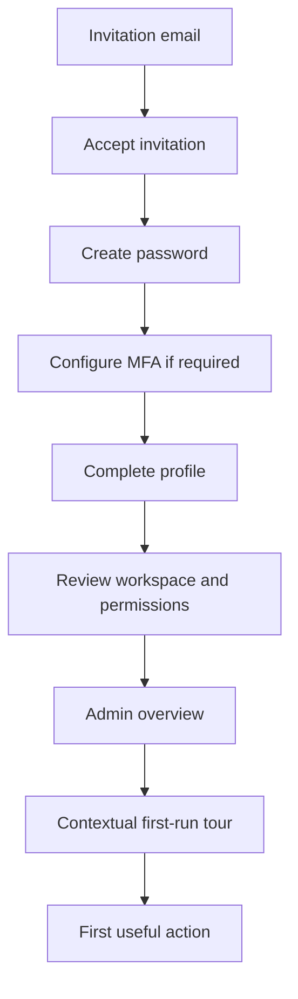

### Screens

1. Invitation
2. Create password
3. Email verification
4. MFA
5. Profile setup
6. Workspace selection
7. Permission summary
8. Admin overview
9. First-run checklist

### Success condition

A new user understands:

- which site they are working on
- their role
- what they can edit
- what they cannot publish
- where their assigned work appears

---

## 2. Daily sales-agent journey

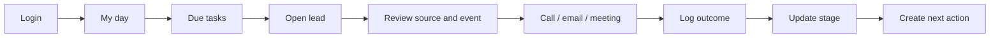

### Required UX

- “My day” view
- overdue tasks
- newly assigned leads
- next appointments
- quick call/email actions
- timeline
- stage control
- next action control
- no need to leave the lead page for basic work

---

## 3. Public exhibitor enquiry journey

This is the primary B2B funnel.

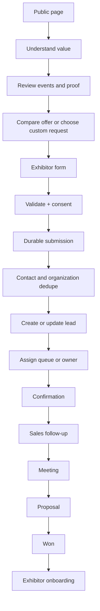

### Public form fields

Minimum useful data:

- name
- organization
- job title
- phone
- email
- event of interest
- offer level or custom request
- message
- consent

### CRM result

- organization
- contact
- lead
- acquisition kind
- event interest
- campaign attribution
- consent record
- form submission
- assignment
- initial activity
- follow-up task

---

## 4. Brochure request journey

Brochure download is a progressive conversion, not a dead-end download.

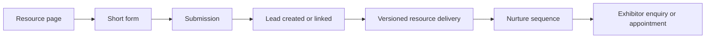

### Important rules

- The resource has a presentation page before download.
- The exact resource version is recorded.
- Delivery state is visible.
- A failed delivery must not be shown as successful.
- Download context includes event, campaign, route and locale.
- Nurture must respect consent.

---

## 5. Appointment booking journey

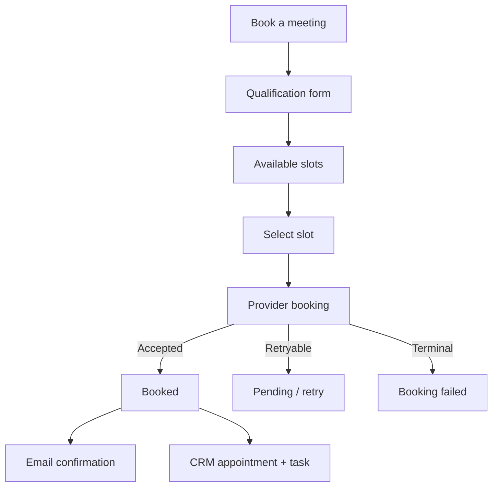

### UX requirement

The acknowledgement must distinguish:

- request received
- provider pending
- booked
- provider failed
- cancelled
- expired

A “request received” screen must never falsely imply that the calendar booking succeeded.

---

## 6. Visitor registration journey

The visitor path is secondary to the homepage but strategically useful.

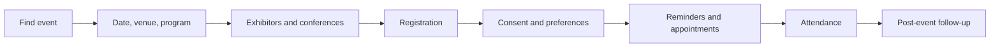

### Useful data, with explicit consent

- residence country and city
- project type
- purchase horizon
- indicative budget
- geographic interest
- appointment preference

### CRM handling

Visitor records should be distinguishable from exhibitor leads while still supporting event reporting and exhibitor lead delivery.

---

## 7. Lead qualification journey

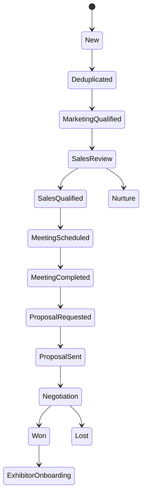

### Required controls

- stage
- owner
- event
- organization
- acquisition source
- campaign
- next action
- value
- lost reason
- timeline
- audit history

### Guardrails

- lost requires a reason
- won requires a confirmed date
- every stage change creates history
- assigned users only see permitted records
- duplicate contacts link to one identity rather than silently creating new ones

---

## 8. Won lead to exhibitor onboarding

The current lead stage includes `exhibitor_onboarding`. The product should make this a real operational workspace.

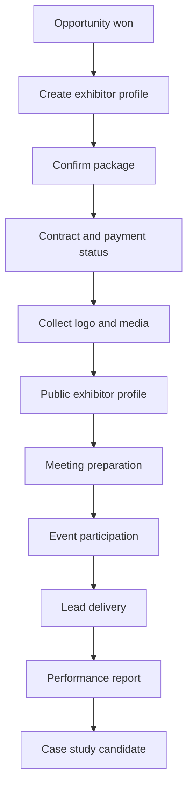

### Onboarding checklist

- legal entity confirmed
- contact owners confirmed
- package confirmed
- contractual documents
- payment state
- logo and rights
- profile copy
- translations
- booth details
- campaign assets
- appointment availability
- event contacts
- post-event reporting owner

---

## 9. CMS page publishing journey

```mermaid
flowchart LR
    CREATE[Create page] --> STRUCTURE[Choose template and sections]
    STRUCTURE --> CONTENT[Edit content]
    CONTENT --> MEDIA[Attach governed media]
    MEDIA --> LOCALES[Complete translations]
    LOCALES --> SEO[Complete SEO]
    SEO --> REVIEW[Submit for review]
    REVIEW --> APPROVE[Approve]
    APPROVE --> SCHEDULE[Schedule or publish]
    SCHEDULE --> LIVE[Public]
    LIVE --> REVISION[Revision history]
```

### Publication states

- Draft
- In review
- Changes requested
- Approved
- Scheduled
- Published
- Expired
- Withdrawn
- Archived

### Mandatory checks

- route and slug valid
- required locales complete
- SEO complete
- linked media rights valid
- metrics verified
- event data validated
- no unapproved package price
- preview passes

---

## 10. Event lifecycle journey

Event lifecycle and public availability are related but independent.

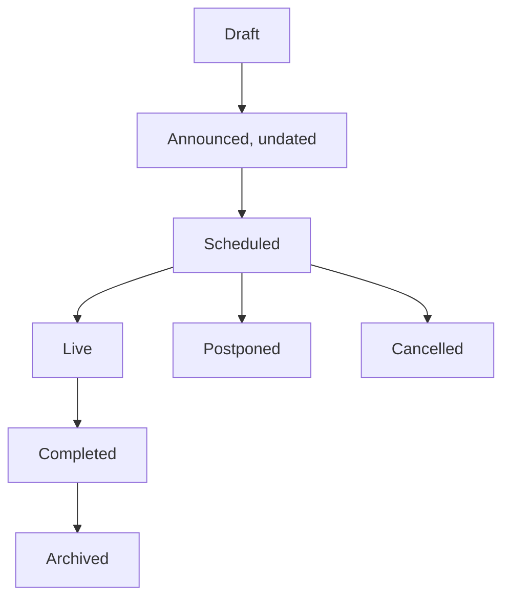

Separate controls:

- event lifecycle
- exhibitor sales status
- visitor registration status
- publication state

The admin must never derive one from another.

---

## 11. Evidence governance journey

Metrics, testimonials, partners, package prices and case-study claims require evidence.

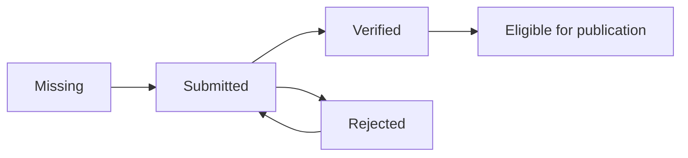

### Evidence record must include

- definition
- period
- source label
- source URL or internal source
- approver
- approval date
- event or case-study relation

This directly enforces the public strategy: proof before promise.

---

## 12. Translation journey

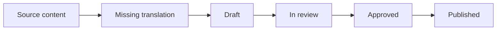

Arabic requires:

- RTL preview
- mirrored directional layout where appropriate
- locale-specific typography testing
- independent SEO values
- no assumption that text length matches French or English

---

## 13. Consent withdrawal and retention journey

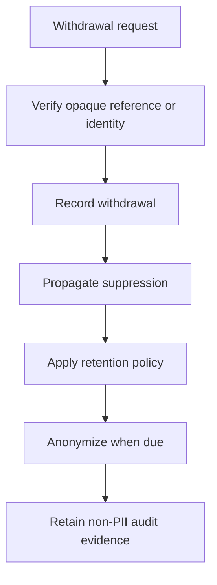

The admin should provide:

- consent history
- withdrawal status
- retention deadline
- anonymization state
- suppression propagation state
