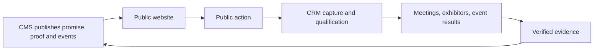
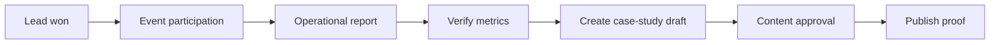

# 03 — PUBLIC FUNNEL TO CMS / CRM MAPPING

## 1. The operating loop

The public website is not merely content published by the CMS. It is the acquisition surface of the CRM.



This creates a closed commercial loop:

> Content creates interest.  
> Interest creates attributable records.  
> Operations create outcomes.  
> Outcomes become verified proof.  
> Proof improves future conversion.

---

## 2. Public narrative to internal ownership

The public strategy uses six conversion movements.

| Public movement | Public content | CMS ownership | CRM / Events ownership |
|---|---|---|---|
| Promesse | Hero, value proposition | Pages, sections, translations | Acquisition context |
| Destination | Event and country cards | Events, venues, event translations | Event interest |
| Preuve | Metrics, partners, history | Metrics, partners, evidence | Event reporting |
| Mécanique | Before / during / after method | Page sections, resources | Tasks, appointments, delivery |
| ROI | Case studies, offers, testimonials | Case studies, packages, testimonials | Won leads, reporting |
| Action | Forms, brochure, WhatsApp, calendar | Form definitions, resources | Submission, lead, appointment |

---

## 3. CTA mapping

### Devenir exposant

**Public context**

- page
- section
- CTA position
- event
- offer
- locale
- campaign
- content version

**Creates or updates**

- form submission
- consent
- contact
- organization
- lead
- event interest
- campaign attribution
- assignment
- activity
- follow-up task
- integration job

### Télécharger la brochure

**Public context**

- resource
- resource version
- event
- locale
- CTA position
- campaign

**Creates or updates**

- form submission
- consent
- contact
- lead
- attribution
- resource delivery
- delivery job
- activity

### Parler sur WhatsApp

**Public context**

- route
- CTA position
- event
- campaign
- locale

**Creates or updates**

- attribution event
- lead activity when identity is available
- optional contact-request record

WhatsApp click data should never be treated as a completed conversation.

### Réserver un rendez-vous

**Public context**

- event
- offer
- route
- locale
- selected staff or team
- requested time

**Creates or updates**

- form submission
- contact
- lead
- appointment
- provider command
- activity
- task
- communication delivery

### Pré-inscription visiteur

**Public context**

- event
- locale
- campaign
- interests
- consent purposes

**Creates or updates**

- visitor registration submission
- contact
- visitor-type lead or registration entity
- event interest
- consent
- attribution
- confirmation delivery

---

## 4. CMS content ownership map

### Homepage

Recommended CMS structure:

```text
Page: home
  01 Hero B2B
  02 Events by country
  03 Proof strip
  04 Why exhibit
  05 Method
  06 MRE market understanding
  07 Visibility 360
  08 Trusted developers
  09 Case studies
  10 Video testimonials
  11 Exhibitor offers
  12 Gallery
  13 Resources
  14 FAQ and contact
```

Each section should store:

- section type
- content payload
- translation payload
- media references
- linked entities
- publication state
- content version
- revision history

### Event pages

An event page is composed from governed entities rather than one large text blob:

- event
- venue
- dates
- lifecycle
- exhibitor sales state
- visitor registration state
- metrics
- packages
- program
- exhibitors
- gallery
- resources
- FAQ
- SEO
- conversion forms

### Proof content

Proof content must come from:

- verified metrics
- verified partner records
- approved testimonials
- approved case studies
- approved media rights
- event reports

A metric is not publishable only because it exists in the database.

---

## 5. CRM source model

Every lead should answer:

- Where did this person come from?
- Which page and CTA produced the action?
- Which event was relevant?
- Which offer or resource was involved?
- Which campaign and medium contributed?
- Which locale was used?
- Which content version was visible?
- Was consent granted and for what purpose?
- Was this a new identity or a duplicate?
- Who owns the next action?

Recommended lead source display:

```text
Source
  Acquisition: Exhibitor enquiry
  Route: /fr/exposer
  CTA: Hero / Devenir exposant
  Event: Paris 2027
  Offer: Premium
  Campaign: LinkedIn / Promoteurs FR
  Locale: fr
  Submitted: 5 Aug 2026, 08:42
```

---

## 6. Deduplication behavior

Deduplication should use:

- normalized email
- normalized phone
- normalized organization name
- idempotency key
- form submission context

Possible results:

1. New contact + new organization + new lead
2. Existing contact + existing organization + new event interest
3. Existing lead updated with a new activity
4. Duplicate submission linked to original
5. Invalid submission rejected
6. Suppressed identity blocked from marketing delivery

The UI must show what happened rather than silently merging records.

---

## 7. From CRM outcome back to CMS proof

A won opportunity or completed event should be eligible to generate:

- event performance metrics
- anonymized conversion statistics
- exhibitor testimonial request
- case-study draft
- gallery selection
- report resource
- partner recurrence proof

Suggested workflow:



This must remain opt-in and governed. CRM facts do not automatically become public claims.

---

## 8. Forms as CMS-managed products

Forms should be versioned CMS entities, not hardcoded page fragments.

A form definition contains:

- key
- audience
- locale
- version
- field schema
- validation schema
- availability window
- consent definitions
- success behavior
- integration behavior

Examples:

- `exhibitor_enquiry`
- `brochure_request`
- `proposal_request`
- `meeting_request`
- `visitor_registration`
- `contact_request`

Every submission stores the form version that was displayed.

---

## 9. Resource delivery

Resource delivery connects CMS and CRM.

CMS owns:

- resource
- locale
- current version
- media file
- legal notice version
- availability

CRM owns:

- recipient
- lead
- submission
- delivery status
- provider message ID
- attempt count
- error state

The success screen must be based on durable submission state, not assumed email delivery.

---

## 10. Funnel analytics model

The analytics workspace should calculate:

### Acquisition

- sessions by campaign
- CTA clicks
- form starts
- form completion
- brochure requests
- appointment requests
- visitor registrations

### Qualification

- duplicates
- accepted submissions
- MQL
- SQL
- meetings scheduled
- meetings completed

### Commercial

- proposals
- negotiation
- won
- lost
- value
- time to first action
- time to qualification
- time to close

### Content

- conversion by page
- conversion by section
- conversion by CTA position
- conversion by event
- conversion by resource
- conversion by locale
- conversion by content version

### Evidence

- metrics missing evidence
- evidence awaiting review
- expiring rights
- outdated sources
- unverified public dependencies
