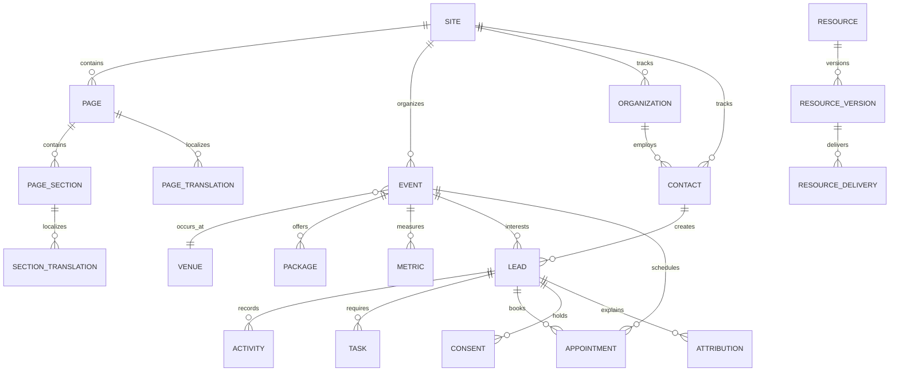

# 06 — DATA DOMAINS, ROLES AND PERMISSIONS

## 1. Existing repository foundation

The current schema already defines:

### Identity and platform

- sites
- domains
- locales
- profiles
- roles
- permissions
- profile roles
- permission overrides
- audit events

### CMS

- pages
- page translations
- sections
- section translations
- revisions
- media
- navigation
- global settings
- SEO
- events
- venues
- packages
- partners
- case studies
- testimonials
- metrics
- resources
- articles
- FAQs

### CRM

- organizations
- contacts
- leads
- event interests
- assignments
- stage history
- form submissions
- consents
- attribution
- activities
- notes
- tasks
- appointment slots
- appointments
- resource deliveries
- integration jobs

The admin UI should map to these domains rather than inventing an unrelated model.

---

## 2. Core entity relationships

---

## 3. Existing roles

### Super Admin

- full platform access
- identity
- settings
- CMS
- CRM
- analytics
- audit

### Content Editor

- read CMS
- edit content
- manage media
- no automatic publication authority unless explicitly granted

### Translator

- read content
- edit localized content
- no base-content mutation
- no publication authority

### Sales Manager

- all CRM records
- assignment and pipeline
- exports
- analytics
- audit access

### Sales Agent

- assigned CRM records
- assigned-record mutation
- limited analytics

### Analyst

- non-PII aggregate analytics

---

## 4. Recommended additional product roles

The database may later add or model these through permissions:

### Event Manager

- event records
- venue
- event packages
- applications
- registrations
- event reporting
- no global identity control

### Publisher

- content review
- publication
- scheduling
- archive and restore
- no CRM PII by default

### Executive Viewer

- executive analytics
- event summary
- commercial forecast
- no raw PII export

### Legal / Compliance Reviewer

- legal documents
- consent definitions
- retention
- audit
- no broad content editing

Avoid creating roles for every small variation. Prefer a stable role plus explicit permission overrides.

---

## 5. Permission behavior in the UI

Permissions must affect:

- visible navigation
- visible records
- visible fields
- enabled actions
- export access
- publication access
- settings access
- financial values
- PII visibility

### Example

A sales agent may:

- see assigned leads
- update assigned lead stage
- create notes
- create tasks
- view assigned appointments

A sales agent may not:

- view all leads
- export the CRM
- manage users
- publish CMS content
- alter consent definitions

The UI must not show an enabled action and rely on the backend to reject it. Frontend affordances and backend policies must agree.

---

## 6. Record ownership

Recommended ownership rules:

- every lead has a queue and optional owner
- every organization has an owner
- every task has an assignee
- every event has operational owners
- every content item has creator and last editor
- every evidence item has approver
- every publication has publisher
- every export has requester and audit record

---

## 7. Audit requirements

Audit the following:

- login and security events
- role and permission changes
- lead assignment
- stage transitions
- exports
- publication
- scheduling
- archive and restore
- evidence approval
- package price approval
- legal and consent changes
- integration configuration
- data anonymization

Audit views should be readable by humans and searchable by:

- actor
- domain
- entity
- action
- date
- request ID

---

## 8. PII handling

PII includes:

- name
- email
- phone
- organization relationship
- messages
- appointment notes
- visitor preferences

Requirements:

- RLS
- least privilege
- field-level masking where useful
- no PII in analytics exports for analysts
- no PII in public references
- clear retention dates
- anonymization support
- consent history
- export audit

---

## 9. Evidence and rights governance

The CMS should treat these as governed records:

- metric
- partner logo
- testimonial
- case-study claim
- event capacity
- package price
- media asset

Publication eligibility depends on:

- evidence status
- source
- approver
- approval date
- rights validity
- translation completeness
- publication state

---

## 10. Concurrency

Content and high-value CRM records should support optimistic concurrency.

UX behavior:

1. user opens record
2. another user saves a newer version
3. first user attempts save
4. system returns conflict
5. compare changes
6. reload, merge or save as draft copy

Never silently overwrite another user’s work.
