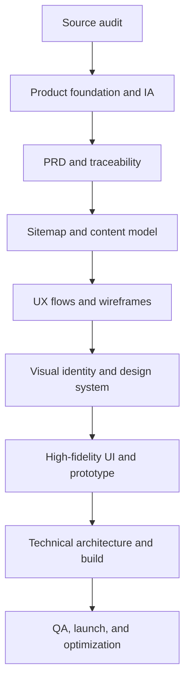

# SPIMARIMMO - Master Product Production Plan

**Document type:** master execution plan  
**Source of truth:** `SPIMARIMMO_Specifications_Strategie_UX_Contenus.pdf`  
**Working language:** English for production documentation; French for website content until the locale strategy is approved  
**Version:** 1.0  
**Status:** active - Phase 0 completed, Phase 1 ready to begin

---

## 1. Mission

Convert the strategic source document into a complete, traceable, production-ready website package, then carry it through design, implementation, launch, and optimization.

The final product is not a simple event website. It is a B2B acquisition and conversion platform that must:

- convince Moroccan real-estate developers to exhibit with SPIMARIMMO;
- prove the reach, quality, and commercial value of the international event network;
- qualify exhibitor leads through brochure, contact, WhatsApp, appointment, and stand-booking paths;
- support a simpler visitor journey for event discovery and pre-registration;
- remain administrable as events, destinations, offers, evidence, and resources evolve;
- measure the complete conversion funnel without inventing claims or business data.

## 2. Non-negotiable production rules

1. **The PDF is the initial source of truth, not permission to invent missing scope.** Every confirmed requirement must be traceable to a source page or an explicitly approved later decision.
2. **Unknown business data remains visibly marked as pending.** Dates, capacities, prices, performance numbers, and case-study outcomes are never fabricated.
3. **Each phase has a review gate.** A downstream phase may explore, but it cannot finalize work built on unapproved upstream assumptions.
4. **UX structure precedes visual decoration.** Brand and visual-system work may run as a discovery track, but high-fidelity production starts only after flows, page inventory, and content hierarchy are stable.
5. **Mobile is a complete experience, not a reduced desktop.** Navigation, content order, media, forms, tables, galleries, and conversion actions require dedicated mobile states.
6. **Every promise needs proof.** Proof may be a verified number, source, case study, client quote, campaign artifact, event image, video, or reporting extract.
7. **Every public template includes operational states.** Default, loading, empty, unavailable, error, success, draft/preview, archived, and consent states are included where applicable.
8. **Accessibility, SEO, analytics, privacy, performance, and content governance are continuous workstreams.** They are not postponed until launch.

## 3. Production model



Every phase produces:

- a working document;
- a reviewable visual or structural artifact;
- a decision log;
- a requirement-to-output traceability update;
- a pass/fail gate for the next phase.

## 4. Phase roadmap

| Phase | Objective | Primary outputs | Exit gate |
|---|---|---|---|
| 00. Source audit | Establish what the PDF confirms, omits, or leaves unresolved | Source inventory, evidence ledger, gap register, risk register, decision backlog | No major source requirement is unclassified |
| 01. Product foundation and information architecture | Define the product logic, audiences, jobs, objects, and content hierarchy | Product foundation, audience/JTBD model, taxonomy, IA model, content relationships | Audiences, tasks, content objects, and navigation principles are approved |
| 02. PRD | Convert strategy into functional, content, data, and quality requirements | PRD, functional requirements, non-functional requirements, roles, integrations, MVP/release scope, acceptance criteria | Requirements are testable and unresolved items have owners |
| 03. Sitemap and page inventory | Define the complete public website and template system | Visual sitemap, URL model, page inventory, template matrix, navigation model, redirect/migration notes | Every required page maps to a template, audience, goal, and CTA |
| 04. UX planning | Design journeys, flows, content order, conversion logic, and responsive behavior | Journey maps, user flows, funnel model, form logic, wireframe briefs, analytics map | All critical journeys complete without dead ends |
| 05. Full-site wireframe iterations | Validate the entire website before visual styling | Low-/mid-fidelity screens for all templates, mobile/desktop variants, component inventory, iteration log | Structure and interaction are approved across all critical templates |
| 06. Visual identity direction | Translate SPIMARIMMO into a distinctive, credible, international visual language | Mood territories, art direction, color, typography, image/video direction, iconography, motion principles | One visual territory is approved and usable across B2B and visitor contexts |
| 07. Design system | Convert the selected identity into reusable interface rules | Tokens, grids, type scale, components, patterns, states, accessibility rules, documentation | Core components pass state, responsive, and accessibility review |
| 08. High-fidelity UI | Apply the system to the full website | Full desktop/mobile screen set, localized content states, visual QA log | Every template and critical state is designed and consistent |
| 09. Prototype and mockup application | Demonstrate the real experience and presentation value | Clickable priority flows, motion specs, device/browser mockups, campaign/application views | Stakeholders can review complete flows and visual behavior |
| 10. Technical architecture and development handoff | Make the approved product directly implementable | Architecture decision record, CMS/data model, API/integration contracts, component mapping, tickets | Engineering can estimate and build without reinterpretation |
| 11. Implementation | Build the production website and editorial tools | Frontend, CMS, integrations, analytics, SEO, tests, preview environments | Release candidate passes functional and content QA |
| 12. Launch and optimization | Release safely and improve measured performance | Launch checklist, monitoring, dashboards, experiment backlog, maintenance playbook | Production is stable, measurable, owned, and documented |

## 5. Detailed phase specifications

### Phase 00 - Source audit

**Purpose:** distinguish confirmed strategy from missing product definition.

**Activities**

- extract and visually inspect all 20 source pages;
- map each source statement to requirement categories;
- classify every item as confirmed, implied, pending, contradictory, or out of scope;
- record placeholder data and content dependencies;
- establish an assumptions and decisions register.

**Deliverables**

- `01_SPIMARIMMO_Phase_00_Source_Audit.md`;
- initial requirement ID taxonomy;
- risk and missing-input register;
- Phase 1 working brief.

### Phase 01 - Product foundation and information architecture

**Purpose:** define what the website is, for whom, and how its information behaves before producing a PRD.

**Activities**

- formalize the product vision, North Star, business outcomes, and scope boundary;
- define primary and secondary personas by decision role, not demographics alone;
- map jobs-to-be-done, objections, evidence needs, and desired actions;
- identify core content objects and relationships;
- define taxonomies for countries, cities, events, status, audiences, offers, resources, case studies, testimonials, partners, and media;
- define search, filtering, sorting, archive, and cross-linking principles;
- define content ownership and freshness rules.

**Expected content objects**

- Salon/Event;
- Destination/Country/City;
- Venue;
- Exhibitor/Developer;
- Exhibitor offer/pack;
- Case study;
- Testimonial;
- Metric/evidence item;
- Campaign proof;
- Resource/download;
- Article/topic;
- Partner/media logo;
- Person/team member;
- Lead/contact/pre-registration/appointment;
- Legal and consent record.

**Gate questions**

- Can every important user question be answered by a defined content object?
- Can each object be reused across homepage, event, case-study, resource, and campaign pages?
- Are archived and upcoming events represented without duplicating page logic?
- Is the exhibitor priority preserved while the visitor path remains obvious?

### Phase 02 - Product requirements document

**Purpose:** translate the approved foundation into testable behavior.

**PRD sections**

- context, problem, vision, objectives, non-objectives;
- audience roles and permissions;
- primary use cases and user stories;
- functional requirements by domain;
- CMS/editorial workflows and publishing states;
- conversion and lead-routing requirements;
- brochure/resource gating rules;
- visitor pre-registration and appointment logic;
- CRM, WhatsApp, calendar, email, analytics, and media integrations;
- data model and retention principles;
- SEO, accessibility, performance, privacy, and security requirements;
- analytics events and success metrics;
- MVP, Release 1, and later opportunities;
- testable acceptance criteria and dependency register.

### Phase 03 - Sitemap and page inventory

**Purpose:** convert the architecture into an exact site surface.

**Outputs**

- hierarchical sitemap;
- header, mega-menu, utility navigation, contextual navigation, and footer models;
- route and URL rules;
- page inventory with owner, purpose, audience, entry paths, main CTA, secondary CTA, required content, SEO intent, analytics events, and template;
- template reuse map;
- event lifecycle behavior for upcoming, active, completed, postponed, cancelled, and undated states;
- multilingual and localization route strategy if approved.

### Phase 04 - UX planning

**Priority journeys**

1. Developer decision-maker -> understands value -> inspects proof -> selects event/offer -> books meeting or requests stand.
2. Marketing/commercial lead -> compares packs -> downloads brochure -> enters nurture/CRM flow.
3. Returning exhibitor -> finds next event -> reviews logistics/offer -> re-engages.
4. Visitor -> selects city -> understands event -> discovers exhibitors/program -> pre-registers.
5. Content visitor -> enters from search -> reads a resource/article -> reaches a relevant event or exhibitor CTA.
6. Editor -> creates/updates an event -> validates facts/evidence -> previews -> publishes -> archives.

**Outputs**

- journey maps and task flows;
- conversion funnel and CTA hierarchy;
- page-level content hierarchy;
- form field logic, validation, consent, success, and failure behavior;
- lead source/attribution rules;
- wireframe briefs;
- analytics measurement plan.

### Phase 05 - Full-site wireframe iterations

**Iteration 1: structural coverage**

- every template represented;
- real content lengths and missing-data states simulated;
- no visual-brand decisions beyond basic hierarchy.

**Iteration 2: conversion and evidence**

- proof adjacency reviewed;
- CTA density and escalation reviewed;
- objections, offers, resources, and cross-links tested.

**Iteration 3: responsive and operational**

- desktop, tablet, and mobile behavior;
- sticky actions, tables, galleries, filters, forms, media, and navigation states;
- empty/error/archive/consent states.

### Phase 06 - Visual identity direction

**Purpose:** create a premium identity suited to high-value B2B decisions without generic event-site aesthetics.

**Outputs**

- two or three clearly distinct visual territories;
- rationale tied to trust, international reach, property investment, and human event energy;
- logo-use audit and any required refinement recommendation;
- palette, typography, composition, photography, video, illustration/data-visualization, iconography, texture, and motion principles;
- do/don't examples and accessibility checks.

### Phase 07 - Design system

**Foundation**

- semantic color tokens;
- typography and fluid scale;
- spacing, radii, elevation, border, and opacity tokens;
- responsive grids and containers;
- icon, media, and motion tokens.

**Components and patterns**

- navigation, buttons, links, badges, and CTA clusters;
- event/destination cards and states;
- proof metrics with source/date;
- benefits, method timelines, comparison tables, logos, testimonials, case studies, galleries, resource cards, article cards, FAQ;
- forms, phone/WhatsApp/calendar actions, validation, consent, alerts, toasts, and success states;
- filters, pagination, breadcrumbs, language control, share actions;
- headers, footers, page heroes, conversion bands, related-content blocks;
- skeleton, empty, error, offline, and restricted-media states.

### Phase 08 - High-fidelity full-site UI

**Minimum screen coverage**

- homepage;
- salons listing and filtered/archived states;
- salon detail for each lifecycle state;
- exhibitor hub and “why exhibit” page;
- offers comparison;
- case-study listing and detail;
- testimonials/proof hub if retained;
- resources listing, resource detail, and download conversion;
- blog listing, category/topic, article, author if required;
- visitor hub, pre-registration, exhibitor directory, programme, practical information, visitor FAQ;
- about, team, partners, media/press, contact;
- legal/privacy/cookies;
- search/results if approved;
- form success/error and 404/500 states;
- CMS preview/editorial states where UI definition is needed.

### Phase 09 - Prototype and mockup application

**Outputs**

- clickable exhibitor conversion flow;
- clickable visitor pre-registration flow;
- responsive navigation and key interaction demonstrations;
- media, gallery, filter, comparison, form, and confirmation behavior;
- motion storyboard/specification;
- realistic desktop, mobile, event signage, social campaign, and presentation mockups using approved identity assets.

Mockups present the approved system; they do not substitute for production screens or specifications.

### Phase 10 - Technical architecture and development handoff

**Decisions required**

- frontend framework and rendering strategy;
- content platform/CMS;
- hosting, CDN, image/video delivery, caching, and preview environments;
- CRM and lead-routing destination;
- WhatsApp and calendar integration method;
- form delivery, spam protection, consent, retention, and audit trail;
- analytics/consent stack;
- localization strategy;
- search requirements;
- authorization roles and editorial workflow.

**Handoff outputs**

- architecture decision records;
- content schema and relationships;
- API/integration contracts;
- component-to-screen traceability;
- token export and asset manifest;
- behavior and motion specifications;
- prioritized engineering backlog with acceptance criteria;
- QA matrix and seed-content requirements.

### Phase 11 - Implementation

**Build streams**

- application foundation and environments;
- design tokens and component library;
- CMS schemas and editorial preview;
- public templates and routes;
- forms, CRM, WhatsApp, calendar, email, and download flows;
- analytics, consent, SEO, structured data, redirects;
- automated unit, integration, accessibility, and end-to-end tests;
- content migration/entry and media optimization;
- stakeholder acceptance environment.

### Phase 12 - Launch and optimization

**Release controls**

- content and source verification;
- browser/device matrix;
- keyboard and assistive-technology review;
- Core Web Vitals and performance budgets;
- security headers, dependency, form-abuse, privacy, and access review;
- indexation, canonical, metadata, structured-data, sitemap, and robots checks;
- analytics event validation and consent-mode checks;
- backup, rollback, incident contacts, and monitoring;
- 30/60/90-day optimization backlog based on actual funnel data.

## 6. Cross-cutting acceptance framework

| Dimension | Definition of done |
|---|---|
| Strategy | The exhibitor value proposition is clear within the first screen and explainable within 90 seconds |
| Evidence | Every major promise is linked to an approved proof item, source, or explicit pending state |
| Conversion | A user can always identify the next relevant exhibitor or visitor action |
| Content | Ownership, freshness, source, status, and reuse rules exist for structured content |
| UX | Critical journeys are complete on mobile and desktop without dead ends |
| Accessibility | Components and templates meet the agreed WCAG target and keyboard behavior |
| Performance | Media-heavy experience respects approved page-weight and Core Web Vitals budgets |
| SEO | Each indexable template has intent, metadata, structured data, linking, and canonical rules |
| Analytics | Critical views, interactions, errors, and conversions have named events and properties |
| Privacy | Consent, retention, lead use, and data-sharing behavior are explicit and testable |
| Engineering | Requirements, components, schemas, integrations, and tests are traceable |

## 7. Decision gates

### Gate A - Before PRD finalization

- product scope and release boundary;
- supported locales;
- conversion channels and lead owners;
- visitor pre-registration depth;
- CRM/CMS constraints;
- event lifecycle states;
- legal/privacy owner.

### Gate B - Before high-fidelity UI

- approved sitemap and template inventory;
- approved wireframes and content hierarchy;
- selected identity territory;
- representative real content and media;
- responsive and accessibility principles.

### Gate C - Before implementation

- final UI and component states;
- validated content model;
- integration contracts;
- analytics taxonomy;
- acceptance tests and content migration plan.

### Gate D - Before launch

- content and legal sign-off;
- cross-browser/device QA;
- accessibility/performance/security verification;
- production analytics and monitoring verification;
- rollback and ownership plan.

## 8. Delivery collection structure

```text
SPIMARIMMO-Product/
  00-Source-and-Governance/
  01-Product-Foundation-and-IA/
  02-PRD-and-Requirements/
  03-Sitemap-and-Content-Model/
  04-UX-Research-Flows-and-Wireframes/
  05-Visual-Identity/
  06-Design-System/
  07-High-Fidelity-UI/
  08-Prototype-Motion-and-Mockups/
  09-Technical-Architecture-and-Handoff/
  10-Implementation-and-QA/
  11-Launch-and-Optimization/
  99-Archive-and-Decisions/
```

Each folder must contain a short `README`/index stating status, owner, version, dependencies, approved decisions, and superseded files.

## 9. Current execution status

- Phase 00 source audit: **completed**.
- Phase 01 product foundation and information architecture: **next active phase**.
- No high-fidelity design decision has been made.
- No business number, date, price, venue, or performance result has been assumed.
- The immediate next deliverable is the Phase 1 Product Foundation and Information Architecture package.
