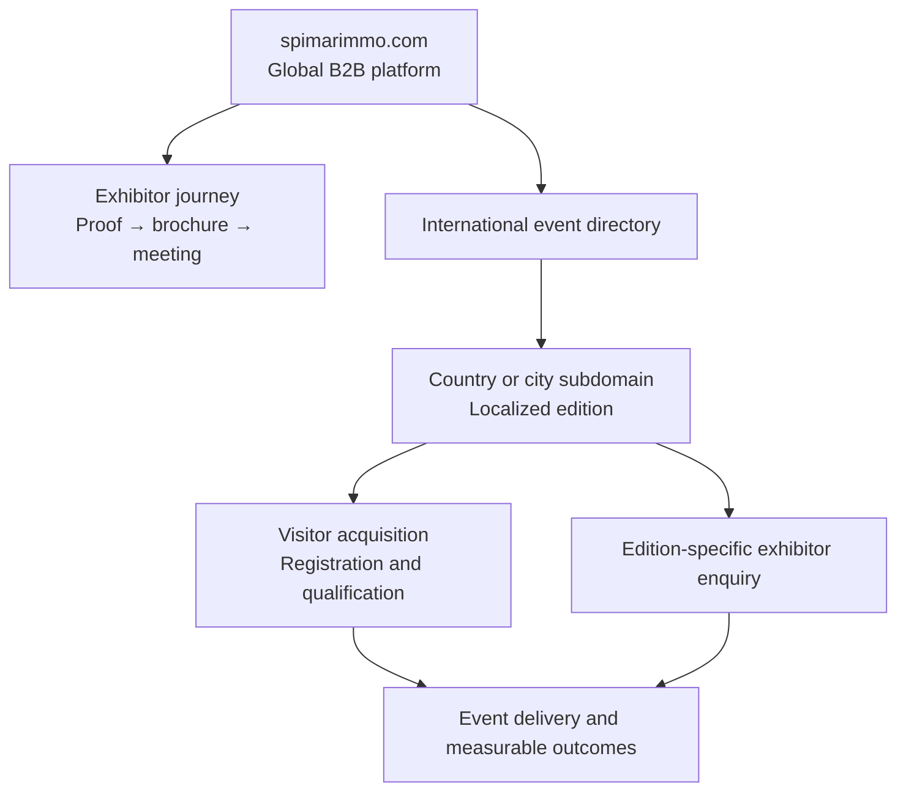

# SPIMARIMMO — Main Deliverables and Top-Down Reading Guide

**Version:** 1.1  
**Updated:** 30 July 2026  
**Owner:** Samney  
**Project state:** `B2B_UX_FOUNDATION_READY_FOR_STAKEHOLDER_REVIEW`  
**Authority:** Official CTO assignment received on 29 July 2026

## 1. Start here

This document is the front door to the SPIMARIMMO assignment.

The detailed workspace contains 20 supporting Markdown documents. They do not all
have the same purpose or approval status. Read this document first, then open only
the detailed files required for the decision you are making.

The project mission is:

> Transform `spimarimmo.com` into a B2B commercial platform that convinces Moroccan
> property developers to invest in SPIMAR's international exhibitions.

The website must answer:

> Why should I invest several tens of thousands of dirhams to exhibit with
> SPIMARIMMO?

Visitor acquisition remains essential, but it supports the exhibitor value
proposition. It is not the parent website's primary commercial conversion.

## 2. Current status in one view

| Area | What exists | Decision state |
|---|---|---|
| Official assignment | Normalized CTO brief | `AUTHORITATIVE` |
| Previous work | Reconciled into keep, reject and supersede decisions | `APPROVED_BASELINE` |
| Website research | Five-site audit and weighted benchmark | `READY_FOR_REVIEW` |
| B2B strategy | Value proposition, audiences, objections, offer and ROI model | `PROPOSED` |
| UX architecture | Sitemap, homepage hierarchy and conversion journeys | `PROPOSED` |
| Content and proof | CMS entities, evidence rules and asset requirements | `COLLECTION_SPEC_READY` |
| Visual direction | Modern performance-led event system; non-luxury | `PROPOSED_NOT_APPROVED` |
| Technical direction | Multi-domain Next.js, CMS and operational-data model | `PROPOSED` |
| Delivery | Roadmap, acceptance criteria, backlog and execution queue | `READY_FOR_REVIEW` |
| New wireframes | Not produced after the official reset | `NEXT` |
| New high-fidelity UI | Not produced after the official reset | `BLOCKED_BY_UX_APPROVAL` |
| Implementation | Not started | `BLOCKED_BY_UPSTREAM_APPROVALS` |

Documentation being present does not mean the product decision is approved.
`PROPOSED` files are complete enough to review, correct and approve.

## 3. Main deliverables — read top down

### Deliverable 1 — Executive orientation

Read:

1. [CTO executive summary](04-delivery/03-CTO-EXECUTIVE-SUMMARY.md)
2. [Official CTO brief](00-governance/00-OFFICIAL-BRIEF.md)

You will understand:

- why the project has been reset;
- who the paying customer is;
- what the global website must sell;
- how exhibitors and visitors are prioritized;
- which decisions the CTO and management must confirm.

Use this deliverable for the first stakeholder review.

### Deliverable 2 — Audit and benchmark

Read:

1. [Five-site audit and competitive benchmark](01-strategy/04-WEBSITE-AUDIT-AND-BENCHMARK.md)
2. [Previous-work recap and reset](00-governance/01-RECAP-AND-RESET.md)

You will understand:

- why the current SPIMAR website is insufficient for B2B exhibitor conversion;
- why the previous `mobile.spimarimmo.com` proposal was rejected as an
  implementation baseline;
- what should be retained from its atmosphere and energy;
- what Cityscape, Morocco Property Expo and Future Real Estate Expo contribute;
- which visual, commercial and technical patterns must be kept, adapted or rejected.

The controlling benchmark direction is:

> Modern Performance-Led Property Expo

This combines Cityscape's B2B sales logic, Morocco Property Expo's regional clarity,
the rejected prototype's useful event energy, and SPIMAR's authentic brand and
international exhibition evidence.

### Deliverable 3 — B2B business and conversion strategy

Read:

1. [Business and conversion strategy](01-strategy/01-BUSINESS-CONVERSION-STRATEGY.md)
2. [Audiences, jobs and objections](01-strategy/02-AUDIENCES-JOBS-OBJECTIONS.md)
3. [Exhibitor offer, ROI and proof model](01-strategy/03-OFFER-ROI-AND-PROOF.md)

You will understand:

- the exhibitor value chain;
- the commercial decision-makers and their objections;
- the role of Standard, Premium and Sponsor packages;
- how SPIMAR should define a qualified visitor and a qualified lead;
- how metrics, case studies and attributed results should support the sale;
- how brochure download, meeting booking and stand enquiry fit the funnel.

The target proof chain is:

```text
registrations
→ verified profiles
→ physical check-ins
→ interactions
→ accepted leads
→ commercial opportunities
→ attributed reservations or sales
```

These stages must never be merged into one inflated headline number.

### Deliverable 4 — Website and UX architecture

Read:

1. [Information architecture and domain model](02-experience/01-INFORMATION-ARCHITECTURE.md)
2. [Global homepage blueprint](02-experience/02-GLOBAL-HOMEPAGE-BLUEPRINT.md)
3. [Exhibitor conversion journey](02-experience/03-EXHIBITOR-CONVERSION-JOURNEY.md)
4. [Local event and visitor journeys](02-experience/04-EVENT-AND-VISITOR-JOURNEYS.md)

You will understand:

- the responsibility of `spimarimmo.com`;
- the responsibility of each country or city subdomain;
- the global sitemap and local event sitemap;
- the priority and lifecycle of international event cards;
- the complete B2B homepage order;
- the brochure, meeting, enquiry and CRM journey;
- the secondary visitor discovery and registration journey.

The domain model is:



### Deliverable 5 — Content, evidence and media

Read:

1. [Content, evidence and asset model](02-experience/05-CONTENT-EVIDENCE-ASSET-MODEL.md)
2. [Evidence and source register](00-governance/02-SOURCE-REGISTER.md)

You will understand:

- which content entities the CMS must manage;
- what every event, metric, case study and testimonial record requires;
- how real event media differs from campaign or generated imagery;
- how hero video, photography and document assets should be selected;
- who must own, validate and approve every public claim.

No final design should invent event dates, attendance, leads, satisfaction, sales,
partners, testimonials, package inclusions or prices.

### Deliverable 6 — Design and responsive direction

Read:

1. [Design and responsive system](03-system/01-DESIGN-AND-RESPONSIVE-SYSTEM.md)
2. Relevant design findings in the
   [benchmark](01-strategy/04-WEBSITE-AUDIT-AND-BENCHMARK.md)

You will understand:

- the modern, sophisticated, detailed and non-luxury design character;
- how WellExpo influences composition without controlling the product structure;
- how SPIMAR yellow, dark event scenes and lighter reading chapters should work;
- the typography, grid, event-card, media and motion principles;
- how desktop, laptop, tablet, mobile and Arabic/RTL must be intentionally composed.

This is a direction specification, not an approved final design system. Earlier
generated screens are historical explorations and do not represent the new official
B2B brief.

### Deliverable 7 — Technical and quality architecture

Read:

1. [Technical architecture and CMS model](03-system/02-TECHNICAL-ARCHITECTURE.md)
2. [SEO, performance, security, privacy and analytics](03-system/03-SEO-PERFORMANCE-SECURITY-ANALYTICS.md)

You will understand:

- the proposed single Next.js application for the parent domain and subdomains;
- host, locale, event and content resolution;
- the boundary between editorial CMS content and operational lead data;
- event lifecycle, form reliability, CRM handoff and observability;
- multilingual SEO, Core Web Vitals, accessibility and security requirements;
- conversion and attribution analytics without exposing personal data.

The technical architecture remains subject to CTO review, especially CMS retention,
CRM integrations, deployment, data retention and privacy configuration.

### Deliverable 8 — Delivery, validation and next actions

Read:

1. [Roadmap and acceptance criteria](04-delivery/01-ROADMAP-AND-ACCEPTANCE.md)
2. [Validation backlog](04-delivery/02-VALIDATION-BACKLOG.md)
3. [Execution queue](00-governance/04-EXECUTION-QUEUE.md)
4. [Decision log](00-governance/03-DECISION-LOG.md)

You will understand:

- the sequence from stakeholder alignment to launch;
- the gates before wireframes, high-fidelity design and development;
- the P0 facts and assets SPIMAR must provide;
- what is approved, proposed, blocked or still open;
- the immediate next production task.

## 4. Homepage solution currently proposed

The proposed parent homepage reads as a B2B sales narrative:

1. B2B promise and real exhibition film.
2. Verified performance indicators.
3. High-visibility international event cards.
4. Reasons to exhibit with SPIMAR.
5. Featured case study.
6. Before, during and after operating method.
7. Marketing and visibility system.
8. MRE market-intelligence chapter.
9. Trusted developers and partners.
10. Video testimonials and real event proof.
11. Exhibitor package comparison.
12. Resources, FAQ and insights.
13. Meeting, brochure and contact conversion.

The detailed section contracts, responsive behavior, content requirements and
analytics are defined in the
[global homepage blueprint](02-experience/02-GLOBAL-HOMEPAGE-BLUEPRINT.md).

## 5. What is completed

- Official CTO brief normalized into product requirements.
- Previous visitor-first direction formally superseded.
- Current website and four reference experiences audited.
- Weighted commercial benchmark completed.
- B2B positioning and conversion strategy proposed.
- Decision-maker audiences, jobs and objections mapped.
- Exhibitor offer, ROI and proof framework proposed.
- Parent-domain and localized-subdomain model defined.
- Global and local sitemaps proposed.
- Homepage section hierarchy specified.
- Exhibitor and visitor journeys specified.
- Content, evidence and media collection model defined.
- Visual and responsive direction specified.
- Technical, CMS and operational-data architecture proposed.
- SEO, performance, security, privacy and analytics contracts proposed.
- Delivery roadmap, quality acceptance and validation backlog prepared.

## 6. What is not completed

- CTO and founder approval of the strategy and UX architecture.
- Confirmed active events, locations, dates, venues and featured edition.
- Verified SPIMAR performance figures and metric definitions.
- Approved packages, inclusions and pricing policy.
- Approved developer and partner logos.
- Publishable case studies and video testimonials.
- Rights-cleared event photography and hero footage.
- CRM, calendar, email, SMS and WhatsApp integration decisions.
- Audit and decision on the current CMS.
- Production copy in French, English and Arabic.
- New official desktop, mobile and RTL wireframes.
- New official high-fidelity screens.
- Final design tokens and motion prototype.
- Claude Code implementation package.
- Product implementation, migration and launch.

## 7. Immediate next deliverable

The next production is the B2B UX foundation:

1. freeze the global and local sitemap;
2. freeze the exhibitor conversion funnel;
3. freeze the homepage hierarchy and event-card states;
4. produce low-fidelity desktop wireframes;
5. recompose them for mobile;
6. produce the Arabic/RTL version;
7. test brochure download, meeting booking, stand enquiry and visitor registration;
8. review the flows with the CTO before visual exploration.

Before wireframing, stakeholders should at minimum confirm:

- the active and upcoming event portfolio;
- which edition is featured first;
- primary and secondary conversions;
- evidence placeholders and unavailable facts;
- the homepage sequence and event-card priority.

Use the [validation backlog](04-delivery/02-VALIDATION-BACKLOG.md) for the review.

## 8. Document inventory

### Governance

| File | Purpose | Status |
|---|---|---|
| [Official brief](00-governance/00-OFFICIAL-BRIEF.md) | Normalized source requirements | `AUTHORITATIVE_INPUT` |
| [Recap and reset](00-governance/01-RECAP-AND-RESET.md) | Reconciles old and new work | `APPROVED_BASELINE` |
| [Source register](00-governance/02-SOURCE-REGISTER.md) | Tracks evidence and publication rules | `ACTIVE` |
| [Decision log](00-governance/03-DECISION-LOG.md) | Records approved and open choices | `ACTIVE` |
| [Execution queue](00-governance/04-EXECUTION-QUEUE.md) | Controls task order and gates | `ACTIVE` |

### Strategy

| File | Purpose | Status |
|---|---|---|
| [Business conversion strategy](01-strategy/01-BUSINESS-CONVERSION-STRATEGY.md) | Defines B2B positioning and funnel | `PROPOSED_FOR_REVIEW` |
| [Audiences and objections](01-strategy/02-AUDIENCES-JOBS-OBJECTIONS.md) | Maps decision-makers and proof needs | `PROPOSED_FOR_REVIEW` |
| [Offer, ROI and proof](01-strategy/03-OFFER-ROI-AND-PROOF.md) | Defines commercial package and measurement structure | `COMMERCIAL_DATA_REQUIRED` |
| [Audit and benchmark](01-strategy/04-WEBSITE-AUDIT-AND-BENCHMARK.md) | Compares five websites and sets direction | `PROPOSED_FOR_STAKEHOLDER_REVIEW` |

### Experience

| File | Purpose | Status |
|---|---|---|
| [Information architecture](02-experience/01-INFORMATION-ARCHITECTURE.md) | Defines global/local pages and event lifecycle | `PROPOSED_FOR_REVIEW` |
| [Homepage blueprint](02-experience/02-GLOBAL-HOMEPAGE-BLUEPRINT.md) | Specifies the parent homepage section by section | `PROPOSED_FOR_WIREFRAMING` |
| [Exhibitor journey](02-experience/03-EXHIBITOR-CONVERSION-JOURNEY.md) | Defines forms, qualification and CRM lifecycle | `PROPOSED_FOR_REVIEW` |
| [Event and visitor journeys](02-experience/04-EVENT-AND-VISITOR-JOURNEYS.md) | Defines localized event experiences | `PROPOSED_FOR_REVIEW` |
| [Content and evidence model](02-experience/05-CONTENT-EVIDENCE-ASSET-MODEL.md) | Defines content, proof and asset contracts | `ACTIVE_COLLECTION_SPEC` |

### System

| File | Purpose | Status |
|---|---|---|
| [Design and responsive system](03-system/01-DESIGN-AND-RESPONSIVE-SYSTEM.md) | Controls future UI exploration | `NOT_VISUALLY_APPROVED` |
| [Technical architecture](03-system/02-TECHNICAL-ARCHITECTURE.md) | Defines the proposed platform and CMS model | `PROPOSED_FOR_TECHNICAL_REVIEW` |
| [Quality architecture](03-system/03-SEO-PERFORMANCE-SECURITY-ANALYTICS.md) | Defines non-functional and measurement contracts | `PROPOSED_QUALITY_CONTRACT` |

### Delivery

| File | Purpose | Status |
|---|---|---|
| [Roadmap and acceptance](04-delivery/01-ROADMAP-AND-ACCEPTANCE.md) | Defines phases and exit conditions | `PROPOSED_FOR_REVIEW` |
| [Validation backlog](04-delivery/02-VALIDATION-BACKLOG.md) | Lists blocking stakeholder inputs | `BLOCKING_INPUT_REGISTER` |
| [CTO executive summary](04-delivery/03-CTO-EXECUTIVE-SUMMARY.md) | Provides the short decision document | `PROPOSITION_STRATÉGIQUE` |

## 9. Source-of-truth rule

When two documents conflict, use this order:

1. official CTO assignment and later written clarifications;
2. verified SPIMAR facts and approved internal evidence;
3. decisions marked `APPROVED` in the decision log;
4. current live-site and competitor evidence;
5. proposed strategy, UX, design and architecture;
6. previous work and generated concepts retained as historical research.

No previous mockup, reference website or technical hypothesis overrides the official
B2B assignment.
