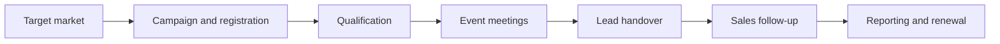
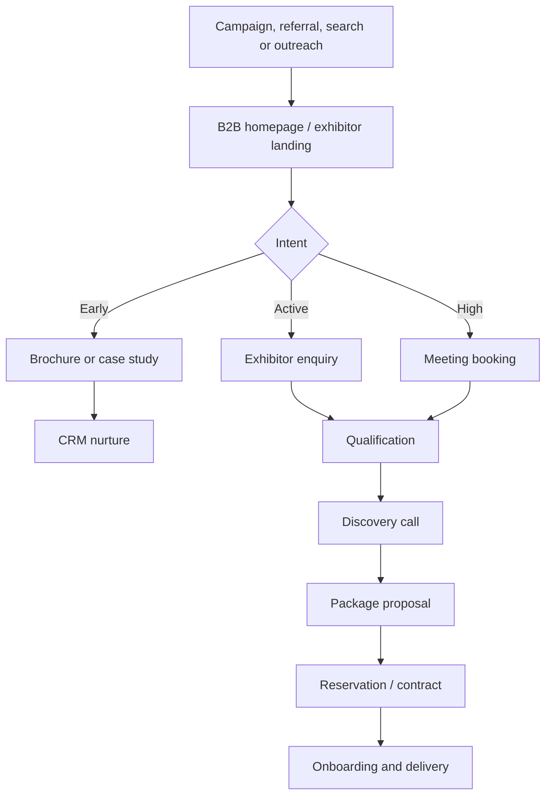

# B2B Business and Conversion Strategy

**Status:** `PROPOSED_FOR_REVIEW`  
**Primary audience:** Moroccan property developers  
**Primary website job:** Create qualified exhibitor opportunities

## 1. Strategic repositioning

SPIMARIMMO should be presented as an international demand-access and event-delivery
partner for Moroccan developers—not simply an exhibition organizer.

### Old website logic

> We organize property exhibitions. Visitors can register.

### Required logic

> We help Moroccan developers meet qualified MRE and international buyers in
> priority markets, supported by acquisition campaigns, exhibition operations,
> appointments, lead delivery and performance reporting.

## 2. Paying-customer value chain

The website must make every stage visible enough that an executive can understand
what their participation fee buys.

## 3. Core value proposition

### Functional value

- access to diaspora and investor audiences in their country of residence;
- coordinated media and event operations;
- a credible environment shared with developers, banks and advisers;
- lead capture and appointment opportunities;
- post-event delivery and reporting.

### Economic value

- concentrate market-entry costs into an organized channel;
- reduce the effort of building local event operations independently;
- create a measurable prospect pipeline;
- generate content and brand visibility around the edition;
- learn which international markets, projects and messages perform.

### Risk-reduction value

- defined process before, during and after the event;
- named deliverables by package;
- evidence from previous editions;
- transparent visitor-qualification method;
- clear lead ownership and handover;
- post-event reporting.

## 4. Website conversion ladder

Not every executive is ready to reserve a stand on first visit. Use progressive
commitments:

| Intent level | User action | Business response |
|---|---|---|
| Explore | View event or case study | Build relevance and trust |
| Learn | Download brochure/guide/calendar | Capture role and company |
| Evaluate | Compare exhibitor offers | Explain deliverables |
| Qualify | Submit exhibitor enquiry | Score market, role and timing |
| Discuss | Book a sales meeting | Prepare a contextual call |
| Commit | Request proposal/reserve package | Enter commercial pipeline |

## 5. Primary and secondary calls to action

### Primary

- `Devenir exposant`
- `Réserver un rendez-vous`
- `Demander une proposition`

Use the action appropriate to the user's funnel stage. Do not use three equally
prominent primary actions in the same viewport.

### Secondary

- `Télécharger la brochure`
- `Voir les prochains salons`
- `Découvrir une étude de cas`
- `Comparer les offres`

### Visitor actions

- `Trouver un salon`
- `Se préinscrire`

Visitor actions remain visible but visually secondary on the global B2B route.

## 6. Message architecture

### Level 1 — Promise

International access to qualified MRE and investor audiences.

### Level 2 — Mechanism

Marketing, qualification, event delivery, appointments and follow-up operate as
one system.

### Level 3 — Evidence

Verified editions, attendance, developers, leads, case studies, testimonials,
logos and real media.

### Level 4 — Offer

Clear Standard, Premium and Sponsor packages with defined deliverables.

### Level 5 — Action

Brochure, meeting and proposal.

## 7. Homepage decision sequence

Within the first two or three screenfuls, a B2B visitor should answer:

1. Is this built for developers like us?
2. Which international markets are available?
3. What audience and commercial opportunity do they create?
4. What exactly does SPIMAR do?
5. Is there credible proof?
6. What should I do next?

## 8. Event portfolio strategy

Country/city editions are products in a portfolio. Each must have:

- lifecycle status;
- target audience;
- exhibitor capacity;
- visitor target and qualification method;
- campaign plan;
- package availability;
- operational owner;
- commercial deadline;
- evidence from previous editions;
- local visitor experience.

The global website sells the network. The subdomain sells a specific edition.

## 9. Recommended commercial funnel

## 10. Lead qualification dimensions

- company and brand;
- role/seniority;
- projects and Moroccan cities represented;
- target international markets;
- preferred edition;
- timing;
- package interest;
- stand size or sponsorship interest;
- commercial objective;
- current international experience;
- contact permission and preferred channel.

Do not force all fields into the first form. Use progressive profiling.

## 11. Business KPIs

### Website

- qualified exhibitor leads;
- brochure download-to-enquiry rate;
- enquiry-to-meeting rate;
- meeting booking completion;
- package-view-to-enquiry rate;
- conversion by event, language, market and source.

### Commercial

- lead response time;
- qualified meeting rate;
- proposal rate;
- proposal-to-reservation rate;
- sales-cycle duration;
- package value;
- acquisition cost;
- renewal rate.

### Event delivery

- qualified visitor registrations;
- check-in rate;
- meetings scheduled/completed;
- leads delivered;
- time to handover;
- partner satisfaction;
- attributed opportunities and sales when methodology permits.

## 12. Guardrails

- Do not promise sales.
- Do not call every registration a qualified lead.
- Do not publish expected attendance as historical attendance.
- Do not merge campaign reach, registrations, check-ins and leads.
- Do not imply that public diaspora statistics prove SPIMAR performance.
- Do not hide package limitations or lead-delivery rules.

## 13. Strategic success condition

The global website succeeds when a previously unfamiliar developer executive can:

- understand SPIMAR's commercial system;
- see relevant markets and event timing;
- trust the operator;
- evaluate evidence and package fit;
- enter a qualified conversation without ambiguity.

