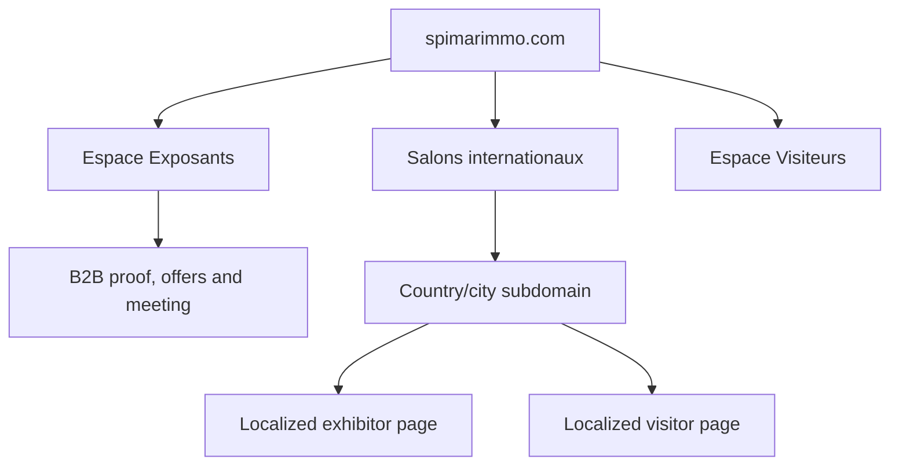

# Information Architecture and Domain Model

**Status:** `PROPOSED_FOR_REVIEW`

## 1. Architecture principle

`spimarimmo.com` is the global commercial and trust platform.

Country/city subdomains are localized event products that acquire and qualify visitors
and convert edition-specific exhibitors.



## 2. Global navigation

### Desktop

1. Logo / home.
2. `Salons`.
3. `Pourquoi exposer ?`
4. `Résultats`.
5. `Offres exposants`.
6. `Ressources`.
7. `Espace visiteurs`.
8. Locale selector.
9. Primary CTA: `Devenir exposant`.

### Mobile

- compact header;
- menu with separate `Exposants` and `Visiteurs` groups;
- visible locale control;
- persistent exhibitor action only on B2B routes;
- visitor registration action only on visitor/event routes.

Do not show two persistent bottom bars at once.

## 3. Global sitemap

```text
spimarimmo.com/
├── /[locale]
│   ├── /salons
│   │   ├── /[country]
│   │   └── /[country]/[city-or-edition]
│   ├── /exposants
│   │   ├── /pourquoi-exposer
│   │   ├── /methode
│   │   ├── /visibilite
│   │   ├── /offres
│   │   ├── /etudes-de-cas
│   │   ├── /temoignages
│   │   ├── /faq
│   │   ├── /brochure
│   │   └── /reserver-un-rendez-vous
│   ├── /visiteurs
│   │   ├── /trouver-un-salon
│   │   ├── /pourquoi-visiter
│   │   ├── /exposants
│   │   ├── /programme
│   │   └── /informations-pratiques
│   ├── /marche-mre
│   ├── /promoteurs-et-partenaires
│   ├── /galerie
│   ├── /ressources
│   │   ├── /brochures
│   │   ├── /guide-exposant
│   │   ├── /calendrier
│   │   ├── /plans
│   │   └── /checklist
│   ├── /insights
│   │   └── /[article]
│   ├── /presse
│   ├── /a-propos
│   ├── /contact
│   ├── /confidentialite
│   ├── /cookies
│   └── /mentions-legales
```

Exact slugs are localized. The semantic content model remains shared.

## 4. Local subdomain sitemap

Example host: `france.spimarimmo.com`

```text
/[locale]
├── /
├── /exposants
├── /exposants/brochure
├── /exposants/demande
├── /visiteurs
├── /visiteurs/inscription
├── /exposants-presents
├── /programme
├── /informations-pratiques
├── /galerie
├── /faq
├── /contact
└── /legal/*
```

For one active city, the subdomain homepage may represent that edition. For multiple
active cities, the homepage becomes a country directory and each edition receives a
stable route.

## 5. Global versus local responsibility

| Capability | Global site | Local subdomain |
|---|---:|---:|
| Network positioning | Primary | Supporting |
| Developer value proposition | Primary | Edition-specific |
| All exhibitions directory | Primary | Related editions |
| Global statistics | Primary | Context only |
| Edition date/venue | Summary | Primary |
| Exhibitor packages | Global base | Edition availability |
| Case studies | Global library | Relevant subset |
| Visitor registration | Route onward | Primary |
| Exhibitor enquiry | Global or edition | Edition-specific |
| Programme/logistics | No | Primary |
| Local SEO | Directory support | Primary |
| Post-event recap | Archive index | Primary |

## 6. Country/event card system

The card directory is a first-class product surface.

### Required card states

- `Registration open`
- `Exhibitor sales open`
- `Coming soon`
- `Sold out`
- `Live`
- `Completed`
- `Recap available`
- `Waitlist`

### Card content

- city and country;
- edition status;
- date or `À venir`;
- venue when confirmed;
- target audience;
- real image;
- exhibitor availability;
- exhibitor CTA;
- visitor CTA;
- language availability;
- previous-edition proof when relevant.

### Hierarchy

- one featured edition;
- two to five active/upcoming editions;
- future-market announcements;
- archive separated from current opportunities.

Do not present completed events as upcoming.

## 7. Domain and canonical policy

- Keep `country.spimarimmo.com` as the canonical public host when the business
  requires the subdomain model.
- Serve every host from one application and tenant registry.
- Redirect duplicate apex domains to the canonical subdomain while preserving path
  and campaign parameters.
- Give every locale a stable URL.
- Use self-referencing canonicals and reciprocal `hreflang`.
- Do not redirect solely from IP or browser language.
- Preserve a visible country and language switcher.

## 8. Event lifecycle

```text
Draft
→ Internal review
→ Announced
→ Exhibitor sales open
→ Visitor registration open
→ Registration closed
→ Live
→ Completed
→ Recap / next-edition waitlist
→ Archived
```

Status controls:

- copy and CTAs;
- form availability;
- countdown;
- indexing;
- event cards;
- notifications;
- brochure version;
- confirmation messages;
- archive and next-event routing.

## 9. Search and filtering

### Exhibition directory

Filter only when portfolio size justifies it:

- country/region;
- city;
- status;
- year;
- audience;
- language.

### Trusted developers

The CTO-requested filters require clarified taxonomy. Proposed:

- `National`;
- `Premium` — only if SPIMAR defines an objective rule;
- `International`;
- project-city coverage;
- past/current edition.

Never label a company “Premium” without an approved classification rule.

## 10. Global footer architecture

Columns:

- exhibitions;
- exhibitors;
- visitors;
- resources and press;
- company;
- legal/privacy;
- language and country.

Include:

- Clarkom organizer relationship;
- current contact details;
- newsletter preferences;
- cookie settings;
- social profiles;
- accessibility/help route if supported.

## 11. IA acceptance criteria

- Exhibitor value and action are reachable from every global page.
- Visitor journeys remain clear without dominating B2B pages.
- Active exhibitions are discoverable within one interaction from the homepage.
- No dead-end country card exists.
- Expired events automatically expose recap/waitlist behavior.
- Breadcrumbs and back-navigation work across parent/subdomain boundaries.
- Locale switching retains the equivalent page when translation exists.
- CMS users can control navigation and event visibility without code changes.

