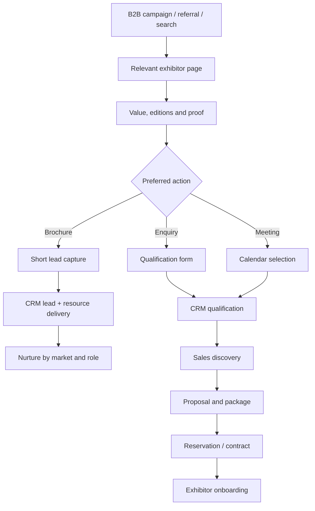

# Exhibitor Conversion Journey and CRM Contract

**Status:** `PROPOSED_FOR_REVIEW`

## 1. Journey objective

Convert a developer decision-maker from interest into a qualified commercial
conversation while collecting only the information required for the current stage.

## 2. End-to-end journey



## 3. Entry-page variants

### Global exhibitor page

Best for:

- general brand search;
- referrals;
- investors evaluating the network;
- undecided market.

Primary action: select an edition or book a conversation.

### Edition-specific exhibitor page

Best for:

- outbound sales;
- event campaign;
- known city/country interest.

Primary action: request the edition proposal.

### Case-study page

Best for:

- retargeting;
- decision-maker proof;
- sales follow-up.

Primary action: discuss a comparable objective.

## 4. Form strategy

### Step 1 — Minimal identity

- first and last name;
- work email;
- phone/WhatsApp;
- company;
- role;
- consent/privacy acknowledgement.

### Step 2 — Commercial context

- target edition(s);
- project cities;
- property/project type;
- primary objective;
- package or sponsorship interest;
- preferred meeting timing;
- optional message.

### Step 3 — Confirmation

- submission summary;
- response expectation;
- assigned next step;
- meeting option;
- brochure delivery;
- privacy/preferences link.

Do not ask detailed budgets or documents before the user understands why they are
needed.

## 5. Progressive profiling

| Stage | Data required |
|---|---|
| Brochure | Name, company, role, work email, market interest, consent |
| Enquiry | Contact, company, edition, objective and project context |
| Meeting | Contact plus calendar/timezone and short agenda |
| Proposal | Billing/legal entity, package, stand and delivery requirements |
| Onboarding | Approved commercial and operational information |

Known information should be prefilled and not repeatedly requested.

## 6. CRM lifecycle

```text
New
→ Deduplicated
→ Marketing qualified
→ Sales review
→ Sales qualified
→ Meeting scheduled
→ Meeting completed
→ Proposal requested
→ Proposal sent
→ Negotiation
→ Won / Lost / Nurture
→ Exhibitor onboarding
```

Every stage needs:

- owner;
- timestamp;
- permitted transitions;
- reason code;
- next action;
- edition association;
- source and campaign;
- audit history.

## 7. Suggested qualification rules

Signals:

- company is a relevant developer/partner;
- role has influence or decision authority;
- project inventory matches target MRE demand;
- edition timing is active;
- contact details are valid;
- intent is concrete;
- package scope is plausible.

Scoring assists prioritization but does not replace human sales judgment.

## 8. Routing

Route by:

- edition/country;
- company type;
- language;
- package/sponsor interest;
- account ownership;
- urgency.

Fallback:

- central commercial queue;
- explicit unassigned alert;
- reassignment audit;
- no lead silently dropped.

## 9. Response service levels

Final timings require commercial approval. Proposed internal targets:

| Lead type | Proposed acknowledgement | Proposed human response |
|---|---:|---:|
| Brochure | Immediate automated delivery | Nurture or review within 1 business day |
| Exhibitor enquiry | Immediate confirmation | Within 4 business hours |
| Meeting request | Immediate calendar confirmation | Before the scheduled meeting |
| Sponsor enquiry | Immediate confirmation | Within 4 business hours |

Do not publish an SLA until the team can operationally meet it.

## 10. Confirmation and communication

### Immediate

- on-screen confirmation;
- email with next step;
- brochure link when requested;
- calendar details when booked;
- contact and preference controls.

### Follow-up

- assigned representative;
- edition-relevant material;
- meeting reminder;
- proposal delivery;
- no unrelated marketing without appropriate basis/consent.

WhatsApp may be offered as a channel, not forced as the only path.

## 11. Failure states

Design:

- validation errors;
- duplicate lead;
- unavailable edition;
- full calendar;
- expired brochure;
- upload failure;
- server failure;
- offline/retry;
- already-booked meeting;
- consent not accepted.

Preserve entered information after recoverable errors.

## 12. Analytics events

```text
exhibitor_cta_clicked
brochure_form_started
brochure_download_completed
exhibitor_form_started
exhibitor_form_step_completed
exhibitor_form_error
exhibitor_enquiry_submitted
meeting_scheduler_opened
meeting_booked
package_compared
proposal_requested
```

Common dimensions:

- event ID;
- host/subdomain;
- locale;
- audience;
- campaign/source;
- CTA position;
- page version.

Do not send names, emails, phone numbers or free text to analytics.

## 13. Handoff to exhibitor onboarding

When a deal is won:

- create exhibitor record;
- link contract/package/edition;
- assign account and operations owners;
- start deliverable checklist;
- request brand and project assets securely;
- track approvals and deadlines;
- configure directory presence and campaigns;
- prepare lead-access permissions;
- schedule reporting expectations.

## 14. Acceptance criteria

- An exhibitor can complete the correct action without entering a visitor flow.
- The relevant edition remains attached to the lead.
- Duplicate submissions do not create uncontrolled duplicates.
- Every successful submission has an owner or visible queue.
- Resource delivery and confirmations are observable.
- Locale, source, consent version and campaign attribution are retained.
- Forms are keyboard accessible, localized and server validated.

