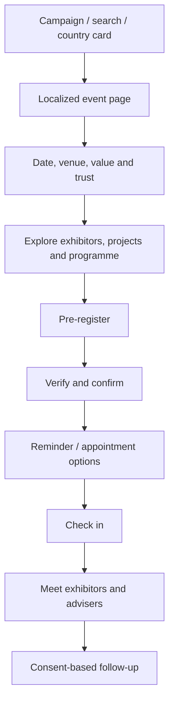

# Local Event and Visitor Experience

**Status:** `PROPOSED_FOR_REVIEW`

## 1. Role of local subdomains

Each country subdomain is a focused market experience with two clear routes:

- edition-specific exhibitor conversion;
- visitor discovery and registration.

The local homepage may lead with the active event, but must preserve a visible route
for exhibitors.

## 2. Local event homepage

Recommended order:

1. Local header and global-network link.
2. Event hero with city, date, venue and status.
3. Visitor CTA and exhibitor CTA with clear role labels.
4. Verified event proof.
5. Exhibitors and projects.
6. Why visit.
7. Programme and practical information.
8. Financing/legal/advisory support.
9. Real previous-edition media.
10. FAQ.
11. Visitor registration.
12. Exhibitor commercial panel.
13. Contact and footer.

## 3. Visitor journey

## 4. Visitor registration

### Initial fields

- name;
- email;
- phone/WhatsApp;
- city/country of residence;
- language;
- property intent;
- Moroccan city/project interest;
- purchase horizon;
- financing interest;
- consent and communication preferences.

Use progressive profiling if a campaign only needs basic pre-registration first.

### Qualification labels

Possible internal segments:

- active buyer;
- 3–6 month horizon;
- 6–12 month horizon;
- explorer;
- investor;
- return/retirement;
- financing required;
- existing customer/contact.

Labels and thresholds require operational approval.

## 5. Registration confirmation

After a valid registration:

- display unique confirmation;
- send invitation/badge if operationally supported;
- show date, venue and map;
- add to calendar;
- explain what to bring;
- allow preference updates;
- offer optional meeting interests;
- communicate when exhibitors/programme will be finalized.

## 6. Exhibitor directory

Each exhibitor record:

- approved logo and name;
- category;
- project cities;
- short verified profile;
- event participation status;
- booth/zone when published;
- meeting or interest action;
- accessibility-safe logo;
- link policy.

Do not publish exhibitors before confirmation or keep withdrawn exhibitors visible.

## 7. Programme

Support:

- dates and local timezone;
- sessions;
- stage/room;
- topic;
- speaker;
- language;
- capacity;
- add-to-calendar;
- changes/cancellations;
- accessible alternatives.

The CMS must prevent schedule conflicts and stale date text.

## 8. Practical information

- venue name and verified address;
- opening hours;
- map/navigation;
- public transport and parking;
- accessibility;
- child/family policy if applicable;
- admission conditions;
- support channels;
- travel/entry guidance only when legally reviewed.

## 9. Country-page localization

Localization includes more than translation:

- local date/time format;
- phone formatting;
- local contact;
- host-city imagery;
- relevant diaspora segment;
- campaign channel;
- legal/privacy copy;
- local venue and accessibility;
- language-specific typography and layout.

Arabic uses true RTL composition. Do not mirror maps, logos or media indiscriminately.

## 10. Post-event state

When an event ends:

- close or transform registration;
- remove countdown;
- publish recap when approved;
- show real gallery/video;
- preserve useful SEO content;
- collect next-edition interest;
- route to other active events;
- record final statistics separately from expected values.

## 11. Relationship with the global event directory

The parent card must always reflect local state:

- date/status;
- exhibitor availability;
- visitor registration;
- media/brochure;
- next edition;
- archive.

Updates should come from the same event record, not manual duplication.

## 12. Visitor analytics

- event card selected;
- visitor route selected;
- exhibitor directory viewed;
- programme viewed;
- registration started/completed;
- qualification completion;
- calendar added;
- map opened;
- WhatsApp/support used;
- confirmation/badge delivered;
- check-in matched.

## 13. Acceptance criteria

- City, date, venue and event status are clear without scrolling.
- Visitor and exhibitor actions are never mislabeled.
- A completed event cannot show a live countdown.
- Registration works in French, English and Arabic/RTL.
- Confirmation explains the next step.
- The same event facts power metadata, page content, forms and emails.
- The page remains useful when registration is closed or the event has ended.

