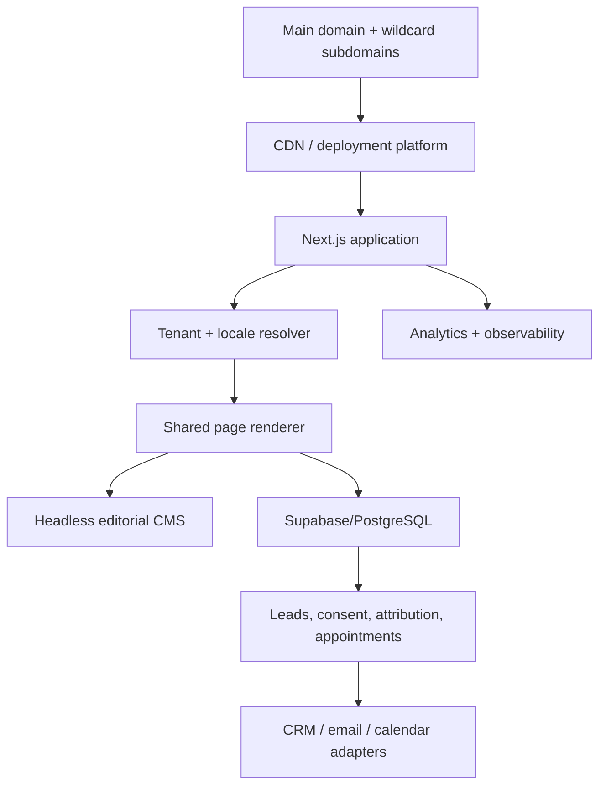

# Technical Architecture and CMS Model

**Status:** `PROPOSED_FOR_TECHNICAL_REVIEW`  
**Architecture goal:** One platform, many domains/locales/events, one governed content
and lead system

## 1. Recommended target

- Next.js 16.x App Router, pinned to the approved stable release at kickoff.
- TypeScript in strict mode.
- Tailwind CSS with documented design tokens.
- Accessible headless primitives only where useful.
- One headless editorial CMS.
- PostgreSQL/Supabase for operational and lead data.
- Server-side form handling and validation.
- Transactional email.
- CRM/calendar adapters.
- CDN-backed responsive media.
- error, performance, uptime and analytics monitoring.

The official Next.js documentation includes a current App Router multi-tenant guide
and host-request handling through Proxy. The implementation must follow the pinned
version's official APIs.

## 2. System topology



## 3. Tenant and host model

```yaml
tenant:
  id:
  canonical_host:
  aliases:
  country:
  default_locale:
  supported_locales:
  active_event_ids:
  contact_profile:
  legal_profile:
  analytics_profile:
  theme_variant:
```

Host resolution:

1. normalize host;
2. match canonical host or approved alias;
3. resolve tenant;
4. resolve locale from path/cookie/default;
5. load content and event state;
6. redirect aliases to canonical host;
7. return explicit unknown/inactive-tenant state.

No hard-coded country switch statement should spread through the app.

## 4. URL proposal

```text
spimarimmo.com/fr/...
spimarimmo.com/en/...
spimarimmo.com/ar/...

france.spimarimmo.com/fr/...
france.spimarimmo.com/en/...
france.spimarimmo.com/ar/...
```

The default locale and exact public slugs require SEO/content approval. Locale URLs
remain explicit and crawlable.

## 5. Editorial CMS strategy

The existing environment reportedly uses headless WordPress/WPGraphQL. Recommended
phase-one approach:

- audit and harden the existing CMS;
- keep it if content quality, permissions and API reliability pass;
- build a CMS adapter rather than coupling components directly to GraphQL shapes;
- migrate into clean content types;
- use preview, review and webhook workflows;
- retain the option to replace the CMS without rewriting page components.

The new frontend still starts from scratch. Reusing a validated CMS is not reusing the
old frontend architecture.

### CMS owns

- page and section content;
- localized copy;
- events and venues;
- exhibitors/partners;
- packages;
- case studies/testimonials;
- resources/articles/FAQ;
- media;
- SEO/social metadata;
- legal-document content;
- publication status.

### Operational database owns

- exhibitor and visitor leads;
- consent records;
- source/campaign attribution;
- form submissions and status;
- appointments;
- communication log;
- attendance/check-in;
- lead delivery and acceptance;
- CRM synchronization state;
- audit log.

Avoid duplicating editable event facts in both systems. Operational records reference the
CMS event ID and snapshot only the facts required for historical integrity.

## 6. CMS content components

Use structured components with controlled variants:

- hero;
- metric field;
- featured event;
- event directory;
- proof/value pillar;
- timeline;
- campaign/visibility map;
- market insight;
- logo wall;
- case study;
- testimonial;
- gallery;
- package comparison;
- resource list;
- FAQ;
- conversion block.

Do not allow arbitrary page-builder freedom that recreates inconsistency.

## 7. Event lifecycle engine

State combines an explicit editorial status with validated dates.

Rules:

- countdown requires future start date and open state;
- visitor form requires registration-open state;
- exhibitor form requires sales-open state;
- completed state removes future tense;
- recap/waitlist appears after end;
- card, metadata, emails and forms read the same state;
- invalid combinations block publication.

## 8. Form architecture

### Request flow

1. Parse and normalize input.
2. Validate with Zod on the server.
3. Verify tenant/event/form configuration.
4. Apply rate limit and bot controls.
5. Generate idempotency key.
6. Deduplicate or link contact.
7. store submission and consent version.
8. enqueue notification/CRM sync.
9. return structured localized result.

### Requirements

- never trust client validation alone;
- never expose service-role credentials;
- do not report success on a failed response;
- retain retryable integration jobs;
- log state without logging unnecessary personal data;
- export access is role restricted.

## 9. Suggested operational entities

```text
contacts
organizations
events_ref
exhibitor_leads
visitor_registrations
consents
campaign_attribution
appointments
communications
attendance
lead_assignments
lead_deliveries
integration_jobs
audit_events
```

Apply Row Level Security and role-based access to every exposed operational table.

## 10. Caching and rendering

- server-render critical page content;
- pre-render published global/event pages where practical;
- use on-demand revalidation after CMS publication;
- cache tenant configuration;
- avoid user-specific content on public cached pages;
- use dynamic server execution only for forms, preview and truly live data;
- invalidate event card/global directory when an edition changes;
- keep stale-if-error behavior for public content where safe.

## 11. Media

- responsive image derivatives;
- art-directed desktop/mobile crops;
- AVIF/WebP where supported;
- video poster and multiple encodes;
- no original upload served directly as hero;
- rights and alt text stored with asset;
- lazy load noncritical video/gallery;
- media CDN and immutable versioned URLs.

## 12. Localization

- locale dictionaries and CMS translations;
- true document `lang` and `dir`;
- locale-aware metadata and form messages;
- preserved translation equivalence;
- locale fallback visible to editors, not silently mixed on public pages;
- no string concatenation that breaks Arabic grammar;
- RTL-safe logical CSS properties.

## 13. Deployment model

- one repository;
- one application deployment per environment;
- wildcard domain support;
- preview URLs linked to CMS drafts;
- development, staging and production;
- database migrations in CI/CD;
- secrets managed by platform;
- protected production writes;
- rollbackable releases;
- smoke tests per representative host and locale.

## 14. Observability

Monitor:

- uptime by host;
- page/render errors;
- form success/failure;
- CRM/email/calendar job state;
- Core Web Vitals by device/market;
- broken links and resources;
- event lifecycle anomalies;
- stale content;
- certificate/DNS status;
- analytics ingestion.

## 15. Architecture decisions still required

- confirm existing WordPress health and ownership;
- choose deployment platform;
- confirm CRM and calendar;
- confirm email/SMS/WhatsApp providers;
- confirm analytics and consent platform;
- confirm authentication/admin roles;
- confirm data residency and retention;
- confirm check-in/attendance integration;
- confirm source of verified metrics.

## 16. Technical acceptance

- One codebase serves the parent and all approved subdomains.
- A new tenant/event launches without code duplication.
- Event expiry behavior is automatic and tested.
- A CMS update revalidates only affected pages.
- Forms preserve tenant, event, locale, attribution and consent.
- Failed integrations are visible and retryable.
- No public CMS/database secret exists in the client bundle.
- Representative FR/EN/AR pages render server-side and pass RTL QA.

