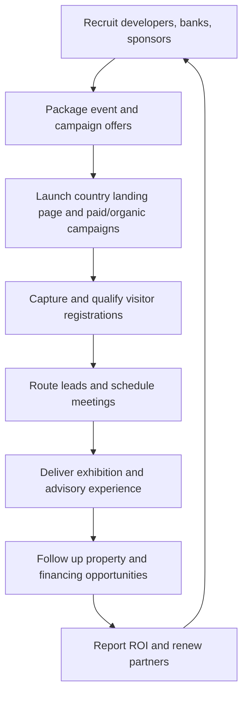
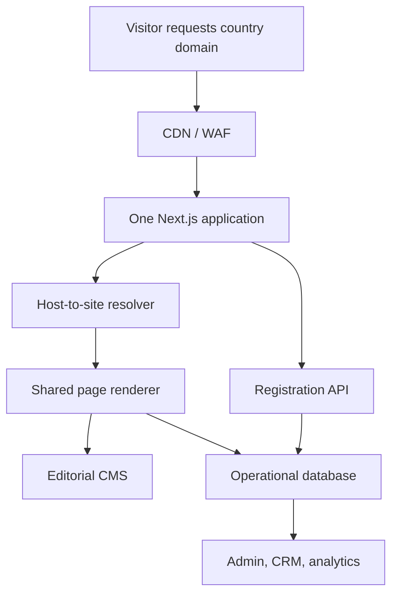

# SPIMAR IMMO & Clarkom
## Business Model, Website Network Audit, and Centralized Next.js Platform Proposal

**Audit date:** 27 July 2026  
**Prepared for:** Samney  
**Scope:** Public business-model research, public website inspection, non-destructive technical review, and target-platform recommendation.

---

## 1. Executive conclusion

SPIMAR IMMO is best understood as a **vertical B2B2C event and lead-generation business for Moroccan real estate**, focused mainly on Moroccans living abroad and, increasingly, international investors.

Clarkom is the communication and event-production agency operating behind the experience. Public evidence shows Clarkom as SPIMAR’s organizing partner, with overlapping contact details and a specialization in real estate, banking, B2B communication, digital, and events.

The commercial engine is:

1. Recruit Moroccan property developers, banks, and sponsors.
2. Package their participation in destination-country real-estate fairs.
3. Acquire and qualify diaspora visitors through country campaigns and landing pages.
4. Connect visitors with projects, advisers, banks, and financing during each event.
5. Follow up the resulting leads and prove commercial value to partners.
6. Renew partners and expand the event format into more cities and countries.

The current digital network is more advanced than it first appears. It already uses:

- Gatsby/React static frontends;
- Netlify hosting and CDN delivery;
- a shared headless WordPress instance exposed through WPGraphQL at `spimar.clarkapi.com`;
- Netlify form handling;
- Plausible and Google Tag Manager on parts of the network.

The main weakness is therefore **not simply “old technology.”** It is fragmented multi-site operations:

- separate country builds and deployments;
- inconsistent content states;
- expired events remaining live;
- country and venue copy mistakes;
- duplicate domains with competing canonicals;
- inconsistent legal links, phone numbers, analytics, and tracking;
- lead capture distributed across site deployments;
- no visible central operational workflow for draft, review, scheduling, expiry, archival, and reporting.

### Recommendation

Move toward **one multi-tenant Next.js platform and one operational control plane**, but do it as a phased migration rather than a blind rewrite.

The recommended target is:

- **One Next.js 16 App Router application** serving the main domain and every country subdomain;
- **host-based tenant resolution** using Next.js Proxy;
- **one shared design system and page renderer**;
- **one editorial CMS** for localized content and media;
- **one PostgreSQL/Supabase operational database** for events, leads, consent, exhibitors, campaigns, appointments, and reporting;
- **one admin console** controlling sites, domains, events, publishing, lead routing, analytics, and health;
- cached/mostly static delivery with CMS webhooks and on-demand revalidation;
- permanent redirects from duplicate country domains to one canonical hostname.

Next.js is a good fit for the target model, but changing Gatsby to Next.js alone will not solve the problem. The most important work is the shared data model, publishing governance, lead pipeline, domain policy, and monitoring.

---

## 2. Research boundaries

This report is based on:

- public pages and indexed sources;
- live HTTP headers and public site assets;
- public metadata, robots, sitemaps, manifests, and page structure;
- public production JavaScript and source-map exposure;
- non-destructive inspection of the public WordPress REST and GraphQL surfaces.

It is **not**:

- an authenticated review of WordPress, Netlify, DNS, analytics, or email accounts;
- a repository or CI/CD audit;
- a penetration test;
- a formal legal opinion;
- a certified Core Web Vitals/Lighthouse report from every target geography.

Any finding concerning an internal workflow is clearly marked as an inference and should be validated with the team.

---

## 3. The two businesses

## 3.1 SPIMAR IMMO

SPIMAR presents itself as a specialist in real-estate events and exhibitions serving Moroccans living abroad. Its public site says the event brand has operated since 2016 and brings together:

- Moroccan property developers;
- financial institutions;
- residential and commercial property projects;
- visitors and investors;
- property and financing advisers.

Its visitor promise is not merely access to stands. The offer includes:

- curated property projects across Moroccan cities;
- financing advice and preferential bank offers;
- personal guidance during the event;
- help with selection and acquisition;
- post-visit follow-up.

The website describes the platform as an intermediary built on selection, transparency, quality, credibility, advice, and financing access.

### Corporate-age clarification

The public brand claims experience since 2016, while public company directories indicate that the present `SPIMARIMMO` legal entity was created in December 2024. These statements can both be true: the exhibition brand or activity may predate the current company. The distinction should be communicated clearly in corporate documents and partner proposals.

## 3.2 Clarkom

Clarkom describes itself as a 360° B2B and institutional communication agency. Its published services include:

- strategic consulting and positioning;
- campaign and media planning;
- fairs and event production;
- scenography, signage, and stands;
- web and multimedia;
- mobile applications;
- print and publishing;
- branding, design, and packaging.

Clarkom’s LinkedIn profile further positions the agency as specializing in **real estate and banking**, which aligns directly with SPIMAR’s exhibitor and financing ecosystem.

Public business-directory information describes Clarkom as a Casablanca SARLAU, with a reported capital of MAD 100,000 and a creation date around 2010–2011. SPIMAR’s website explicitly names Clarkom as the organizing partner.

## 3.3 Probable relationship

The strongest evidence supports this interpretation:

- **Clarkom is the agency/operator.**
- **SPIMAR is the specialized event brand and commercial platform.**

Clarkom supplies the operating capabilities—strategy, creative, media, web, event logistics, print, and project management—while SPIMAR packages those capabilities into a repeatable vertical offering for Moroccan real estate abroad.

The public evidence does not prove ownership or group structure, so this report does not claim that one company legally owns the other.

---

## 4. Business-model analysis

## 4.1 Model type

SPIMAR operates as a hybrid of:

- an international event organizer;
- a vertical marketing and communication platform;
- a two-sided B2B2C marketplace;
- a lead-generation and matching service;
- a property and financing advisory channel.

It is not primarily an online property marketplace today. The websites function mainly as acquisition and registration funnels supporting physical events.

## 4.2 Customer groups

| Side | Actors | Primary need |
|---|---|---|
| Paying B2B side | Property developers | Reach qualified diaspora buyers and sell inventory |
| Paying B2B side | Banks and finance partners | Acquire mortgage, account, and investment customers |
| Paying B2B side | Sponsors and service providers | Brand exposure and access to a focused audience |
| Visitor side | Moroccans living abroad | Discover credible projects, compare options, and obtain guidance |
| Visitor side | International investors | Access Moroccan property opportunities and local expertise |
| Operating side | Country representatives, advisers, event staff | Run campaigns, registrations, events, and follow-up |

## 4.3 Value proposition

### For visitors

- A curated selection instead of searching the market alone.
- Direct access to developers and banks in the country of residence.
- Guidance on projects, cities, budgets, and financing.
- A more trustworthy and lower-friction purchase journey.
- Event-specific offers and preferential financing.

### For developers

- Concentrated access to diaspora demand.
- Physical meetings with qualified prospects.
- Country-specific marketing and media activation.
- Stand, event, and campaign production through one operator.
- Lead capture and post-event sales opportunities.

### For banks

- Access to buyers with financing needs.
- New-account, mortgage, and cross-border customer acquisition.
- A trusted context for advisory conversations.
- Co-marketing with developers and the event brand.

### For Clarkom/SPIMAR

- A repeatable vertical event format.
- Recurring relationships with developers and banks.
- Reusable brand assets, campaign systems, and country networks.
- First-party demand data that improves future editions.

## 4.4 Probable revenue streams

The public websites do not publish prices or contracts. The following streams are therefore commercially probable, not confirmed:

1. **Exhibitor packages**
   - stand space;
   - event participation;
   - featured placement;
   - logistics and installation;
   - promotional materials.

2. **Sponsorship packages**
   - title or category sponsorship;
   - branding at the venue;
   - digital placements;
   - stage, content, and media visibility.

3. **Marketing and communication services**
   - country campaigns;
   - creative production;
   - media buying;
   - social media;
   - print and event collateral.

4. **Qualified lead and appointment services**
   - pre-qualified visitor leads;
   - scheduled meetings;
   - post-event follow-up;
   - campaign attribution and reporting.

5. **Advisory or referral economics**
   - property or financing referrals;
   - commercial introductions;
   - consulting and market-entry support.

   Any commission-based model must be verified contractually and represented transparently to visitors.

6. **Year-round digital products**
   - featured property/project listings;
   - partner portal subscriptions;
   - country campaign pages;
   - lead-management access;
   - analytics and reporting.

## 4.5 End-to-end operating cycle

## 4.6 Core metrics the business should manage

### Acquisition

- cost per registration;
- registrations by country, city, campaign, source, and partner;
- landing-page conversion rate;
- qualified-registration rate;
- duplicate/fraud/spam rate.

### Attendance

- registration-to-attendance rate;
- check-in rate by source;
- attendance by time slot;
- walk-in versus registered visitors.

### Commercial outcomes

- adviser meetings booked;
- appointments completed;
- leads assigned per developer/bank;
- lead response time;
- qualified opportunities;
- reservations or sales attributed to the event;
- financing applications and approvals;
- pipeline value.

### Partner economics

- exhibitor acquisition cost;
- average package value;
- sponsor revenue;
- partner renewal rate;
- revenue and gross margin by event;
- reported partner ROI.

### Experience and trust

- visitor satisfaction/NPS;
- partner satisfaction;
- complaint rate;
- consent and data-rights requests;
- follow-up completion;
- content accuracy incidents.

---

## 5. Current website estate

The main site links to country experiences for:

- United Arab Emirates;
- Canada;
- France;
- the Netherlands;
- Belgium;
- Germany;
- the United States.

Additional indexed or linked properties include:

- `dubai.spimarimmo.com`;
- `spimarbelgique.com`;
- `spimaremirates.com`;
- `spimarcanada.com`;
- `spimarausa.com` or similar historical domains.

This creates two kinds of web property:

1. the central brand site at `spimarimmo.com`;
2. country/event landing sites on subdomains and, in some cases, separate apex domains.

## 5.1 Confirmed current implementation

| Layer | Observed implementation |
|---|---|
| Frontend | Gatsby/React static builds |
| Hosting | Netlify for SPIMAR main and country sites |
| Editorial backend | WordPress |
| Content API | WPGraphQL at `spimar.clarkapi.com/graphql` |
| Forms | Netlify Forms posting to the current page |
| Main-site analytics | Plausible |
| Country analytics | Shared Google Tag Manager container; Plausible also appears on some pages |
| Clarkom site | Legacy custom static HTML/CSS/jQuery/PHP-form implementation behind Cloudflare |

## 5.2 What this architecture gets right

- Static delivery has a low origin-compute requirement.
- Netlify provides CDN distribution and immutable caching for hashed assets.
- Images use Gatsby processing and modern WebP variants in several places.
- Shared WordPress content is already separated from the frontend.
- Country sites share a visual and code foundation.
- HTTPS is active.
- The main SPIMAR response includes HSTS, `X-Content-Type-Options`, frame denial, and a referrer policy.

The platform should retain these strengths.

---

## 6. Current problems and risks

## 6.1 P0: public content accuracy and expiry

These are the most urgent issues because they directly affect visitor trust and campaign conversion.

| Property | Observation on 27 July 2026 | Risk |
|---|---|---|
| Canada | Still promotes the 1–3 May 2026 Montreal event and displays a zeroed countdown | Users see an expired event as current |
| France | Country page is extremely thin and still shows a 2023 copyright | Unclear current event status and weak credibility |
| Germany | Page shows a 2023 copyright | Signals stale or unmaintained content |
| Belgium/Netherlands | Indexed Belgium content has referred to Amsterdam/Netherlands and uses a Netherlands contact email | Wrong-country routing and lost leads |
| United States | Page title refers to New York while the published venue content refers to Orlando | Major campaign and trust inconsistency |
| Country network | Phone numbers and Clarkom contacts vary across pages | Visitors and partners may contact the wrong team |

### Root cause

The current builds treat country sites as separately maintained campaign artifacts. There is no enforced event-state lifecycle that automatically changes a page when an event ends.

### Fix

Every event needs a state machine:

`Draft → Review → Scheduled → Registration Open → Live → Ended → Recap/Waitlist → Archived`

When `endAt` passes, the frontend must automatically:

- stop the countdown;
- close or change registration;
- display an event-ended/recap state;
- preserve SEO value;
- offer the next event or a country waitlist;
- prevent outdated ads and metadata from remaining active.

## 6.2 P0: likely fragmented lead operations

The public production source shows forms using `data-netlify="true"` and posting URL-encoded data to the current page. Because country sites are separate deployments, form submissions are likely separated by deployment/site unless an additional private consolidation process exists.

Risks include:

- leads stored in different places;
- inconsistent notification rules;
- no single customer record;
- duplicates across countries or editions;
- weak ownership and assignment;
- incomplete campaign attribution;
- difficult partner reporting;
- manual CSV export and follow-up.

This must be confirmed with the team, but the platform should assume that a central lead pipeline is required.

## 6.3 P0: form reliability and consent

The current SPIMAR client code:

- submits to the current URL;
- treats any resolved HTTP response as success;
- does not check `response.ok`;
- sets the submitting state to `true` after success;
- exposes only client-side validation in the public bundle;
- does not visibly show a dedicated consent checkbox in the inspected form;
- does not visibly expose bot protection in the initial page code.

This means a rejected server response may still produce a success message.

The Clarkom website submits with legacy jQuery to `contact.php`. The public endpoint returns 404 to GET/HEAD inspection. A controlled staging submission is required to confirm whether POST still works. Until then, the contact form must be treated as **at risk of being broken**.

### Required replacement behavior

- server-side schema validation;
- `response.ok` and structured error handling;
- rate limiting;
- bot protection;
- idempotency key;
- explicit, versioned consent;
- UTM/referrer/campaign capture;
- country/event association;
- central lead creation;
- notification retry queue;
- observable delivery status;
- accessible inline error and success states.

## 6.4 P1: duplicate domains and SEO cannibalization

Several events are available on both a country subdomain and a separate apex domain. For example:

- `belgique.spimarimmo.com` and `spimarbelgique.com`;
- `abudhabi.spimarimmo.com` and `spimaremirates.com`;
- `canada.spimarimmo.com` and `spimarcanada.com`.

The inspected versions declare themselves canonical rather than consolidating to one preferred host. This creates duplicate-content and attribution problems.

### Fix

Choose one canonical policy:

- recommended: `country.spimarimmo.com` as the canonical public host;
- permanently redirect alternate domains to the canonical country/event URL;
- keep alternate domains only as protected marketing assets;
- preserve path and campaign parameters during redirects;
- never allow two identical pages to self-canonicalize on different hosts.

## 6.5 P1: incomplete technical SEO

Observed issues:

- `sitemap.xml` returns 404 on the main site and inspected country sites;
- country sites return 404 for `robots.txt`;
- the main multilingual site does not visibly emit canonical or `hreflang` links;
- country pages can remain indexed after the event has expired;
- duplicate event domains use competing canonicals;
- structured event data was not evident in the inspected HTML.

### Fix

Generate per-host:

- `robots.txt`;
- `sitemap.xml`;
- canonical URLs;
- `hreflang` alternates for Arabic, French, and English;
- Event, Organization, Place, Breadcrumb, and FAQ structured data where applicable;
- status-aware metadata;
- noindex rules for previews, admin, internal search, and expired campaign variants.

Next.js provides first-class metadata, robots, and sitemap conventions, but the data governance remains the team’s responsibility.

## 6.6 P1: analytics and attribution fragmentation

The main site uses Plausible, while country pages expose a shared Google Tag Manager container and, on some pages, Plausible as well.

Risks:

- double counting;
- inconsistent event names;
- country reports that cannot be compared;
- missing consent-mode governance;
- campaign data separated from registrations;
- no shared visitor-to-lead-to-attendance funnel.

### Fix

Create one measurement specification:

- global event taxonomy;
- `site_id`, `event_id`, `country`, `city`, `locale`, and `campaign_id` on every event;
- server-side conversion events after successful lead creation;
- deduplication IDs for browser/server events;
- unified consent state;
- shared dashboards;
- documented ownership and QA.

## 6.7 P1: public source maps

Production `.js.map` files are publicly downloadable and contain original source paths and source code. They reveal:

- internal component structure;
- form logic;
- service endpoints;
- Gatsby/WordPress integration details.

Source maps are not automatically a vulnerability, but public maps unnecessarily increase information exposure.

### Fix

- disable public browser source maps in production;
- upload private source maps to the selected error-monitoring service;
- strip source-map references from public assets;
- confirm that no secrets have ever been embedded in frontend builds.

## 6.8 P1: WordPress/API attack surface

The public CMS exposes:

- the WordPress REST index;
- WPGraphQL introspection;
- public `wp-login.php`;
- an XML-RPC endpoint accepting POST;
- plugin namespaces including Wordfence and FileBird.

Some exposure is normal for a headless CMS, and no exploit was attempted or identified. However, it increases the surface that must be maintained.

### Fix

- keep WordPress core and plugins patched;
- remove unused plugins and REST namespaces;
- disable XML-RPC if no integration needs it;
- protect login with MFA, rate limiting, and WAF rules;
- separate editor accounts from deployment/service accounts;
- use least-privilege roles;
- restrict admin access by identity-aware proxy or approved networks where practical;
- limit GraphQL query depth, complexity, and rate;
- consider persisted/allowlisted production queries;
- back up database and media independently and test restore procedures.

## 6.9 P1: missing modern security policy headers

The main SPIMAR/Netlify sites have several useful headers, but the inspected responses did not show a complete modern policy set such as:

- Content-Security-Policy;
- Permissions-Policy;
- Cross-Origin-Opener-Policy where compatible.

Clarkom’s inspected public response did not expose the same baseline set of HSTS, content-type, frame, and referrer controls.

### Fix

Define and test a shared header policy:

- strict HSTS after confirming every subdomain supports HTTPS;
- CSP with explicit script, style, image, font, frame, and connection sources;
- `frame-ancestors` policy;
- `X-Content-Type-Options: nosniff`;
- `Referrer-Policy`;
- `Permissions-Policy`;
- secure cookie attributes;
- a CSP reporting endpoint during rollout.

Do not deploy an untested CSP directly to production because analytics, video, maps, and forms can be blocked.

## 6.10 P1: Clarkom website technical debt

Clarkom’s site is a legacy one-page implementation with:

- conditional markup for Internet Explorer 6–8;
- legacy jQuery and plugins;
- autoplaying looped audio;
- disabled user zoom through viewport settings;
- several H1 headings on one page;
- an old “Post Comment” label on the contact CTA;
- placeholder-driven form fields without modern accessible labeling;
- historical or disabled social links;
- no public sitemap;
- a PHP contact endpoint that requires validation;
- static content that no longer represents the depth of the operating business.

This weakens the credibility of an agency selling web, mobile, and digital services.

### Recommendation

Rebuild Clarkom as a separate brand experience within the same engineering platform or monorepo, but do not mix Clarkom’s agency content into SPIMAR’s tenant model. They can share:

- design-system foundations;
- hosting and observability;
- content tooling;
- CRM integration;
- deployment standards.

They should retain distinct navigation, brand identity, SEO, and conversion goals.

## 6.11 P2: performance and payload opportunities

Positive findings:

- static HTML and CDN delivery;
- immutable one-year caching on hashed assets;
- WebP image variants;
- HTTP/2;
- a relatively simple page model.

Observed opportunities:

- the Canada page referenced roughly 1.15 MB of decoded same-origin assets directly from HTML in the audit snapshot;
- at least roughly 310 KB of decoded framework/application JavaScript was referenced before additional route/component chunks;
- several PNG assets were between roughly 100–190 KB even where WebP variants existed;
- multiple PWA icons are referenced on campaign pages;
- Gatsby hydration and shared framework code are expensive for what are mostly content and registration pages;
- fonts include full custom and Arabic font files;
- Clarkom includes background audio and legacy plugin code;
- service-worker behavior is inconsistent: active on the main site and absent on inspected country builds.

These figures are directional, not official browser transfer totals. A formal mobile Lighthouse and real-user monitoring baseline should be collected from Canada, France, Germany, the UAE, and the United States before migration.

### Performance targets

At the 75th percentile on mobile:

- LCP: **under 2.5 seconds**;
- INP: **under 200 ms**;
- CLS: **under 0.1**;
- error-free registration completion: **above 99.5%**;
- availability for active campaign sites: **at least 99.9%**.

### Performance actions

- default to React Server Components;
- ship client JavaScript only for interactive sections;
- optimize hero images per breakpoint;
- use AVIF/WebP with correct `sizes`;
- self-host and subset fonts by language;
- defer video, maps, and marketing scripts;
- cache site/event data by tags;
- invalidate only affected tenants/events;
- remove PWA/service-worker behavior unless an offline business case exists;
- set performance budgets in CI;
- monitor real users per country and device class.

---

## 7. Why the current CMS has not solved the multi-site problem

The current system already has a shared WordPress source. The issue is that a CMS alone does not provide a complete multi-site operating system.

The missing layer is a **control plane** that knows:

- which domains belong to which country;
- which event is current;
- when registration opens and closes;
- which content is global versus country-specific;
- who may publish each country;
- which legal text and consent version applies;
- where a lead should be routed;
- which analytics identifiers belong to each event;
- what should happen automatically when an event ends;
- whether every public domain is healthy and accurate.

Without those controls, central content can still produce fragmented deployments and manual errors.

---

## 8. Recommended target product

The target should be treated as an **Event Growth and Operations Platform**, not just a CMS.

## 8.1 Product modules

### A. Site and domain registry

- country/site creation;
- subdomain and custom-domain mapping;
- canonical-domain policy;
- locales, timezone, currency, phone, email, address;
- social and analytics configuration;
- domain verification and TLS status;
- redirect management;
- site enable/disable and maintenance mode.

### B. Event lifecycle

- event details, dates, venue, capacity, and map;
- registration window;
- countdown;
- event status;
- speakers/advisers;
- schedule;
- media, brochure, and video;
- automatic expiry and recap state;
- next-edition waitlist.

### C. Content and localization

- global reusable content;
- country overrides;
- Arabic/French/English variants;
- preview;
- draft/review/publish workflow;
- scheduled publishing;
- media library;
- content-quality checklist;
- legal-content versioning.

### D. Partners and exhibitors

- developer, bank, sponsor, and service-provider profiles;
- projects and offers;
- stand/package data;
- country/event participation;
- contacts and documents;
- lead-sharing permissions;
- post-event reports.

### E. Registration and CRM

- visitor form builder with governed fields;
- server-side validation;
- consent records;
- duplicate detection;
- campaign attribution;
- lead scoring and qualification;
- assignment to advisers/partners;
- communication and follow-up status;
- export and deletion workflows.

### F. Appointment and check-in

- meeting-slot booking;
- QR registration confirmation;
- check-in;
- adviser desk/partner routing;
- attendance analytics;
- walk-in registration.

### G. Analytics and monitoring

- acquisition funnel;
- registrations and attendance;
- partner pipeline and ROI;
- content and campaign performance;
- form/API failures;
- uptime and domain status;
- stale-content alerts;
- audit logs.

## 8.2 Roles

| Role | Scope |
|---|---|
| Platform super admin | All sites, domains, users, security, and governance |
| Global content admin | Shared brand content and translations |
| Country manager | One or more assigned countries |
| Event manager | Assigned events, venue, schedule, and operational status |
| Marketing manager | Campaigns, analytics, landing pages, and attribution |
| Lead manager | Registrations, qualification, routing, and follow-up |
| Partner user | Only the leads/reports explicitly shared with that partner |
| Legal/privacy reviewer | Legal text, consent versions, retention and requests |
| Analyst/read-only | Dashboards and exports without mutation rights |

## 8.3 Core data model

| Entity | Important fields |
|---|---|
| `Site` | id, slug, country, locales, timezone, currency, status |
| `Domain` | hostname, site_id, canonical, redirect_target, verified_at |
| `Event` | site_id, title, city, venue, start_at, end_at, status, capacity |
| `Page` | site_id, locale, route, status, SEO, blocks |
| `ContentBlock` | type, global/default value, site override, locale |
| `Partner` | type, legal name, brand, contacts, status |
| `EventPartner` | event_id, partner_id, package, stand, permissions |
| `Project` | partner_id, cities, property type, price range, status |
| `Lead` | identity, contact data, source, score, owner, lifecycle |
| `Registration` | lead_id, event_id, attendance status, QR/check-in |
| `Consent` | lead_id, purpose, policy version, timestamp, source |
| `Campaign` | channel, UTM values, country, event, cost identifiers |
| `Appointment` | registration, partner/adviser, slot, status |
| `PublishJob` | site/page/event, requested_by, scheduled_at, result |
| `AuditLog` | actor, action, target, before/after, timestamp |
| `HealthCheck` | domain, route, status, latency, checked_at |

---

## 9. Recommended Next.js architecture

## 9.1 High-level design

## 9.2 Host-based routing

One application should resolve:

- `spimarimmo.com` → global site;
- `canada.spimarimmo.com` → Canada tenant;
- `france.spimarimmo.com` → France tenant;
- `belgique.spimarimmo.com` → Belgium tenant;
- additional subdomains → their configured tenant;
- alternate apex domains → permanent canonical redirect.

Implementation pattern:

1. `proxy.ts` reads the normalized `Host` header.
2. It resolves a cached `Domain` record.
3. It rejects or redirects unknown hosts.
4. It internally rewrites to a route such as `/_sites/[siteSlug]/...`.
5. The page renderer loads the site, event, locale, and theme configuration.

Vercel maintains an official multi-tenant Next.js example using Next.js 16, App Router, Proxy, tenant-specific content, and custom subdomains. It is a useful reference pattern, not a complete SPIMAR solution.

## 9.3 CMS decision

### Recommended migration path

**Phase 1: keep and harden the existing headless WordPress CMS.**

Reasons:

- content and media already exist there;
- WPGraphQL is already integrated;
- editors may already know the workflow;
- it lowers migration risk;
- the frontend and operational platform can be rebuilt independently.

Use WordPress for:

- editorial pages;
- translated content;
- partner/project marketing content;
- media;
- legal-page drafts.

Use PostgreSQL/Supabase for:

- sites/domains;
- events and operational state;
- leads and registrations;
- consent;
- appointments and check-in;
- campaign attribution;
- permissions;
- audit logs;
- monitoring records.

### Longer-term option

After the Next.js platform is stable, decide whether to:

- retain WordPress as the permanent editorial CMS; or
- migrate to a structured headless CMS backed by PostgreSQL.

Do not use raw Supabase tables as the only CMS unless the team explicitly budgets for editorial preview, rich media, localization, scheduling, permissions, revisions, and workflow. Supabase is excellent for operational data, but a professional content experience still requires a designed editorial layer.

## 9.4 Rendering and caching

Recommended behavior:

- statically cache public content and event pages;
- keep registration APIs dynamic;
- tag cache entries by `site`, `event`, `page`, and `locale`;
- trigger signed CMS webhooks on publish;
- call `revalidateTag` or `revalidatePath` only for affected content;
- serve stale content briefly during safe regeneration where appropriate;
- bypass public cache for preview and admin;
- avoid a global service worker unless offline access becomes a requirement.

This preserves the speed and resilience of the current static model without rebuilding every country site independently.

## 9.5 DNS and deployment

- Use one production application/project.
- Configure `*.spimarimmo.com` for country tenants.
- Keep the apex and `www` normalization explicit.
- Attach historical country apex domains only to redirect them.
- Use preview deployments for every pull request.
- Provide country-aware preview URLs.
- Maintain infrastructure configuration in source control.
- Use separate development, staging, and production data.

## 9.6 Admin/control-plane experience

The admin homepage should answer:

- Which events are live, upcoming, ended, or stale?
- Are any domains, forms, maps, or brochures broken?
- How many registrations arrived today?
- Which campaigns and countries are converting?
- Which leads have not been contacted within the SLA?
- Which event is missing required content or legal approval?
- Which site will change state in the next seven days?
- Did the latest publish/revalidation succeed?

---

## 10. Lead and data architecture

## 10.1 Registration transaction

```mermaid
sequenceDiagram
    participant V as Visitor
    participant W as Country site
    participant API as Registration API
    participant DB as Lead database
    participant Q as Job queue

    V->>W: Submit registration
    W->>API: Validated request + consent + attribution
    API->>API: Rate, bot, schema, duplicate checks
    API->>DB: Create/update lead and registration
    DB-->>API: Registration ID
    API->>Q: Notification and CRM jobs
    API-->>W: Confirmed success
    W-->>V: Confirmation and next step
```

## 10.2 Reliability requirements

- client and server validation;
- transactional lead/registration creation;
- idempotency to prevent double registration;
- background notification retry;
- delivery failure dashboard;
- dead-letter queue;
- duplicate merging;
- per-event routing rules;
- contact SLA alerts;
- export audit trail;
- data-retention and deletion jobs.

## 10.3 Privacy and governance

SPIMAR collects names, email addresses, phone numbers, countries, cities, property interests, and campaign metadata across multiple jurisdictions.

The platform should therefore provide:

- explicit purpose-based consent;
- privacy-policy version attached to every submission;
- proof of time, source, event, and language;
- configurable retention;
- access, correction, export, and deletion workflows;
- processor/vendor inventory;
- data-transfer documentation;
- country/event-specific legal review;
- partner data-sharing permissions;
- suppression lists and opt-out enforcement.

The current main privacy policy is materially more complete than several historical country pages, but the form implementation, trackers, processors, and actual retention rules must be aligned with what the policy states.

---

## 11. Security blueprint

## 11.1 Public frontend

- WAF and DDoS protection;
- strict allowlist-based CSP;
- security-header baseline;
- dependency and secret scanning;
- no public source maps;
- signed preview access;
- bot protection on forms;
- rate limits by IP, device, event, and identity;
- safe file and brochure hosting;
- URL and redirect validation.

## 11.2 CMS/admin

- SSO or strong authentication;
- MFA for every privileged user;
- role and country scoping;
- audit logs;
- short session lifetime for privileged actions;
- re-authentication for exports and permission changes;
- media upload restrictions;
- malware scanning;
- backup and restore testing.

## 11.3 Supabase/PostgreSQL

- Row Level Security on every exposed table;
- service-role key used only on the server;
- separate public and administrative APIs;
- encrypted backups;
- field-level minimization for sensitive data;
- restricted exports;
- database audit and slow-query monitoring;
- retention jobs.

## 11.4 Delivery

- protected main branch;
- reviewed migrations;
- preview and staging checks;
- software-bill-of-materials/dependency visibility;
- rollback procedure;
- uptime and error alerts;
- incident runbook;
- ownership for CMS, domains, leads, analytics, and privacy.

---

## 12. Monitoring and observability

## 12.1 Technical monitoring

Per hostname:

- DNS and TLS validity;
- HTTP status;
- page latency;
- broken asset, brochure, video, and map links;
- form API success rate;
- JavaScript errors;
- CMS webhook and revalidation failures;
- registration queue age;
- database and API latency.

## 12.2 Content monitoring

Automated rules:

- event ended but registration still open;
- zero countdown shown for more than one hour;
- event city and venue country mismatch;
- country email does not match site configuration;
- missing privacy/terms version;
- outdated year;
- absent canonical, sitemap, or structured data;
- broken brochure or map;
- duplicate self-canonical content on another hostname.

## 12.3 Business monitoring

One cross-country dashboard:

- spend → session → registration → qualified lead → attendance → appointment → opportunity;
- conversion and cost by event/country/source;
- follow-up SLA;
- partner pipeline;
- event profitability;
- data-quality and consent coverage.

---

## 13. Migration plan

## Phase 0 — Inventory and ownership

- inventory every domain, subdomain, deployment, repository, CMS model, form, email rule, analytics property, and data store;
- identify business and technical owners;
- export and back up WordPress, Netlify forms, media, redirects, analytics, and DNS;
- document event and country content;
- establish the canonical-domain policy.

**Exit condition:** no unknown public property or lead source.

## Phase 1 — Stabilize the existing network

Before the rewrite:

- replace expired event pages with recap/waitlist states;
- correct Belgium/Netherlands and New York/Orlando content;
- unify contact details;
- repair or replace the Clarkom contact form;
- add sitemaps, robots, canonicals, and redirects;
- fix form response handling;
- remove public source maps;
- add baseline security headers;
- validate analytics and consent;
- harden WordPress.

**Exit condition:** current campaigns are trustworthy and leads are not being silently lost.

## Phase 2 — Platform foundation

- create the Next.js application and shared design system;
- define Site, Domain, Event, Partner, Lead, Registration, Consent, and Campaign models;
- implement host-based tenant routing;
- connect read-only WordPress content;
- build auth, roles, audit logs, and preview;
- implement monitoring foundations.

**Exit condition:** global site and a test tenant render from one application.

## Phase 3 — Pilot country

Use one active country—preferably the next country with a scheduled event.

- migrate its pages and event lifecycle;
- integrate central registration;
- add attribution and notifications;
- configure canonical redirects;
- measure performance and conversion against the old site;
- run editorial and operational acceptance testing.

**Exit condition:** the pilot handles a real campaign reliably.

## Phase 4 — Country migration

- migrate remaining countries in controlled batches;
- import historical events;
- redirect duplicate apex domains;
- remove country-specific Gatsby builds;
- verify sitemaps, analytics, consent, and lead routing per country.

**Exit condition:** all SPIMAR public properties are governed by one application and registry.

## Phase 5 — Event operations and partner product

- appointment booking;
- QR check-in;
- exhibitor/partner access;
- lead sharing;
- pipeline and ROI reports;
- content and stale-page monitoring;
- automated event recap and next-edition funnels.

## Phase 6 — Clarkom modernization

- rebuild Clarkom’s agency site;
- create service, case-study, event, and contact content;
- connect its separate lead pipeline;
- share platform engineering standards without diluting brand separation.

---

## 14. Immediate priority backlog

## Within 72 hours

1. Correct or archive all expired and mismatched event pages.
2. Confirm whether every registration form creates a lead and sends notifications.
3. Confirm the Clarkom contact form’s POST behavior in a controlled environment.
4. Choose canonical domains and start duplicate-host redirects.
5. Standardize public phone numbers, emails, cities, venues, and copyright years.

## Within two weeks

1. Add robots, sitemaps, canonical, hreflang, and event structured data.
2. Add server-verified form success and central failure alerts.
3. Remove public source maps.
4. Establish security headers and WordPress hardening.
5. Create one analytics and consent specification.
6. Inventory Netlify forms and consolidate historical lead data.
7. Implement an event-expiry checklist even before automation.

## Within one month

1. Approve the target data model.
2. Build the domain/site registry.
3. Build a Next.js multi-tenant proof of concept.
4. Connect the existing WordPress content read-only.
5. Implement a central registration API and lead store.
6. Select the first live-event pilot.

---

## 15. Build-versus-improve decision

| Choice | Benefit | Limitation | Recommendation |
|---|---|---|---|
| Keep Gatsby as-is | Lowest immediate cost | Preserves operational fragmentation | No |
| Improve current Gatsby network | Fastest way to fix urgent defects | Still requires deployment and governance redesign | Do now as stabilization |
| Rebuild only the frontend in Next.js | Better developer experience and runtime flexibility | Can reproduce all current workflow problems | Insufficient alone |
| Build Next.js + CMS + operational control plane | Solves multi-site, publishing, leads, monitoring, and scale | Higher initial product/engineering investment | Recommended target |

### Final opinion

The Next.js idea is correct **if the objective is to turn SPIMAR’s websites into a business platform**.

Do not sell the project internally as:

> “We will replace Gatsby with Next.js.”

Sell it as:

> “We will create one governed digital operating system for every SPIMAR country, event, campaign, registration, partner, and lead.”

That outcome produces measurable value:

- fewer content mistakes;
- faster launch of a new country or event;
- lower maintenance cost;
- one source of truth;
- more reliable lead capture;
- stronger partner reporting;
- better security and compliance control;
- higher campaign conversion;
- a foundation for year-round digital revenue.

---

## 16. Public evidence and technical references

### Business and organization

- [SPIMAR IMMO main website](https://spimarimmo.com/)
- [Clarkom website](https://www.clarkom.com/)
- [Clarkom LinkedIn company profile](https://ma.linkedin.com/company/clarkomagency)
- [Clarkom public business-directory listing](https://www.telecontact.ma/annonceur/clarkom/3293127/casablanca.php)
- [SPIMARIMMO public company profile](https://www.charika.ma/societe-spimarimmo-1321631)

### Country examples

- [SPIMAR Canada](https://canada.spimarimmo.com/)
- [SPIMAR France](https://france.spimarimmo.com/)
- [SPIMAR Germany](https://allemagne.spimarimmo.com/)
- [SPIMAR Belgium](https://belgique.spimarimmo.com/)
- [SPIMAR United States](https://usa.spimarimmo.com/)
- [SPIMAR Emirates](https://abudhabi.spimarimmo.com/)
- [SPIMAR Dubai](https://dubai.spimarimmo.com/)

### Legal pages

- [SPIMAR privacy policy](https://spimarimmo.com/privacy-policy/)
- [SPIMAR terms](https://spimarimmo.com/terms-of-service/)

### Next.js primary references

- [Vercel’s official Next.js multi-tenant example](https://github.com/vercel/platforms)
- [Next.js cache revalidation](https://nextjs.org/docs/app/getting-started/revalidating)
- [Next.js `revalidateTag`](https://nextjs.org/docs/app/api-reference/functions/revalidateTag)
- [Next.js metadata and Open Graph guidance](https://nextjs.org/docs/app/getting-started/metadata-and-og-images)
- [Next.js sitemap convention](https://nextjs.org/docs/app/api-reference/file-conventions/metadata/sitemap)
- [Next.js robots convention](https://nextjs.org/docs/app/api-reference/file-conventions/metadata/robots)

---

## 17. Recommended next deliverable

The next work should be a separate, implementation-ready specification:

**`SPIMAR_MULTI_SITE_PLATFORM_PRD_AND_TECHNICAL_ARCHITECTURE.md`**

It should contain:

- personas and role permissions;
- complete requirements;
- country/event/CMS user journeys;
- information architecture;
- database schema;
- API contracts;
- Next.js route and tenant-resolution design;
- CMS content models;
- lead/CRM workflow;
- analytics event taxonomy;
- security threat model;
- migration mapping for every current domain;
- acceptance criteria;
- phased engineering backlog.

