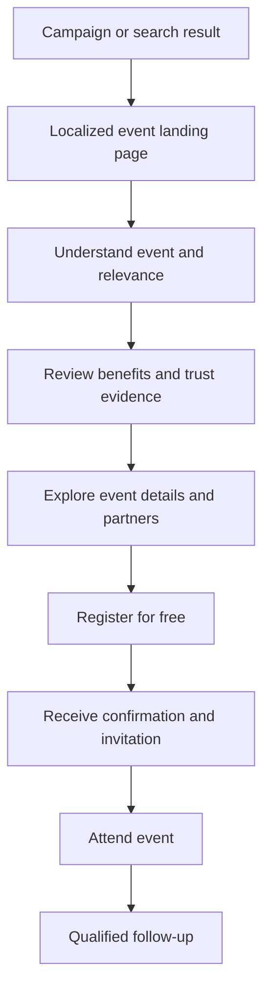
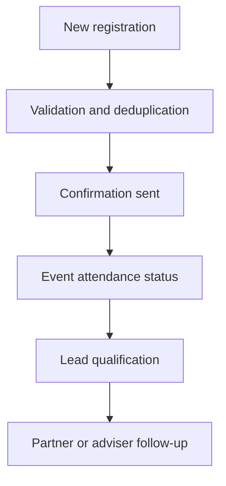

# Spimar Immo Digital Experience Redesign

## UX/UI Audit, Conversion Architecture and Scalable Multi-Market Platform Strategy

**Prepared for:** Clarkom — Pre-Onboarding Assignment  
**Project:** Spimar Immo  
**Source websites:** [spimarimmo.com](https://spimarimmo.com/) and [clarkom.com](https://clarkom.com/)  
**Document status:** Discovery and strategic design direction  
**Date:** July 2026

---

## 1. Executive Summary

Spimar Immo is an international real-estate event platform connecting Moroccans living abroad with Moroccan property developers, financial institutions and real-estate advisers.

The website's primary purpose is not simply to display real-estate projects. Its most important business objective is to transform campaign traffic into qualified event registrations:

> Discover the event → understand its value → trust the organizers and exhibitors → register → attend → become a qualified real-estate lead.

The current website communicates the general purpose of Spimar Immo, lists country-specific editions and provides attendance forms. However, the experience lacks the clarity, trust architecture, content hierarchy and conversion strategy required for an international event platform.

The recommended solution is a premium, dark, multilingual and event-focused experience supported by one reusable multi-market platform. Instead of building and maintaining disconnected country websites, Clarkom should be able to create, localize, publish, monitor and archive every Spimar event through a shared CMS and component system.

Next.js is recommended over a plain React single-page application because the project requires server-rendered content, strong SEO, localized event pages, image optimization, structured metadata, controlled caching and high performance.

---

## 2. Assignment Objectives

This assignment covers:

1. Auditing the existing Spimar Immo website.
2. Understanding the platform's audience, purpose and conversion model.
3. Identifying UX, UI, content and conversion pain points.
4. Defining a new landing-page information architecture.
5. Establishing a strategic CTA placement system.
6. Proposing a modern premium dark-mode visual direction.
7. Recommending a scalable technical architecture.
8. Defining SEO, performance, accessibility and security requirements.
9. Establishing analytics, KPIs and an implementation roadmap.

---

## 3. Business and Product Understanding

### 3.1 What Spimar Immo provides

Spimar Immo organizes international real-estate exhibitions for:

- Moroccans living abroad.
- Foreign investors interested in Morocco.
- Moroccan property developers.
- Banks and financial institutions.
- Real-estate and financial advisers.
- Institutional and commercial partners.

The website states that Spimar has operated in the real-estate event sector since 2016. Its current digital ecosystem includes a global website and several country-specific subdomains.

### 3.2 Core stakeholder groups

| Stakeholder | Need | Expected outcome |
|---|---|---|
| Visitor | Find trustworthy Moroccan property opportunities | Register and attend an event |
| Investor | Compare projects and obtain professional guidance | Identify a qualified opportunity |
| Property developer | Reach a qualified diaspora audience | Generate leads and sales conversations |
| Financial institution | Offer financing guidance | Acquire qualified finance prospects |
| Spimar | Organize and promote successful exhibitions | Attendance, credibility and commercial results |
| Clarkom | Launch and manage campaigns efficiently | Reusable, measurable event infrastructure |

### 3.3 Primary business conversion

The primary conversion should be:

> Free event registration / invitation reservation

Secondary conversions can include:

- WhatsApp conversation.
- Request for event information.
- Add event to calendar.
- View exhibitors.
- Watch a previous edition.
- Subscribe for future event announcements.

### 3.4 Core business opportunity

The redesign should evolve Spimar Immo from a set of isolated informational pages into a reusable event-conversion system.

Clarkom should be able to:

- Create a new country event without rebuilding a website.
- Localize content by language and market.
- Reuse approved sections and components.
- Manage dates, locations, speakers, partners and forms.
- Apply campaign-specific tracking.
- Monitor registrations and conversion rates.
- Archive previous events without losing SEO value.
- Maintain consistent branding across all countries.

---

## 4. Target Audiences

### 4.1 Primary persona — Diaspora property buyer

**Profile**

- Moroccan citizen living in France, Belgium, Canada, Germany, the UAE or another international market.
- Interested in buying a residence, family property, retirement home or investment property in Morocco.
- May have limited knowledge about projects, regulations or financing.

**Goals**

- Discover credible projects.
- Compare options across Moroccan cities.
- Speak directly with developers.
- Understand available financing.
- Avoid unreliable intermediaries.
- Make progress during a short visit.

**Concerns**

- Is the event legitimate?
- Are the developers trustworthy?
- Is registration free?
- Will somebody aggressively sell to me?
- Are financing consultations available?
- Is the event relevant if I have not selected a project?
- How will my personal information be used?

### 4.2 Secondary persona — Investor

**Goals**

- Find projects with strong investment potential.
- Compare cities, developers and property categories.
- Obtain more advanced commercial and financial information.
- Arrange follow-up conversations.

### 4.3 B2B persona — Exhibitor or partner

**Goals**

- Understand the audience quality.
- Review previous editions.
- Assess event credibility and reach.
- Request participation or partnership information.

### 4.4 Internal persona — Event manager

**Goals**

- Launch event pages rapidly.
- Update content without involving developers.
- Manage registrations.
- export or synchronize leads.
- Track campaign attribution.
- Monitor registrations by country, channel and event.

---

## 5. Current Experience Audit

## 5.1 Strengths

- The core niche is clear: Moroccan real estate for Moroccans abroad.
- Event attendance is already treated as the primary action.
- Country-specific editions demonstrate international reach.
- The website includes information about developers, banks and advisory support.
- Spimar communicates experience, transparency and professional guidance.
- Arabic content directly addresses a significant target audience.
- Legal and privacy pages are present.
- The relationship with Clarkom as an organizer is visible.

## 5.2 Positioning and messaging issues

The current hero explains the category, but it does not provide enough immediate event information.

The first screen should answer:

- What is the event?
- Who is it for?
- Where will it happen?
- When will it happen?
- What will the visitor gain?
- Is attendance free?
- Why should the visitor trust it?
- What should the visitor do next?

The present messaging emphasizes broad qualities such as credibility, transparency and quality. These are important but repetitive. They need to be converted into specific visitor benefits and verifiable evidence.

### Recommended change

Replace generic claims with:

- Real dates and locations.
- Verified partner logos.
- Previous event photography.
- Concrete visitor benefits.
- Confirmed exhibitor categories.
- Real event statistics.
- Testimonials and media evidence.

## 5.3 Information architecture issues

- Global and country pages do not follow one clear reusable structure.
- Country choice is not treated as a central journey decision.
- Upcoming and past events are not clearly distinguished.
- Event details are not sufficiently prioritized.
- Long informational sections compete with the registration objective.
- The relationship among Spimar, Clarkom, developers and financial partners needs clarification.
- Some country experiences contain very limited supporting content.
- Navigation labels do not fully represent the user's questions.

## 5.4 UX issues

- The next event is not always understandable within the first screen.
- Users must process significant text before gaining confidence.
- The page does not progressively answer objections before requesting registration.
- The registration form does not receive enough contextual support.
- Country landing pages may feel incomplete when content or assets are unavailable.
- There is insufficient guidance about what happens after registration.
- Mobile visitors need a persistent and accessible action.
- Partner and exhibitor discovery is underdeveloped.

## 5.5 UI and visual-system issues

- Some visual assets appear blurred or insufficiently optimized.
- The hero lacks a strong premium real-estate composition.
- The dark aesthetic does not yet provide sufficient depth and hierarchy.
- Typography, spacing and components need greater consistency.
- The CTA presentation feels generic.
- Sections rely heavily on text instead of structured visual proof.
- Brand color usage needs a documented system.
- The website needs a consistent Arabic and Latin typography strategy.
- Skeleton/loading states must not appear as dominant content.

## 5.6 Conversion issues

The current website includes registration CTAs, but conversion depends on more than CTA frequency.

Before registering, a visitor requires:

1. Relevance.
2. Event clarity.
3. Tangible value.
4. Trust.
5. Low perceived commitment.
6. Clear expectations.
7. Urgency or a reason to act now.

The current journey does not consistently build these conditions in sequence.

## 5.7 Content issues

- Similar ideas are repeated across sections.
- Long paragraphs are difficult to scan.
- Visitor benefits need stronger prioritization.
- Event facts and general brand content are mixed.
- Copy does not always distinguish first-time visitors, investors and partners.
- The platform needs content rules for future country pages.

---

## 6. Pain-Point Matrix

| Pain point | Effect | Priority | Recommended response |
|---|---|---:|---|
| Event date and location are not immediately prominent | Users cannot quickly evaluate relevance | Critical | Place event facts in the hero and sticky mobile CTA |
| Generic value proposition | Weak differentiation and reduced urgency | Critical | Use benefit-led, city-specific messaging |
| Limited trust evidence | Users hesitate to share their data | Critical | Add verified partners, previous editions, statistics and testimonials |
| Fragmented country websites | Inconsistent UX and high maintenance cost | Critical | Build one multi-market platform with reusable event templates |
| Repetitive long content | Reduced comprehension | High | Convert content into short sections, cards, steps and FAQs |
| Weak pre-form persuasion | Lower registration conversion | High | Build a deliberate trust and objection-handling sequence |
| Inconsistent visual system | Lower perceived quality | High | Establish documented tokens and reusable components |
| No clear post-registration journey | User uncertainty | High | Explain confirmation, invitation and follow-up flow |
| Weak event discovery | Visitors struggle to find relevant editions | Medium | Add country and upcoming-event directory |
| Limited measurement model | Decisions cannot be tied to evidence | High | Implement campaign attribution and conversion analytics |
| Heavy or unoptimized assets | Slow loading and campaign drop-off | High | Use responsive images, caching and strict performance budgets |
| Insufficient localization framework | Inconsistent international content | High | Implement locale-aware routes and CMS validation |

---

## 7. UX Strategy

### 7.1 Experience principles

The redesigned experience should follow six principles:

1. **Event clarity first** — communicate what, where, when and for whom.
2. **Benefits before biography** — explain visitor value before long brand history.
3. **Evidence over claims** — use real partners, photography and results.
4. **One primary conversion** — maintain consistent registration language.
5. **Local relevance** — adapt every event page to its host market.
6. **Reusable architecture** — avoid unique one-off implementations.

### 7.2 Desired user journey



### 7.3 Information priority

Every localized page should follow this information order:

1. Event identity.
2. Date and venue.
3. Visitor benefit.
4. Registration action.
5. Trust evidence.
6. Reasons to attend.
7. Exhibitors and opportunities.
8. Event logistics.
9. Previous-edition evidence.
10. FAQ and objection handling.
11. Final registration.

---

## 8. Proposed Landing-Page Architecture

## 8.1 Utility and primary navigation

Recommended navigation:

- Logo.
- Upcoming event.
- Why attend?
- Exhibitors.
- Previous editions.
- FAQ.
- Language switcher.
- Country selector.
- Primary CTA: **Register for free**.

The primary navigation should become compact and sticky after scrolling.

## 8.2 Hero section

The hero must communicate the complete offer within a few seconds.

### Required content

- Spimar identity.
- Host city and country.
- Event category.
- Audience.
- Date.
- Venue.
- Primary benefit statement.
- Registration status.
- Primary CTA.
- Secondary exploration CTA.
- One immediate trust signal.

### Example copy

> **Meet Morocco's leading real-estate developers in Paris**
>
> Compare selected projects, speak with financing partners and receive personalized guidance—all in one event created for Moroccans living in France.

### Actions

- **Reserve my free invitation**
- **Explore the event**

### Supporting information

- Event date.
- Venue.
- Free-registration label.
- Capacity or registration deadline when accurate.
- Confirmed partner logos.

## 8.3 Trust strip

Show a short evidence bar below the hero:

- Operating since 2016.
- Number of editions.
- Number of visitors.
- Number of participating developers.
- Number of financial partners.

Only verified statistics should be published.

## 8.4 Why attend?

Use benefit-led cards:

- Discover selected Moroccan projects.
- Compare opportunities across multiple cities.
- Meet developers directly.
- Explore financing solutions.
- Receive personalized guidance.
- Save time by meeting key stakeholders in one place.

## 8.5 Upcoming-event details

This section should contain:

- Date and opening hours.
- Venue address.
- Map and navigation link.
- Event agenda.
- Accessibility information.
- Transport or parking information.
- Add-to-calendar action.
- Contact support.

## 8.6 Exhibitors and partners

Separate participants into:

- Property developers.
- Financial institutions.
- Institutional partners.
- Media partners.
- Organizer.

Each item can include:

- Logo.
- Name.
- Category.
- Short description.
- Confirmed status.

## 8.7 Featured destinations or opportunities

The event page should preview relevant property destinations without becoming a complete property marketplace:

- Casablanca.
- Rabat.
- Marrakech.
- Tangier.
- Agadir.
- Other strategic regions.

Recommended CTA:

> Discover available opportunities at the event

## 8.8 How it works

Use a five-step visual sequence:

1. Register online.
2. Receive confirmation and invitation.
3. Visit the event.
4. Meet developers and advisers.
5. Continue with qualified opportunities.

## 8.9 Previous editions

Include:

- Real event photography.
- Short highlight video.
- Previous cities and dates.
- Visitor testimonials.
- Participating brands.
- Media coverage.
- Verified results.

This is a key trust-building section.

## 8.10 Registration section

### Recommended initial fields

- Full name.
- Email address.
- Phone or WhatsApp number.
- Country/city of residence.
- General property interest.
- Consent.

Do not request sensitive financial details during the first registration unless operationally required.

### Form UX requirements

- Clearly mark required and optional fields.
- Use localized validation messages.
- Preserve entered information after a recoverable error.
- Explain why the phone number is requested.
- Link to the privacy policy.
- Show a clear loading state.
- Prevent duplicate submission.
- Provide a clear success state.
- Send confirmation through email and/or approved messaging channels.

## 8.11 FAQ

Recommended questions:

- Is attendance free?
- Do I need an invitation?
- Can I attend without choosing a project?
- Which developers will participate?
- Are financing consultations available?
- Is this an event or a property-sales platform?
- Can I bring another person?
- Is the venue accessible?
- How will my information be used?
- What happens after registration?

## 8.12 Final conversion section

Example:

> **One event. Multiple developers. Real opportunities across Morocco.**

CTA:

> **Reserve my free invitation**

Repeat the city, date and venue near the action.

## 8.13 Footer

Include:

- Spimar contact information.
- Clarkom organizer information.
- Country/event directory.
- Privacy policy.
- Legal notice.
- Cookie preferences.
- Social channels.
- Language selection.

---

## 9. CTA and Conversion Strategy

### 9.1 Primary CTA

Use one primary action consistently:

> **Register for free**

or:

> **Reserve my free invitation**

The final wording should be validated with the business and tested by language.

### 9.2 Secondary actions

- View event details.
- Explore exhibitors.
- Watch previous edition.
- Add to calendar.
- Contact via WhatsApp.

Secondary actions must not visually compete with registration.

### 9.3 Recommended CTA placement

| Location | CTA behavior |
|---|---|
| Header | Persistent registration action |
| Hero | Main conversion |
| After benefits | Conversion after value explanation |
| After exhibitors | Conversion after opportunity proof |
| After previous editions | Conversion after trust proof |
| Final section | Full registration form |
| Mobile bottom bar | Persistent thumb-accessible CTA |

### 9.4 CTA interaction

The CTA should:

- Scroll to the registration section, or
- Open a focused registration step/modal when appropriate.

It should not unexpectedly redirect visitors across domains.

### 9.5 Conversion psychology

The experience should progressively establish:

1. **Relevance:** this event is designed for me.
2. **Value:** attending helps me solve a real problem.
3. **Trust:** the organizers and participants are credible.
4. **Ease:** registration is simple and free.
5. **Expectation:** I understand what happens next.
6. **Urgency:** the event has a date, capacity or registration deadline.

---

## 10. Visual and Art Direction

## 10.1 Desired brand attributes

The new experience should feel:

- Premium.
- International.
- Trustworthy.
- Contemporary.
- Real-estate oriented.
- Event driven.
- Moroccan without visual clichés.
- Editorial and spacious.

## 10.2 Dark-mode color direction

| Role | Direction |
|---|---|
| Main background | Deep charcoal with green undertone |
| Raised surface | Graphite / deep emerald |
| Primary accent | Refined Moroccan green or turquoise |
| Secondary accent | Controlled warm gold |
| Main text | Warm white |
| Secondary text | Muted stone |
| Borders | Low-contrast cool gray/green |
| Success | Accessible emerald |
| Error | Accessible warm red |

Final colors must be tested for WCAG contrast.

## 10.3 Typography

Use a deliberate bilingual type system:

- High-quality Arabic font with excellent screen legibility.
- Compatible Latin font for French and English.
- Clear display, heading, body, label and caption scales.
- Controlled line length for Arabic and Latin paragraphs.
- Responsive type using `clamp()` or tokenized sizes.

Typography should support both right-to-left and left-to-right interfaces without layout compromise.

## 10.4 Photography

Prioritize:

- Real exhibition photography.
- Real visitors and conversations.
- Moroccan architecture and urban environments.
- Premium property imagery.
- Developer and partner presence.

Avoid:

- Generic stock handshakes.
- Excessive skyline composites.
- Low-resolution event photography.
- Decorative imagery that competes with the CTA.

## 10.5 Motion

Motion should support comprehension:

- Controlled content reveal.
- Subtle image depth.
- Animated statistics when visible.
- Smooth anchor navigation.
- Clear form transitions.
- Reduced-motion support.

Avoid:

- Heavy scroll hijacking.
- Autoplay video on mobile.
- Long loading intros.
- Excessive parallax.
- Animations that delay registration.

## 10.6 Component direction

Create reusable components for:

- Navigation.
- Event hero.
- Date and venue badge.
- CTA.
- Trust metrics.
- Benefit cards.
- Partner logos.
- Destination cards.
- Agenda.
- Testimonials.
- Media gallery.
- FAQ.
- Registration form.
- Success confirmation.
- Footer.

---

## 11. Responsive and Accessibility Strategy

### 11.1 Mobile-first priorities

Campaign traffic is likely to include a high proportion of mobile visitors. The mobile experience should prioritize:

- Event identity.
- Date and location.
- Registration CTA.
- Fast loading.
- Short scannable sections.
- Thumb-friendly controls.
- Native input behavior.
- WhatsApp support.

### 11.2 Breakpoints

Use content-based responsive behavior rather than device-specific designs.

Recommended ranges:

- Small mobile.
- Large mobile.
- Tablet.
- Laptop.
- Wide desktop.

### 11.3 Accessibility requirements

- WCAG 2.2 AA target.
- Keyboard-accessible navigation and forms.
- Visible focus states.
- Semantic landmarks and heading order.
- Accessible form labels and errors.
- Descriptive alt text.
- Sufficient color contrast.
- Reduced-motion support.
- Logical RTL and LTR reading order.
- Minimum comfortable interactive target sizes.

---

## 12. Technical Architecture Recommendation

## 12.1 Framework decision

### Recommended: Next.js

React is the underlying UI library. Next.js adds the application capabilities required for this platform:

- Server rendering.
- Static generation and revalidation.
- Routing and localized layouts.
- Metadata handling.
- Image and font optimization.
- Server Components.
- Secure server-side operations.
- API/route handlers where appropriate.
- Strong deployment and caching options.

A plain React SPA is not recommended as the default because it would require additional solutions for SEO, rendering, routing, metadata, caching and server operations.

## 12.2 Suggested stack

- **Framework:** Next.js App Router.
- **Language:** TypeScript.
- **Styling:** Tailwind CSS.
- **Components:** Reusable internal UI system; selectively use accessible headless primitives.
- **Content:** Headless CMS.
- **Database:** PostgreSQL/Supabase or equivalent managed relational database.
- **Validation:** Zod.
- **Forms:** Native forms or React Hook Form when form complexity justifies it.
- **Email:** Transactional email provider.
- **Analytics:** Privacy-conscious analytics plus campaign conversion tracking.
- **Monitoring:** Error, performance and uptime monitoring.
- **Hosting/CDN:** Platform supporting edge delivery and secure preview deployments.

## 12.3 Multi-market URL model

Preferred long-term structure:

```text
spimarimmo.com/
spimarimmo.com/france/paris
spimarimmo.com/belgium/brussels
spimarimmo.com/canada/montreal
spimarimmo.com/uae/abu-dhabi
spimarimmo.com/usa/new-york
```

Benefits:

- Consolidated domain authority.
- Easier analytics.
- Shared deployment.
- Simplified CMS.
- Consistent design and behavior.
- Lower maintenance cost.
- Easier international SEO governance.

Existing subdomains can:

- Redirect permanently to canonical routes, or
- Resolve to the same Next.js application when campaign requirements demand subdomains.

The final choice should consider existing indexed URLs, campaigns, analytics and operational constraints.

## 12.4 CMS event model

Each event should contain:

- Event ID and status.
- Country.
- City.
- Languages.
- Title and description.
- Start/end dates.
- Time zone.
- Venue and map information.
- Registration status and capacity.
- Hero media.
- Benefits.
- Agenda.
- Partners and exhibitors.
- Destinations/projects.
- Testimonials.
- Previous-edition media.
- FAQ.
- Form configuration.
- SEO metadata.
- Social preview media.
- Tracking configuration.
- Publication schedule.

## 12.5 Event lifecycle

Recommended statuses:

```text
Draft → Review → Scheduled → Registration Open → Registration Closed
→ Event Live → Event Completed → Archived
```

Each status should control:

- CTA wording.
- Registration availability.
- Page banners.
- Indexing rules.
- Confirmation messaging.
- Archived content.

## 12.6 Registration data model

Core entities:

- Visitor.
- Event.
- Registration.
- Consent.
- Campaign attribution.
- Communication log.
- Attendance status.
- Lead status.
- Internal note.

Avoid storing unnecessary sensitive personal or financial information.

---

## 13. Performance Strategy

### 13.1 Core Web Vitals targets

- **LCP:** below 2.5 seconds.
- **CLS:** below 0.1.
- **INP:** below 200 milliseconds.

These should be measured at the 75th percentile using real-user data.

### 13.2 Performance requirements

- Render meaningful content on the server.
- Use responsive AVIF/WebP images.
- Prevent layout shifts with explicit media dimensions.
- Self-host and subset fonts.
- Keep the hero lightweight.
- Avoid heavy client-side libraries.
- Use Server Components by default.
- Lazy-load non-critical galleries and video.
- Cache published event pages.
- Revalidate only when content changes.
- Minimize third-party tracking scripts.
- Respect performance budgets during development.

### 13.3 Suggested budgets

- Initial critical JavaScript: as small as realistically possible.
- No large unoptimized hero video on mobile.
- Compressed hero media with responsive variants.
- Maximum third-party script count defined before implementation.
- Automated Lighthouse and bundle checks in CI.

---

## 14. SEO Strategy

### 14.1 Technical SEO

- Server-render indexable content.
- Unique metadata per event and locale.
- Canonical URLs.
- Correct `hreflang`.
- XML sitemaps.
- Robots rules.
- Semantic headings.
- Accessible internal navigation.
- Permanent redirects from retired URLs.
- Clean handling of past events.

### 14.2 Structured data

Use applicable schema:

- `Event`.
- `Organization`.
- `BreadcrumbList`.
- `FAQPage`, only when content and current search-engine policies support it.
- `Place`.

Event structured data can include:

- Name.
- Dates.
- Status.
- Attendance mode.
- Location.
- Organizer.
- Image.
- Description.

### 14.3 Content SEO

Create localized pages around real visitor intent:

- Moroccan real-estate exhibition in Paris.
- Buy property in Morocco from France.
- Moroccan property investment event.
- Financing Moroccan property from abroad.

Content must remain natural, useful and market-specific.

### 14.4 International SEO

- Match content language to market needs.
- Maintain translation parity for critical information.
- Do not auto-redirect users solely based on IP.
- Allow country and language selection.
- Preserve locale choice.
- Define one canonical page for each event-language combination.

---

## 15. Security and Privacy Strategy

### 15.1 Application security

- Server-side input validation.
- Output encoding.
- Rate limiting.
- Bot and spam protection.
- Secure headers.
- Content Security Policy.
- Strict transport security.
- Controlled CORS.
- Secure cookie configuration.
- Dependency monitoring.
- Secrets stored outside source code.
- Restricted CMS roles.
- Audit logs for sensitive operations.

### 15.2 Registration security

- Prevent duplicate submissions.
- Normalize phone and email data.
- Validate consent.
- Avoid exposing internal database identifiers.
- Protect exports.
- Restrict lead access by role.
- Record meaningful lead-state changes.

### 15.3 Privacy

- Collect only necessary information.
- Explain the purpose of every sensitive field.
- Separate event communication consent from unrelated marketing consent.
- Define retention and deletion policies.
- Provide a contact route for privacy requests.
- Document third-party processors.
- Avoid sending personal details into analytics tools.

Final compliance requirements should be reviewed against the countries in which the events and registrations operate.

---

## 16. Analytics and Measurement

## 16.1 Primary KPIs

- Landing-page conversion rate.
- Registration completion rate.
- Cost per registration.
- Qualified registration rate.
- Attendance rate.
- Lead-to-meeting rate.
- Lead-to-opportunity rate.
- Channel conversion rate.
- Country/event conversion rate.

## 16.2 UX metrics

- Hero CTA click rate.
- Form-start rate.
- Form-abandonment rate.
- Field-level error rate.
- Scroll depth.
- Partner-section engagement.
- FAQ engagement.
- Mobile vs desktop conversion.
- Core Web Vitals.

## 16.3 Recommended event taxonomy

- `event_page_view`
- `hero_register_click`
- `sticky_register_click`
- `view_event_details`
- `view_exhibitor`
- `play_previous_event_video`
- `registration_start`
- `registration_error`
- `registration_complete`
- `calendar_add`
- `whatsapp_contact`

Events should include non-sensitive dimensions:

- Event ID.
- Country.
- City.
- Language.
- Campaign source.
- Campaign medium.
- Campaign name.
- Device category.

## 16.4 Experimentation opportunities

Test:

- Hero value proposition.
- CTA label.
- Embedded form versus focused modal.
- Trust-strip placement.
- Partner logos near the hero.
- Short versus detailed registration form.
- Event photography versus architectural imagery.

Tests require sufficient traffic and a clearly defined success metric.

---

## 17. Content Strategy

### 17.1 Content hierarchy

Each section should answer one visitor question:

| Section | Question answered |
|---|---|
| Hero | What is this, where and when? |
| Trust strip | Why should I believe it? |
| Benefits | Why should I attend? |
| Event details | What will happen? |
| Partners | Who will I meet? |
| Opportunities | What can I discover? |
| How it works | What happens after I register? |
| Previous editions | Has this worked before? |
| FAQ | What concerns remain? |
| Form | How do I participate? |

### 17.2 Tone of voice

- Professional.
- Clear.
- Reassuring.
- Direct.
- International.
- Human.
- Free of inflated claims.

### 17.3 Localization workflow

1. Create approved source copy.
2. Translate professionally.
3. Review with a market/language owner.
4. Validate dates, location and partner names.
5. Preview RTL/LTR layouts.
6. Publish through approval workflow.
7. Re-check after any event update.

---

## 18. Registration and Follow-Up Journey

### 18.1 Before submission

- Explain what the user receives.
- Show the event facts.
- State whether registration is free.
- Link privacy information.
- Keep the commitment small.

### 18.2 Success state

The confirmation screen should:

- Confirm successful registration.
- Repeat event date and location.
- Explain invitation delivery.
- Provide an add-to-calendar action.
- Offer directions or event details.
- Allow users to contact support.

### 18.3 Communication sequence

Potential sequence:

1. Immediate confirmation.
2. Invitation/event details.
3. Reminder before the event.
4. Final practical reminder.
5. Post-event follow-up.

Communication frequency and consent must be controlled.

### 18.4 Internal lead workflow



---

## 19. Suggested Page Inventory

### Global platform

- Global homepage.
- Event directory.
- Country directory.
- About Spimar.
- Previous editions.
- Partners.
- Contact.
- Privacy policy.
- Legal notice.
- Cookie policy/preferences.

### Event pages

- Localized event landing page.
- Registration confirmation.
- Registration-closed state.
- Event-completed/archive state.

### Optional B2B pages

- Become an exhibitor.
- Become a partner.
- Request event information.

---

## 20. Implementation Roadmap

## Phase 0 — Discovery

- Confirm business objectives.
- Interview Spimar and Clarkom stakeholders.
- Review analytics and campaign sources.
- Inventory all domains and subdomains.
- Document current forms and lead destinations.
- Confirm supported languages and future markets.
- Validate legal and privacy requirements.

## Phase 1 — Audit and definition

- Complete UX/UI audit.
- Perform content inventory.
- Map current and target journeys.
- Define conversion KPIs.
- Establish prioritized requirements.
- Define technical and content constraints.

## Phase 2 — UX architecture

- Sitemap.
- Event template architecture.
- Low-fidelity wireframes.
- Form flow.
- Error and success states.
- Mobile navigation.
- CMS content model.

## Phase 3 — UI system

- Art direction.
- Color and typography tokens.
- Spacing and layout system.
- Component specifications.
- Responsive states.
- RTL/LTR behavior.
- Accessibility validation.
- High-fidelity landing page.

## Phase 4 — Technical foundation

- Next.js application.
- CMS integration.
- Database and registration flow.
- Authentication for administrators.
- Analytics.
- Email confirmations.
- Security configuration.
- CI/CD and preview environments.

## Phase 5 — First event pilot

- Implement one country/event.
- Migrate validated content.
- Run performance and accessibility tests.
- Complete security review.
- Validate campaign tracking.
- Conduct stakeholder acceptance testing.

## Phase 6 — Migration and rollout

- Create remaining localized events.
- Configure redirects.
- Submit sitemap.
- Monitor crawl and conversion.
- Archive old implementations.
- Train content/event managers.

## Phase 7 — Optimization

- Analyze real-user performance.
- Review form abandonment.
- Run conversion experiments.
- Improve content using event feedback.
- Add operational automation.

---

## 21. Deliverables

Recommended deliverables for the full assignment:

1. Executive project summary.
2. Business and audience analysis.
3. Current-state UX/UI audit.
4. Pain-point matrix.
5. User journey map.
6. Conversion and CTA strategy.
7. Proposed sitemap.
8. Landing-page information architecture.
9. Low-fidelity responsive wireframes.
10. Premium dark-mode visual direction.
11. Design-system foundation.
12. High-fidelity desktop and mobile screens.
13. Next.js technical architecture.
14. CMS and event content model.
15. SEO strategy.
16. Performance plan.
17. Security and privacy plan.
18. Analytics taxonomy.
19. Migration plan.
20. Phased delivery roadmap.

---

## 22. Risks and Mitigations

| Risk | Impact | Mitigation |
|---|---|---|
| Unverified statistics or partner claims | Loss of trust | Publish only approved evidence |
| Separate codebases per country | High cost and inconsistency | Use one multi-market platform |
| Heavy video and imagery | Slow campaign pages | Enforce media and performance budgets |
| Long registration form | High abandonment | Progressive profiling and short first step |
| Uncontrolled translations | Incorrect event information | Introduce locale review and approval |
| Poor redirect strategy | SEO loss | Inventory URLs and implement tested redirects |
| Excessive tracking | Performance/privacy problems | Tracking governance and consent controls |
| CMS over-flexibility | Inconsistent pages | Use structured content and constrained components |
| Weak post-registration operations | Low attendance | Automate confirmation and reminders |

---

## 23. Acceptance Criteria

The first production event page should:

- Clearly communicate the event, audience, date and city above the fold.
- Provide one consistent primary registration CTA.
- Support Arabic and relevant Latin-language content.
- Work correctly in RTL and LTR.
- Meet agreed accessibility targets.
- Meet Core Web Vitals targets using real-user monitoring.
- Produce indexable server-rendered content.
- Include valid event metadata.
- Protect registration endpoints against spam and abuse.
- Capture campaign attribution without collecting sensitive analytics data.
- Provide clear success, error, closed and archived states.
- Allow authorized staff to update event content without code changes.

---

## 24. Strategic Recommendation

Spimar Immo should not receive only a new isolated landing page.

The better long-term solution is:

> A reusable event-conversion platform that allows Clarkom to launch, localize, manage, measure and optimize every international Spimar Immo campaign from one centrally controlled system.

The first redesigned landing page should serve as the pilot template for this wider system. It should prove:

- Stronger information hierarchy.
- Greater trust.
- Higher registration conversion.
- Better mobile performance.
- Cleaner multilingual management.
- Faster launch of future events.
- Lower maintenance cost.

---

## 25. Recommended Next Steps

1. Obtain current analytics, registration and campaign data.
2. Inventory all active and historic Spimar subdomains.
3. Confirm the next priority event and its content.
4. Validate visitor and business requirements with Clarkom.
5. Define measurable baseline KPIs.
6. Build the desktop and mobile wireframes.
7. Establish the dark-mode visual system.
8. Produce high-fidelity event screens.
9. Validate the reusable CMS model.
10. Implement the first Next.js pilot page.

---

## Conclusion

The existing Spimar Immo website provides a useful foundation and communicates the essential purpose of the organization. Its main weakness is not the absence of content; it is the absence of a deliberate conversion hierarchy and a scalable multi-market delivery system.

The redesigned experience should place the visitor's decision at the center:

> Is this event relevant, credible, valuable and easy to attend?

Every section should help answer that question and move the visitor toward a confident registration.

By combining a premium bilingual design, clear event information, evidence-based trust, consistent CTAs and a reusable Next.js/CMS architecture, Clarkom can transform Spimar Immo into a faster, more measurable and more scalable international event platform.

