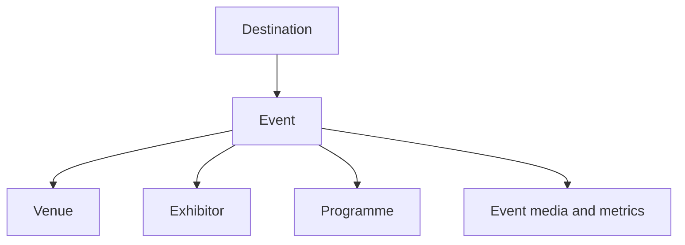
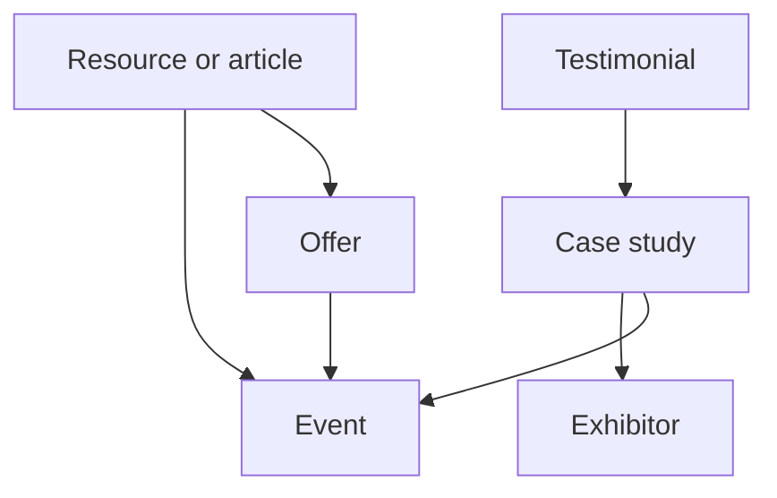
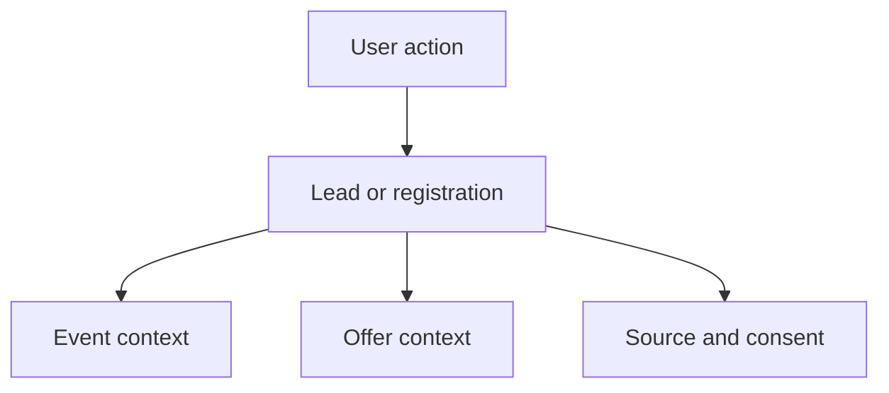

# SPIMARIMMO - Phase 01 Product Foundation and Information Architecture

**Source:** `SPIMARIMMO_Specifications_Strategie_UX_Contenus.pdf`  
**Depends on:** Phase 00 Source Audit  
**Version:** 0.9  
**Status:** complete draft - awaiting Gate 1 business decisions

---

## 1. How to read this document

This phase converts the strategic source into a product and content architecture. It does not yet specify implementation technology.

| Label | Meaning |
|---|---|
| **CONFIRMED** | Explicitly required by the source PDF |
| **PROPOSED** | Architecture needed to make the confirmed strategy coherent and scalable; requires approval |
| **OPEN** | Business, legal, operational, or technical decision not contained in the source |

## 2. Product foundation

### 2.1 Product definition

**CONFIRMED**  
SPIMARIMMO is a B2B event marketing and conversion platform that connects Moroccan real-estate developers with qualified MRE and international investor demand through an organized international salon network.

The public website has two coordinated roles:

1. **Primary commercial role:** persuade, reassure, qualify, and convert developer decision-makers into exhibitor opportunities.
2. **Supporting demand role:** help visitors discover, understand, register for, and prepare for relevant events, while producing credible evidence of audience demand.

### 2.2 Problem statement

Developer decision-makers are asked to make a high-value commitment, but an event-led website often presents dates and atmosphere without adequately explaining commercial value, audience quality, delivery method, evidence, expected return, and operational support.

The product must reduce that perceived risk by connecting every promise to visible proof and every decision stage to an appropriate next action.

### 2.3 Vision

Create the trusted digital decision platform for Moroccan real-estate developers evaluating access to MRE and international buyers, while giving visitors the simplest route to the right event and a useful, consent-based preparation experience.

### 2.4 North Star experience

A developer decision-maker can, in less than 90 seconds:

- understand what SPIMARIMMO organizes;
- identify where and when the network operates;
- recognize the intended audience and its motivations;
- inspect credible proof and comparable outcomes;
- understand what is delivered before, during, and after an event;
- choose a relevant event or offer;
- take the next step through stand request, appointment, WhatsApp, or brochure.

### 2.5 Product outcomes

| Outcome | Product interpretation | Candidate measure |
|---|---|---|
| Increase qualified exhibitor demand | More high-intent commercial conversations for specific salons/offers | Qualified exhibitor leads by event and source |
| Reduce decision friction | Decision-makers find proof, method, offer, and next action quickly | Proof engagement, offer views, brochure-to-meeting progression |
| Strengthen credibility | Public claims are sourced, dated, and connected to evidence | Percentage of published claims with approved evidence metadata |
| Grow useful visitor demand | Visitors find and register for relevant events | Pre-registration completion and qualified consent rate |
| Improve operational reuse | One content model powers event, destination, proof, resource, and campaign surfaces | Template reuse and editorial time per event update |
| Create a measurable funnel | Marketing and commercial teams can trace acquisition to meaningful outcomes | Source/medium/campaign/event attribution coverage |

All candidate measures remain **PROPOSED** until KPI definitions, analytics tools, and lead stages are approved in the PRD.

### 2.6 Scope boundary

#### Confirmed public scope

- exhibitor-focused homepage;
- event discovery and detail;
- exhibitor proposition, method, proof, offers, case studies, testimonials, resources, and contact paths;
- visitor event discovery, programme/exhibitor information, practical information, FAQ, and pre-registration;
- transversal company, partner, media, editorial, contact, and legal pages.

#### Proposed enabling scope

- structured CMS for reusable destinations, events, offers, evidence, resources, case studies, testimonials, exhibitors, and articles;
- lead capture with source/event/offer context and consent record;
- editorial preview, validation, scheduled publishing, and archive behavior;
- analytics taxonomy covering content, proof, conversion, and errors.

#### Open or not yet approved

- online stand payment or contractual reservation;
- authenticated exhibitor or visitor portals;
- ticket/QR issuance and on-site check-in;
- in-platform lead delivery to exhibitors;
- visitor-to-exhibitor appointment marketplace;
- multilingual launch scope;
- CRM, CMS, WhatsApp, calendar, email, analytics, and consent vendors;
- personalization, marketing automation, or advanced lead scoring.

These items must not be treated as committed features until Phase 2.

## 3. Audience and decision-role architecture

### 3.1 Primary B2B decision unit

The source correctly treats the developer decision as collective. The website must serve three roles in one buying unit without creating three separate products.

| Role | Core job | Primary question | Required proof | Desired action |
|---|---|---|---|---|
| General management | Decide whether participation is a credible, controlled investment | “Is the organizer trustworthy, and is the commercial risk justified?” | Track record, verified scale, recognized partners, comparable outcomes, clear terms | Request senior discussion or approve evaluation |
| Commercial leadership | Assess opportunity quality and sales potential | “Will we meet qualified prospects and obtain usable leads/appointments?” | Qualification method, audience intent, appointment mechanics, lead definitions, case-study outcomes, reporting sample | Select event, inspect offer, book commercial meeting |
| Marketing leadership | Assess reach, image, content, and campaign value | “What visibility and campaign assets do we receive?” | Media plan, campaign artifacts, reach definitions, content capture, press/influence proof, deliverable inventory | Compare packages, download brochure, request activation plan |

### 3.2 Secondary visitor roles

**CONFIRMED shared intent:** find the right city/event, understand the programme and access, discover exhibitors, pre-register, and prepare appointments.

**PROPOSED intent segments for content relevance:**

- primary-residence buyer;
- secondary-residence buyer;
- return-to-Morocco project;
- retirement project;
- property investor;
- intergenerational/family transmission project.

These segments originate from the source’s MRE motivation model. They should guide content and optional visitor qualification, not create unsupported targeting claims.

### 3.3 Operational audiences

The source does not name internal users, but the product requires them.

| Proposed role | Responsibility | Minimum capability to specify in PRD |
|---|---|---|
| Content editor | Maintain articles, resources, basic pages, metadata | Create/edit, preview, submit for approval |
| Event manager | Maintain dates, venues, programme, exhibitors, status, practical details | Structured event editing, validation, archive |
| Marketing reviewer | Validate campaign claims, media, CTAs, SEO, and campaign tracking | Review, approve, schedule, inspect analytics |
| Commercial reviewer | Validate offers, case studies, lead forms, lead ownership, and outcomes | Approve commercial content and routing rules |
| Legal/privacy reviewer | Validate terms, consent, rights, and public claims | Approval checkpoint and change history |
| Administrator | Manage roles, integrations, configuration, and emergency changes | Permissions, audit access, configuration |

Actual role combinations and permissions remain **OPEN** for Phase 2.

## 4. Experience principles

1. **Exhibitor-first hierarchy.** B2B proof controls the homepage; visitor actions are easy to find but do not dominate the first narrative.
2. **Destination makes the network tangible.** Country and event surfaces appear early and act as commercial proof, not only calendar data.
3. **Proof sits next to the claim.** Metrics, sources, media, cases, or concrete deliverables appear at the point of doubt.
4. **Progressive commitment.** Brochure and WhatsApp support early interest; appointments and stand requests serve stronger intent.
5. **One event, one canonical record.** The same event data feeds cards, listings, detail pages, resources, forms, analytics context, and archives.
6. **Status changes the experience.** An upcoming, open, live, completed, postponed, cancelled, or undated event cannot show the same content or CTA.
7. **Content has provenance.** Numbers and claims require source, period, definition, approval status, and owner.
8. **No dead-end content.** Articles, resources, case studies, and testimonials link to a relevant destination, event, offer, or conversion action.
9. **Media supports trust and performance.** Authentic images/video are prioritized with poster, caption, transcript, reduced-motion, responsive, and fallback behavior.
10. **Consent is contextual.** Users see why information is collected, how it is used, and whether it may be shared.

## 5. Core information domains

The diagrams show conceptual relationships, not a finalized database schema.

## 6. Conceptual content-object catalog

### 6.1 Destination

**Purpose:** represent the country/city market and group current/historical events.

**Key attributes:** country, city, locale names, country code, hero media, market introduction, visitor context, practical overview, status, featured priority, SEO metadata.

**Relationships:** has many events, articles, resources, metrics, and optional market evidence.

**Lifecycle:** draft -> reviewed -> published -> inactive/archived.

**Owner:** event operations + editorial.

### 6.2 Event/Salon

**Purpose:** canonical commercial and visitor record for one edition.

**Key attributes:** name, edition/year, destination, status, start/end date, timezone, venue, booking state, registration state, expected/actual attendance, capacity, exhibitor count, short proposition, programme summary, practical data, hero media, featured state, contacts, SEO metadata.

**Relationships:** belongs to destination and venue; has programme items, exhibitors, offers, metrics, galleries, resources, testimonials/cases, and contextual conversion forms.

**Required evidence controls:** expected vs actual label, source, period, definition, approval state.

**Owner:** event operations.

### 6.3 Venue

**Purpose:** normalize hotel/event-location information for accuracy and reuse.

**Key attributes:** official name, address, city, country, map coordinates/link, accessibility information, transport/parking, contact, approved media.

**Relationships:** used by one or more events.

**Owner:** event operations.

### 6.4 Exhibitor/Developer

**Purpose:** represent participating or trusted real-estate developers.

**Key attributes:** legal/public name, logo variants, description, categories/markets, website, participation status, rights/approval record, featured state.

**Relationships:** participates in events; may have case studies, testimonials, media, and programme appearances.

**Important distinction:** “participating in this event,” “past participant,” and “trusted client” are separate claims.

**Owner:** partnerships/commercial.

### 6.5 Offer/Pack

**Purpose:** explain and compare exhibitor participation levels.

**Key attributes:** tier, positioning, availability, event applicability, surface, stand specification, visibility, conferences, campaign inventory, interviews, placement, networking, options, price display rule, tax/terms reference, version/effective dates.

**Relationships:** applies globally or to selected events; links to evidence, brochure, and contextual lead form.

**Owner:** commercial + finance/legal approval.

### 6.6 Metric/Evidence item

**Purpose:** make every quantitative claim governed and reusable.

**Key attributes:** public label, value, unit, metric type, definition, period, geography/event scope, expected/actual status, source name, source URL/file reference, methodology note, approval status, approver, review date, expiry date.

**Relationships:** supports event, destination, homepage block, value pillar, campaign, or case study.

**Owner:** domain owner + reviewer.

### 6.7 Campaign proof

**Purpose:** show concrete evidence of before/during/after marketing delivery.

**Key attributes:** phase, channel, action, artifact/media, reach/result metric, period, campaign/event, usage rights, caption, approval.

**Relationships:** belongs to event/campaign and supports value pillar or case study.

**Owner:** marketing.

### 6.8 Case study

**Purpose:** connect client objective, delivery, outcome, and decision-maker voice.

**Key attributes:** client/exhibitor, event, challenge, objective, solution, deliverables, approved metrics, attribution caveat, quote/video, media, publication permission, CTA, SEO metadata.

**Relationships:** belongs to exhibitor and event; references metrics, offer, testimonial, and media.

**Owner:** commercial + marketing + client approval.

### 6.9 Testimonial

**Purpose:** provide role-specific human validation.

**Key attributes:** person name, role, organization, quote, video, captions/transcript, language, event/case context, permission, approval/expiry.

**Relationships:** links to exhibitor, case study, event, or general proof system.

**Owner:** commercial/communications.

### 6.10 Resource/Download

**Purpose:** support sales education and SEO while enabling progressive conversion.

**Key attributes:** type, title, summary, audience, language, file/asset, version, publication date, event/destination relevance, cover, contents, access rule, form variant, SEO metadata.

**Relationships:** links to event, destination, offer, topic, and lead conversion.

**Owner:** marketing/editorial.

### 6.11 Article/Editorial content

**Purpose:** build expertise and capture relevant organic demand.

**Key attributes:** title, dek, body, author, topic, audience, language, publication/update dates, citations, related event/destination/offer/resource, SEO metadata, structured-data type.

**Relationships:** cross-links to commercial and event content.

**Owner:** editorial + subject reviewer.

### 6.12 Programme item

**Purpose:** structure event programme information.

**Key attributes:** title, type, description, start/end, timezone, stage/room, speakers, language, audience, capacity/registration rule, status.

**Relationships:** belongs to event; may reference exhibitors, speakers, or topics.

**Owner:** event operations.

### 6.13 Person

**Purpose:** represent team members, speakers, testimonial authors, or media contacts without duplicating identity data.

**Key attributes:** name, role, organization, biography, portrait, links, public contact rule, type, consent/rights.

**Relationships:** team page, programme, testimonial, press/contact.

**Owner:** communications/HR/event operations depending on role.

### 6.14 Partner/Media organization

**Purpose:** represent institutional, media, and operating partners.

**Key attributes:** name, type, logo, description, website, active period, event relevance, rights/approval.

**Relationships:** links to event, destination, press item, or company proof.

**Owner:** partnerships/communications.

### 6.15 Lead/Conversion record

**Purpose:** preserve commercial context and consent across conversion channels.

**Conceptual attributes:** lead type, person/company data, role, phone/email, event, offer, message, source/medium/campaign, landing page, referral, language, consent purposes, consent timestamp, privacy version, status, owner, timestamps, delivery state, error state.

**Relationships:** event, offer, resource, campaign, source page, and later CRM record.

**Owner:** commercial/marketing/privacy.

### 6.16 Visitor pre-registration

**Purpose:** register visitor intent and prepare event participation.

**Conceptual attributes:** event, identity/contact, residence city/country, project type, buying horizon, indicative budget band, geographic interest, communication preferences, consent, confirmation status, attendance status.

**OPEN:** ticketing, QR, appointments, guest handling, cancellation, reminders, and exhibitor sharing.

**Owner:** event operations + marketing/privacy.

### 6.17 Legal/Consent document

**Purpose:** version the terms shown when information is collected or content is published.

**Key attributes:** document type, locale, version, effective date, body/file, jurisdiction note, owner, approval status.

**Relationships:** referenced by forms, cookie/analytics behavior, downloads, and registrations.

**Owner:** legal/privacy.

## 7. Controlled taxonomies

### 7.1 Geographic taxonomy

Country -> city -> venue -> event edition.

Use ISO country codes internally, localized public labels, and one canonical destination slug strategy. Avoid treating a city as interchangeable with an event edition.

### 7.2 Event status taxonomy

| Status | Source/proposal | Meaning | Primary CTA behavior |
|---|---|---|---|
| Draft | Proposed | Internal preparation only | None publicly |
| Announced/undated | Proposed | Destination confirmed, date not validated | Notify/contact; never invent date |
| Reservations open | Proposed from source behavior | Exhibitor commercial action open | Request/book stand discussion |
| Upcoming | Confirmed | Date and practical information public | Exhibitor + visitor registration according to availability |
| Live/in progress | Confirmed | Event currently active | Programme/access; limited exhibitor CTA |
| Completed | Confirmed | Actual results/media replace forecasts | View results; next-event CTA |
| Postponed | Proposed | Event delayed | Explanation, status update, contact/notification |
| Cancelled | Proposed | Event will not occur | Explanation, alternatives, contact/refund policy if relevant |
| Archived | Proposed | Historical record retained | Results, media, case studies, next event |

Exact transitions and automation rules are Phase 2 work.

### 7.3 Audience taxonomy

- exhibitor/prospective developer;
- existing/returning exhibitor;
- visitor/investor/MRE;
- partner/media;
- internal/editorial.

### 7.4 Decision-role taxonomy

- general management;
- commercial;
- marketing;
- operations;
- finance/legal;
- other/unspecified.

### 7.5 Proof taxonomy

- scale/volume;
- audience quality;
- commercial outcome;
- marketing reach;
- operational delivery;
- satisfaction;
- institutional trust;
- atmosphere/attendance;
- expert/market research.

### 7.6 Resource taxonomy

- brochure;
- exhibitor guide;
- calendar;
- floor plan;
- checklist;
- report/study;
- press/media kit;
- article/interview.

### 7.7 Editorial topic taxonomy

- Moroccan property market;
- diaspora/MRE;
- investment;
- taxation;
- trends;
- interviews;
- event preparation;
- exhibitor marketing and sales.

The last topic is **PROPOSED** to support the primary B2B audience.

## 8. Findability and discovery model

### 8.1 Event discovery

**Default order:** commercially featured valid event -> reservations-open/upcoming events -> live events if relevant -> completed/archive.

**Proposed filters:** country, city, year/edition, event status.

**Rules:**

- never sort an invalid or unconfirmed date as if it were real;
- show status in text, not color alone;
- preserve a canonical event URL when its lifecycle changes;
- route completed events toward results, media, case studies, and the next relevant event.

### 8.2 Exhibitor/case discovery

**Proposed filters:** event, destination, year, outcome/proof type, exhibitor category if a valid taxonomy exists.

Logo collections must distinguish present, past, and trusted exhibitors to avoid misleading recurrence claims.

### 8.3 Resource/editorial discovery

**Proposed filters:** audience, type, topic, destination/event, language, publication year.

Each resource/article must have at least one relevant next step:

- related event;
- related offer;
- related case study;
- related download;
- appropriate contact action.

### 8.4 Site search

Search is **OPEN**, not source-confirmed. If included, initial scope should index events, destinations, exhibitors, case studies, resources, and articles; legal pages may be indexed but should not dominate results.

## 9. Navigation architecture hypothesis

This is a Phase 1 hypothesis to test in sitemap and wireframes, not final navigation copy.

### 9.1 Global header

- **Salons** - upcoming/active events, destinations, archive;
- **Exposer** - why exhibit, method, visibility, offers, brochure/guide;
- **Preuves** or **Pourquoi SPIMARIMMO** - figures, case studies, testimonials, trusted developers;
- **Ressources** - downloads, insights/blog, reports;
- **Visiteurs** - find an event, programme/exhibitors, practical information, pre-registration;
- **Primary CTA:** Devenir exposant;
- **Utility:** language, contact, optional search.

### 9.2 Rationale

- preserves exhibitor priority;
- makes “proof” visible instead of burying it inside corporate content;
- groups operational event content under Salons;
- gives visitors one unambiguous portal;
- leaves the highest-intent exhibitor action visually persistent.

### 9.3 Open naming decision

Confirm whether public brand copy uses “SPIMARIMMO” exclusively or accepts “SPIMAR.” Until approved, use the full brand name in navigation and claims.

## 10. Page-to-object composition principles

| Surface | Primary object | Reused supporting objects |
|---|---|---|
| Homepage | Curated commercial narrative | Featured events, metrics, value pillars, campaign proof, logos, cases, testimonials, offers, resources |
| Events listing | Event collection | Destination, status, metric previews |
| Event detail | Event | Destination, venue, metrics, exhibitors, programme, offers, media, resources, lead form |
| Why exhibit | Value proposition | Method phases, proof, cases, metrics, campaign artifacts |
| Offers | Offer collection | Event applicability, evidence, brochure, contextual lead form |
| Case-study detail | Case study | Exhibitor, event, metrics, testimonial, offer/CTA |
| Resource detail | Resource | Event/destination/topic, access form, related content/CTA |
| Article | Article | Author, sources, destination/event/offer/resource relationships |
| Visitor hub | Curated visitor narrative | Upcoming events, destination, practical information, registration CTA |
| Exhibitor directory | Event participation relation | Exhibitor, event, categories if validated |

## 11. Content governance model

### 11.1 Required metadata for governed claims

Every public metric or performance claim should store:

- value and unit;
- exact definition;
- expected or actual status;
- covered event/period/geography;
- source and methodology;
- public source label/link when appropriate;
- owner;
- approver and approval date;
- next review/expiry date.

### 11.2 Content states

**PROPOSED general workflow:** draft -> in review -> changes requested -> approved -> scheduled/published -> expired/archived.

Sensitive content may require a second approval:

- offers/pricing: commercial + finance/legal;
- case metrics: commercial + client approval;
- market statistics: editorial + subject/legal review;
- logos/testimonials/media: rights/permission verification;
- forms/consent: privacy/legal approval.

### 11.3 Freshness rules

| Content | Review trigger |
|---|---|
| Event dates/status/venue | Operational change and scheduled pre-event checks |
| Expected attendance/capacity | Forecast approval or operational change |
| Actual results | Post-event reporting approval |
| Offer/pricing/terms | Commercial version change or expiry |
| Market statistics | Source update or editorial expiry date |
| Case study/testimonial/logo | Permission expiry, client request, or material update |
| Legal/consent copy | Legal change, vendor change, or new processing purpose |
| Team/partner information | Organizational change |

Exact intervals are **OPEN** and should be assigned in the governance plan.

## 12. Initial analytics architecture

This phase defines measurement domains, not final event names.

| Domain | What must become measurable |
|---|---|
| Discovery | Event/destination impressions, filter use, card selection |
| Evidence | Metric visibility, source expansion, case study, testimonial/video, gallery interaction |
| Offer consideration | Offer view, compare interaction, brochure intent |
| Conversion | Form start, validation error, completion, WhatsApp click, calendar start/completion, brochure delivery |
| Visitor funnel | Event selection, pre-registration start/completion, programme/exhibitor interaction |
| Content | Resource/article view, related-content navigation, commercial CTA transition |
| Quality | Media fallback, form delivery error, broken download, empty result, 404/500 |

Each event must later include contextual properties such as audience, event, destination, offer, content ID, locale, campaign attribution, consent state, and success/failure reason where lawful and appropriate.

## 13. Gate 1 decision set

The architecture is coherent enough to proceed, but the following answers are required before Phase 1 can be marked approved and Phase 2 PRD can be finalized.

| Decision | Recommended default | Why it matters |
|---|---|---|
| Launch product boundary | Marketing + lead generation + visitor pre-registration; no payment or private portal | Preserves source intent without silently creating an event SaaS |
| Stand reservation meaning | Qualified request routed to commercial team | Avoids implying inventory/contract/payment mechanics not specified |
| Launch locales | French first; architecture localization-ready | Source is French; additional locales require content and QA ownership |
| Brand naming | Use SPIMARIMMO consistently | Removes the “SPIMAR” inconsistency until approved |
| Event states | Approve expanded lifecycle proposed in section 7.2 | Required for accurate cards, CTAs, archive, and CMS behavior |
| Visitor registration | Short consent-based registration with confirmation; advanced ticketing later | Matches source while controlling scope |
| CMS model | Structured object CMS with review/preview workflows | Required by reuse, evidence governance, and event lifecycle |
| CRM behavior | Context-rich lead handoff with owner, status, and SLA | Prevents lost conversions |
| Offer pricing | Do not expose until approved; support public/consultation modes | Source states commercial details are unfinished |
| Search | Defer unless content volume or migration proves need | Avoid unnecessary early complexity |

## 14. Phase 1 acceptance review

### Completed

- product definition, problem, vision, outcomes, and scope boundary;
- B2B decision-unit and visitor audience architecture;
- experience principles;
- core domain relationships;
- conceptual catalog for 17 structured objects;
- taxonomy and expanded event lifecycle proposal;
- discovery, navigation, composition, governance, freshness, and measurement models;
- Gate 1 decision set.

### Pending approval

- release boundary;
- stand-reservation semantics;
- launch locales;
- brand naming;
- expanded event lifecycle;
- visitor registration depth;
- CMS/CRM operational constraints;
- public pricing rule;
- site-search inclusion.

### Next phase after approval

Phase 02 will convert this architecture into the full PRD: user stories, functional behavior, editorial roles/permissions, lead and registration flows, integration requirements, non-functional standards, analytics taxonomy, release scope, and testable acceptance criteria.

