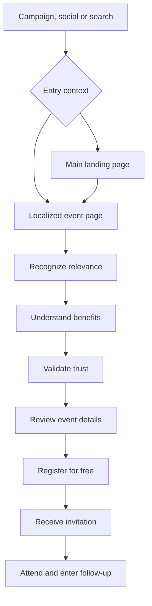

# Spimar Immo — UX Architecture

## Experience Model

The product contains two closely related experiences:

1. **Main landing page:** establishes Spimar’s value, proves trust and routes visitors to the most relevant upcoming event.
2. **Event-location page:** converts campaign traffic for a specific city, date and audience into registrations.

Both experiences use the same design system, CMS entities and conversion components. The main landing page is the first design and implementation target.

## Mobile-First Product Principle

The experience is designed from the smallest supported viewport upward. Mobile is not
a compressed desktop page: it is the primary conversion surface for social, WhatsApp,
paid-campaign and search traffic.

The first mobile viewport must answer:

1. What is Spimar?
2. What is the next relevant event?
3. Where and when is it?
4. Why should the visitor trust it?
5. How can the visitor register?

Desktop progressively adds richer imagery, editorial composition and navigation without
changing the conversion sequence.

## User Journey

## Main Landing Page Architecture

### 1. Sticky Navigation

- **Mobile:** logo, locale control and menu trigger.
- **Desktop:** logo, upcoming events, why attend, exhibitors, previous editions and FAQ.
- Country and language controls: French, Arabic and English.
- Registration action remains visible on desktop and moves to a thumb-reachable bottom
  action bar on mobile.

### 2. Hero

- Spimar category and organizer context.
- One concise global value proposition.
- Featured upcoming event with city, country, date and venue.
- Primary CTA: `Reserve my free invitation` for the featured event.
- Secondary CTA: `Explore upcoming events`.
- Trust signal.
- Hero image or optional controlled video.

**Mobile composition:** compact eyebrow, short headline, two-line support copy, event
date/location card, full-width primary CTA and one proof line. The key CTA must appear
without requiring a scroll on common 360–430 px wide devices.

**Desktop composition:** two-column editorial layout with conversion content on one
side and approved campaign imagery on the other. Decorative media must never push the
event essentials below the fold.

### 3. Trust Strip

- Operating since 2016.
- Verified editions/visitors/partners.
- Partner logos.

Never publish unverified numbers.

### 4. Why Attend?

- Discover selected projects.
- Compare opportunities.
- Meet developers.
- Explore financing.
- Receive professional guidance.
- Save time.

### 5. Event Details

- Horizontally scrollable mobile event cards with a visible next-card affordance.
- Desktop grid of upcoming event cards ordered by relevance and date.
- Country, city, dates and event status.
- Direct link to the localized event page.
- Clear handling for announced, registration-open, sold-out and past states.

### 6. Exhibitors and Partners

- Developers.
- Financial institutions.
- Institutional partners.
- Organizer.

### 7. Destinations and Opportunities

- Casablanca.
- Rabat.
- Marrakech.
- Tangier.
- Agadir.
- Other confirmed regions.

This is an event preview, not a full property catalogue.

### 8. How It Works

1. Register.
2. Receive confirmation.
3. Attend.
4. Meet professionals.
5. Continue with qualified opportunities.

### 9. Previous Editions

- Photography.
- Short highlights video.
- Testimonials.
- Previous cities.
- Participating brands.
- Media evidence.

### 10. FAQ

Answer attendance cost, invitations, financing, exhibitors, guests, accessibility, privacy and post-registration steps.

### 11. Registration

On the main page, registration is tied to the selected featured event. Other event cards first resolve the visitor to the correct localized event page.

Recommended initial fields:

- Full name.
- Email.
- Phone/WhatsApp.
- Country/city of residence.
- General interest.
- Consent.

On mobile, use a two-step flow:

1. Identity: name, email and phone/WhatsApp.
2. Context: residence, interest and consent.

Preserve entered data between steps, display progress, use correct input modes and
avoid opening a full-screen modal unless testing proves it converts better. The form
must be usable with the software keyboard open.

### 12. Final Footer

- Spimar details.
- Clarkom organizer details.
- Country/event directory.
- Legal and privacy links.
- Social profiles.

## Event-Location Page Overrides

The event-location template retains the same conversion sequence but replaces global discovery content with:

- Market-specific audience language.
- Exact date, venue, hours, map and transport.
- Local exhibitors and partners.
- Local agenda.
- Market-specific proof.
- Event-specific registration and confirmation.
- Event-specific SEO and campaign attribution.

## Localization and Bidirectionality

- `fr`, `ar` and `en` are required at launch.
- Content must be translated by meaning, not mechanically duplicated.
- Arabic switches document direction to RTL.
- Components must use logical CSS properties and direction-safe icons.
- Navigation, cards, form controls, validation, galleries and motion must be tested in both directions.
- Dates, phone formats, consent text and event labels are locale-aware.
- Missing translations must fail visibly in development and use an explicitly approved fallback in production.

## CTA Placement

| Position | Action |
|---|---|
| Sticky header | Register |
| Hero | Register |
| After benefits | Register |
| After partners | Register |
| After previous editions | Register |
| Final section | Complete form |
| Mobile sticky bar | Register |

## Mobile-First Section Order

1. Compact navigation.
2. Hero and featured-event facts.
3. Trust proof.
4. Upcoming events.
5. Benefits.
6. Exhibitors and partners.
7. How it works.
8. Previous-edition evidence.
9. Destination preview.
10. FAQ.
11. Registration.
12. Footer.

The mobile order intentionally surfaces the event and trust before extended brand
storytelling.

## Responsive Priorities and Breakpoint Behavior

On mobile, prioritize:

1. Event name.
2. Date.
3. Location.
4. CTA.
5. Trust.
6. Fast access to form.

Avoid autoplay hero video and excessive animation on mobile.

| Range | Composition rule |
|---|---|
| 320–479 px | Single column, 16 px gutters, full-width actions, compact media |
| 480–767 px | Single column with larger gutters and selected two-up micro-content |
| 768–1023 px | Tablet composition; two-column where content remains readable |
| 1024–1439 px | Desktop grid and full navigation |
| 1440 px+ | Constrained content width; never stretch text or cards indefinitely |

Use content-driven CSS and container queries where components benefit from them.
Breakpoints are implementation guidance, not a reason to duplicate components.

## Mobile Interaction Contract

- Minimum interactive target: 44 × 44 CSS px.
- The sticky bottom CTA respects safe-area insets and never covers content or consent.
- Only one dominant action is shown at a time.
- Menus and selectors support keyboard, screen reader and focus trapping.
- Carousels are swipeable but never trap vertical scrolling.
- Accordions preserve readable headings and large tap targets.
- Forms use `email`, `tel` and suitable autocomplete attributes.
- Validation appears inline and is announced accessibly.
- Back navigation never destroys entered registration data.
- RTL reverses directional layout and icons while dates, phone numbers and brand marks
  retain the correct intrinsic direction.
- Motion honors `prefers-reduced-motion`.

## Mobile Performance Budget

- No autoplay hero video on constrained mobile connections.
- Mobile hero uses an art-directed image rather than downloading the desktop crop.
- Initial hero image target: at most 180 KB after optimization.
- Initial JavaScript target: at most 170 KB compressed, excluding deferred analytics.
- Third-party scripts load after consent or interaction where possible.
- Reserve image dimensions to prevent layout shift.
- Font strategy must avoid invisible text and unnecessary weights.
- Target mobile Core Web Vitals at the 75th percentile: LCP ≤ 2.5 s, CLS ≤ 0.1,
  INP ≤ 200 ms.

## Mobile Acceptance Criteria

- The featured event, date, location and registration CTA are understandable at 360 px.
- There is no horizontal page overflow in French, English or Arabic.
- The primary journey can be completed one-handed.
- Registration works with a mobile keyboard and common autofill.
- Sticky controls do not overlap the cookie banner, form, footer or browser safe area.
- The page remains understandable with images disabled.
- The page is usable at 200% text zoom.
- Navigation and registration are operable using keyboard and screen reader semantics.
- Slow-network and failed-media states preserve the conversion path.
- Tracking distinguishes sticky CTA, hero CTA, event-card CTA and completed registration.
