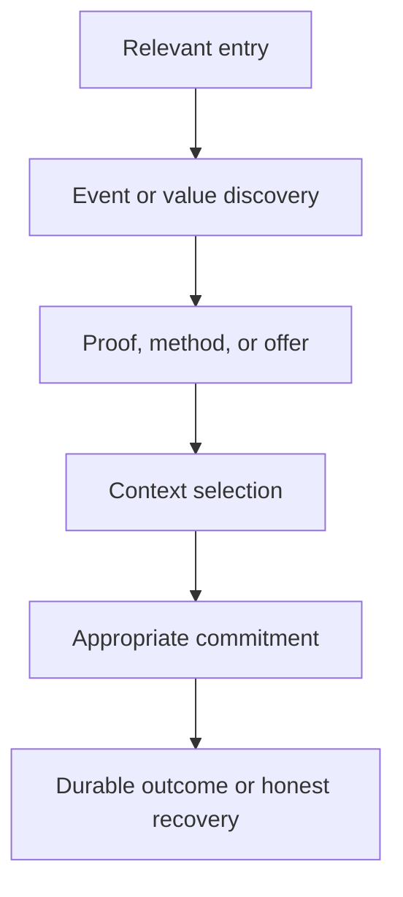

# SPIMARIMMO Navigation, Conversion, and Measurement Map

**Document ID:** `SPM-NCM-001`  
**Version:** 1.0  
**Status:** `APPROVED_AT_GATE_4`  
**Date:** 31 July 2026

---

## 1. Cross-route experience model

Navigation must allow exploration without forcing a linear funnel, while contextual actions preserve the user’s decision progress.

Any indexable route may be `A`. The experience must provide enough orientation and contextual next steps to rejoin the model without sending every user through the homepage.

## 2. Navigation responsibilities by route family

| Route family | Primary orientation | Local navigation emphasis | Required next-step logic | Safe exit |
|---|---|---|---|---|
| `RT-HOME` | Global B2B network and proposition | Events, exhibitor value, proof, resources, visitor entry | Event selection or progressive exhibitor action | Contact/footer/company/legal |
| Events/destinations `TPL-02/03` | Location, edition, lifecycle, audience availability | Current/future/completed; useful filters only | Canonical event or market discussion | Global events/home |
| Event `TPL-04/05` | Canonical event identity/status | Overview, programme, exhibitors, practical, gallery when published | Separate exhibitor and visitor actions | Destination/other event/contact |
| Exhibitor `TPL-06/09` | Decision role and commercial evaluation | Why, method, visibility, offers | Relevant event, proof, brochure, meeting, enquiry | Events/resources/contact |
| Proof/case `TPL-07/08` | Scope, definition, source, caveat | Related cases/proof types when useful | Relevant event/offer/discussion | Proof hub/home |
| Resource/editorial `TPL-10/11` | Content type, version, topic, source | Related useful content—not generic recirculation | Event, offer, resource access, enquiry | Resource/insight index |
| Visitor `TPL-12` | Visitor purpose and event discovery | Events, programme, exhibitors, practical info | Registration/waitlist if valid | Events/home/contact |
| Conversion `TPL-14/15` | Purpose, context, recipient, state | Minimal; avoid distraction during form | Submit/confirm/fallback | Return to origin/event/contact |
| Institutional/legal/system `TPL-13/16/17` | Organization, policy, or recovery | Context-specific | Routed contact/preferences/recovery | Home/relevant event/resource |

## 3. Global and local navigation rules

### 3.1 Global header

- Primary labels: `Salons`, `Exposer`, `Preuves`, `Ressources`, `Visiteurs`.
- Persistent commercial CTA: `Devenir exposant`.
- Locale control is explicit and keyboard/touch operable.
- Mobile navigation retains both audience entries and one primary commercial action without covering content.
- Published company/press/contact/legal links appear in appropriate secondary/footer regions.

### 3.2 Event context navigation

An event context exposes only published supporting routes:

- overview;
- programme;
- exhibitors;
- practical information;
- gallery.

Unavailable children are not rendered as empty navigation destinations merely to make the menu look complete. Registration and exhibitor actions are contextual controls—not peer informational tabs—and their availability is derived independently.

### 3.3 Breadcrumbs and return paths

- Nested indexable routes use semantic breadcrumbs where they improve orientation.
- A local single-event homepage does not fabricate global breadcrumb ancestry; canonical/host rules determine the path.
- Conversion routes provide an explicit return to the originating event/content when safe.
- Browser back/forward behavior must not resubmit forms or expose personal values.

## 4. Contextual CTA matrix

| Surface | Primary CTA | Secondary CTA | Conditions | Context carried |
|---|---|---|---|---|
| Homepage hero | `Devenir exposant` | Brochure | Always truthful Release 1 outcome; brochure active | Host, locale, placement, campaign |
| Homepage event card | Event detail or exhibitor request when open/limited | Visitor detail/registration when open | Derived state; avoid two equal unlabeled audience actions | Event, destination, audience selection |
| Event overview | Audience-appropriate valid action | Other audience entry + brochure/meeting | Exception/lifecycle precedence first | Event, destination, state, host, locale |
| Destination | Open relevant edition | Market discussion/brochure | Event inventory/content readiness | Destination, selected edition if any |
| Exhibitor proposition/method | Relevant event or enquiry | Proof/brochure/meeting | Keep value before form | Page theme, event if selected |
| Proof/case | Relevant event or enquiry | Related case/source | Proof approved and related action valid | Case/proof/event/source placement |
| Offers | Request proposal/enquiry | Meeting/brochure | Applicable approved version and availability | Offer version, event, capability interest |
| Resource detail | Access/request resource | Related event/enquiry | Active localized version | Resource/version/event/offer |
| Article | Related event/resource | Exhibitor discussion | Genuine semantic relationship | Article/topic/source placement |
| Visitor hub/event | Register/waitlist | Programme/practical/alternative event | Registration state | Visitor audience, event, locale |
| Confirmation | One real next step | Return/event/contact fallback | Outcome-specific | Safe submission/resource/event state |

## 5. Event action-resolution contract

The UI resolves actions in this order:

1. **Exception:** postponed/cancelled suppresses invalid promotion and actions.
2. **Lifecycle validity:** invalid dates/state block publication; completed/archived changes tense and removes invalid future actions.
3. **Audience availability:** exhibitor-sales and visitor-registration states produce their own controls.
4. **Content readiness:** event facts, programme, offers, resources, proof, and practical content render only when approved.
5. **Locale/host readiness:** action route must be valid for the current published equivalent.
6. **Provider readiness:** meeting/resource/WhatsApp/provider-backed action degrades to approved fallback.

### 5.1 Exhibitor action labels

| State | Primary control | Allowed alternatives |
|---|---|---|
| `planned` | Interest/contact only | Brochure, relevant market discussion |
| `open` | `Devenir exposant` / `Demander une proposition` | Meeting, brochure, WhatsApp |
| `limited` | Same request with explicit limited status | Meeting, next edition |
| `sold_out` | Approved waitlist/contact or next edition | Brochure/other event |
| `closed` | Next edition/contact | Historical proof/resources |

### 5.2 Visitor action labels

| State | Primary control | Allowed alternatives |
|---|---|---|
| `planned` | Preparation/updates if approved | Programme/event information |
| `open` | `S’inscrire` | Programme, exhibitors, practical info |
| `waitlist` | `Rejoindre la liste d’attente` | Alternative event |
| `full` | Approved waitlist or alternative event | Practical info |
| `closed` | Next event/practical info | Visitor hub |

## 6. Entry and recovery map

| Entry/failure context | Orientation required | Best continuation | Never do |
|---|---|---|---|
| Search/campaign → article/resource | Content purpose, source/date, related event/value context | Relevant event/resource/action | Generic “contact us” dead end |
| Shared event link | Event identity, status, verified facts, audience split | Valid exhibitor or visitor path | Force homepage before showing event |
| Local host root | Edition/market identity, locale, current state | Event content and contextual actions | Leak another host’s content |
| 404/unpublished object | Localized explanation and current context if safe | Relevant directory/home/contact | Reveal draft/private object existence |
| Invalid filter | State that no match exists; keep current inventory visible when useful | Clear/reset filters | Empty page with no recovery |
| Closed action | State closure and meaning | Waitlist/next edition/brochure/contact | Enabled CTA that fails after click |
| Broken/expired resource | Explain unavailability/replacement | Approved replacement/contact/retry | False delivered confirmation |
| Form validation error | Error summary, linked fields, retained safe values | Correct and resubmit | Clear all fields or analytics payload values |
| Integration delay | Confirm durable record only; identify real next step | Automatic/operator recovery and safe fallback | Ask user to resubmit blindly |
| Invalid confirmation URL | Privacy-safe expired/invalid status | Start appropriate journey or contact | Personal data/object enumeration |
| Incomplete locale | Keep valid current content and explain | Equivalent parent/route or current locale | Mixed-language critical flow |
| Offline/runtime failure | Safe retry and cached/known context where appropriate | Home/event/contact | Stack traces or tenant leakage |

## 7. Funnel and outcome definitions

| Stage | Website evidence | Operational evidence | Not equivalent to |
|---|---|---|---|
| Discovery | Route view, event card view | None | Interest or lead |
| Engagement | Event/proof/case/offer/resource interaction | None | Qualification |
| Consideration | Package compare, resource request start | Possibly no record yet | Submission |
| Conversion start | Form/scheduler interaction | Optional draft only if explicitly implemented | Durable lead |
| Durable submission | Server-stored valid enquiry/registration/resource request | Immutable ID and job state | CRM sync, email delivery, booking |
| Provider outcome | CRM synced, email/resource delivered, calendar accepted | Provider reference/correlation | Qualified/won/attendance |
| Business outcome | Qualified/nurture/disqualified, meeting/proposal/won/lost, visitor attendance | CRM/operations source | Public metric without approved definition |

## 8. Analytics touchpoint map

| Journey stage | Events | Required context | Consent/data rule |
|---|---|---|---|
| Audience/navigation | `audience_path_selected`, `event_card_viewed`, `event_card_selected`, `destination_filter_used`, `locale_changed` | Route/template/content, host, locale, audience, event/destination, placement | No personal data; consent classification enforced |
| Evidence | `proof_item_viewed`, `proof_source_opened`, `case_study_opened`, `testimonial_played`, `gallery_opened` | Proof/case/media version, scope, placement | No identity inference |
| Offers/resources | `package_viewed`, `package_compared`, `resource_page_viewed`, `resource_request_started`, `resource_delivered` | Offer/resource version, event/applicability, source | Delivery only on valid resource/provider outcome |
| Exhibitor | `exhibitor_cta_clicked`, `exhibitor_form_started`, `exhibitor_form_error`, `exhibitor_enquiry_submitted`, `meeting_scheduler_opened`, `meeting_booked`, `whatsapp_clicked` | Event/offer/audience/placement/attribution; safe failure class | Submission only after durable storage; booking only after provider; no field values |
| Visitor | `visitor_registration_started`, `visitor_registration_error`, `visitor_registration_submitted` | Event, registration state, host, locale, source | Separate visitor funnel and purposes |
| Quality/recovery | `media_fallback_used`, `form_delivery_failed`, `integration_delayed`, `broken_resource`, `empty_result_viewed`, `error_page_viewed` | Route/template/object/provider class/correlation-safe status | Never log submitted payload, token, or personal URL |

### 8.1 Event emission safeguards

- One user action produces one canonical event per schema version.
- CTA click, form start, durable submission, provider delivery, and business qualification are separate.
- First-known/latest attribution is stored operationally under approved windows; analytics does not carry personal values.
- Consent-required tracking does not run before the applicable choice.
- A route transition retains stable IDs; translated labels are not used as primary analytical keys.

## 9. Consent and preference touchpoints

| Touchpoint | Necessary behavior | Optional behavior |
|---|---|---|
| Initial page | Essential storage/security and consent preference access | Analytics/marketing scripts only under approved classification/choice |
| Brochure request | Process data necessary to deliver requested resource and disclosed follow-up | Separate marketing consent |
| Exhibitor enquiry | Process request and route to disclosed recipient category | Separate ongoing marketing consent where approved |
| Visitor registration | Process event registration and transactional acknowledgement | Separate marketing; exhibitor sharing excluded by default |
| Meeting | Process contact/context and provider scheduling under disclosed purpose | Marketing remains separate |
| WhatsApp | User initiates external channel; disclose provider context where required | No inferred marketing consent from click |
| Preferences/legal | Revisit cookie/communication preferences and rights process | Choices propagate to relevant systems |

## 10. Measurement questions for UX validation

Phase 05 testing and later implementation analytics must answer:

1. Can each decision role find a relevant event and supporting proof without search?
2. Do users distinguish event lifecycle from exhibitor and visitor availability?
3. Do prospects select the correct commitment level rather than using one generic form?
4. Are offer applicability and proposal-only pricing understood on mobile?
5. Can users explain the difference between submitted, delivered, synced, and booked?
6. Do closed, missing, invalid-locale, and provider-failure states retain orientation and an honest next step?
7. Does Arabic RTL preserve meaning, focus order, action hierarchy, and form comprehension?
8. Which route/content/placement assists durable qualified enquiries without claiming causality from mere views?
