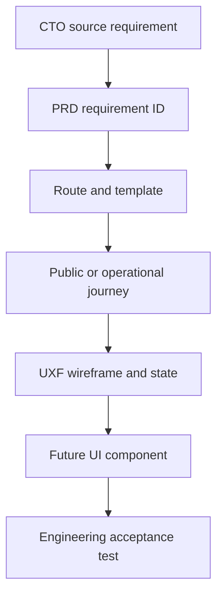

# SPIMARIMMO Phase 05 Wireframe Traceability Matrix

**Document ID:** `SPM-WFT-001`  
**Version:** 1.0  
**Status:** `APPROVED_WITH_CONDITIONS_AT_GATE_5`  
**Date:** 31 July 2026

---

## 1. Traceability chain

Phase 05 closes the chain through `E`. Component and executable-test evidence remain Phase 07/10/11 responsibilities.

## 2. Frame-to-requirement traceability

Analytics values name approved touchpoints only. They never authorize payload values or tracking before the applicable consent classification permits it.

| Frame | Route/template | Journey or blueprint | Primary PRD trace | Measurement/recovery proof | Status |
|---|---|---|---|---|---|
| `UXF-001` | `RT-HOME` / `TPL-01` | `JRN-P01` | `HOM-001`–`014`, `SHL-001`–`007`, `EXP-001`–`005` | `audience_path_selected`, `event_card_viewed`, exhibitor CTA context | `PRODUCED` |
| `UXF-002` | `RT-HOME` / `TPL-01` | `JRN-P01` | `HOM-001`–`014`, `ACC-001`–`012`, `PER-001`–`010` | Mobile event selection; one safe contextual action | `PRODUCED` |
| `UXF-003` | `RT-HOME` / `TPL-01` | `JRN-P01`, `JRN-O03` | `LOC-001`–`013`, `ACC-001`–`012`, `PER-001`–`010` | `locale_changed`; static-media fallback | `PRODUCED` |
| `UXF-004` | `RT-HOME` / `TPL-01` | `JRN-P01`, `JRN-O02` | `HOM-005`–`013`, `EXP-005`–`013`, `CMS-006`–`010` | `media_fallback_used`; unsupported modules suppressed | `PRODUCED` |
| `UXF-005` | `RT-EXP-HUB` / `TPL-06` | `JRN-P01` | `EXP-001`–`005`, `SHL-001`, `US-A1/A2` | Role path → event/resource/enquiry | `PRODUCED` |
| `UXF-006` | `RT-EXP-WHY/METHOD` / `TPL-06` | `JRN-P01` | `EXP-001`–`004`, `HOM-008`–`009`, `US-B1` | Mechanism paired with applicable proof | `PRODUCED` |
| `UXF-007` | `RT-EXP-VISIBILITY` / `TPL-06` | `JRN-P01`, `JRN-O02` | `EXP-002`–`003`, `EXP-012`, `CMS-006`–`007` | Proof/artifact pending and activation-request recovery | `PRODUCED` |
| `UXF-008` | `RT-EXP-OFFERS` / `TPL-09` | `JRN-P01/P03` | `OFR-001`–`012`, `US-B2` | `package_viewed`, `package_compared`; selected context persists | `PRODUCED` |
| `UXF-009` | `RT-EXP-OFFERS` / `TPL-09` | `JRN-P01/P03` | `OFR-001`–`012`, `ACC-001`–`012` | Mobile/zoom comparison without squeezed semantics | `PRODUCED` |
| `UXF-010` | `RT-EXP-OFFERS` / `TPL-09` | `JRN-P01/P03` | `OFR-001`–`012`, `EVS-001`–`008` | Limited/sold-out/closed alternative; no false price | `PRODUCED` |
| `UXF-011` | Proof collection / `TPL-07` | `JRN-P01`, `JRN-O02` | `EXP-005`–`013`, `CMS-006`–`010` | Proof events; `empty_result_viewed`; filter reset | `PRODUCED` |
| `UXF-012` | `RT-CASE-DETAIL` / `TPL-08` | `JRN-P01`, `JRN-O02` | `EXP-008`–`011`, `MOD-005`, `US-A2` | `case_study_opened`; permission/media withdrawal | `PRODUCED` |
| `UXF-013` | `RT-EVT-INDEX` / `TPL-02` | `JRN-P01/P06` | `EVT-001`–`004`, `EVT-008`, `VIS-001` | Event-card/destination-filter events; archive separation | `PRODUCED` |
| `UXF-014` | `RT-EVT-INDEX` / `TPL-02` | `JRN-P01/P06` | `EVT-001`–`004`, `ACC-001`–`012` | `empty_result_viewed`; reset and focus recovery | `PRODUCED` |
| `UXF-015` | `RT-DST-DETAIL` / `TPL-03` | `JRN-P01` | `EVT-001`–`003`, `RES-007`, `SEO-001` | Edition selection; no-stat and history-only recovery | `PRODUCED` |
| `UXF-016` | `RT-EVT-DETAIL` / `TPL-04` | `JRN-P01/P03/P06` | `EVT-004`–`018`, `EVS-001`–`008` | Separate exhibitor/visitor CTA events over one event | `PRODUCED` |
| `UXF-017` | `RT-EVT-DETAIL` / `TPL-04` | `JRN-P03/P06` | `EVS-001`–`008`, `EVT-013`–`018`, `VIS-003`–`013` | Independent open/closed alternatives; mobile action safety | `PRODUCED` |
| `UXF-018` | `RT-EVT-DETAIL` / `TPL-04` | `JRN-P01/P03/P06`, `JRN-O03` | `LOC-001`–`013`, `ACC-001`–`012`, `PER-001`–`010` | RTL equivalence and static-media fallback | `PRODUCED` |
| `UXF-019` | `RT-EVT-DETAIL` / `TPL-04` | `JRN-O01`, public recovery | `EVS-001`–`008`, `EVT-014`–`018`, `OPS-001`–`010` | Exception precedence; stale action suppression | `PRODUCED` |
| `UXF-020` | `RT-EVT-DETAIL` / `TPL-04` | `JRN-P01/P06`, `JRN-O01` | `EVT-004`–`018`, `EXP-005`–`013` | Actual-result proof; no historical registration CTA | `PRODUCED` |
| `UXF-021` | `RT-EVT-PROGRAMME` / `TPL-05` | `JRN-P06`, `JRN-O01` | `EVT-005`, `EVT-009`, `VIS-001`–`002` | Changed/cancelled item notice; current schedule | `PRODUCED` |
| `UXF-022` | `RT-EVT-EXHIBITORS` / `TPL-05` | `JRN-P06`, `JRN-O01/O02` | `EVT-010`–`011`, `VIS-002`, `CMS-007` | Participation approval/withdrawal; visitor continuation | `PRODUCED` |
| `UXF-023` | `RT-EVT-PRACTICAL` / `TPL-05` | `JRN-P06`, `JRN-O01` | `EVT-006`, `EVT-012`, `VIS-009` | Venue/access change and missing-accessibility recovery | `PRODUCED` |
| `UXF-024` | `RT-EVT-GALLERY` / `TPL-05` | `JRN-P01/P06`, `JRN-O02` | `EVT-005`, `EXP-010`–`011`, `ACC-008`, `PER-005` | `gallery_opened`, `media_fallback_used`; no false documentary media | `PRODUCED` |
| `UXF-025` | `RT-VIS-HUB` / `TPL-12` | `JRN-P06` | `VIS-001`–`016`, `US-D1` | Visitor audience/event selection; separate funnel | `PRODUCED` |
| `UXF-026` | `RT-VIS-HUB` / `TPL-12` | `JRN-P06` | `VIS-001`–`003`, `VIS-014`–`016` | Planned/no-event preparation and updates; no fake registration | `PRODUCED` |
| `UXF-027` | `RT-EVT-REGISTER` / `TPL-14` | `JRN-P06` | `VIS-003`–`013`, `CON-001`–`012`, `PRI-001`–`012` | Registration start/submission only after durable storage | `PRODUCED` |
| `UXF-028` | `RT-EVT-REGISTER` / `TPL-14` | `JRN-P06`, `JRN-O04` | `CON-003`–`012`, `ACC-001`–`012`, `SEC-001`–`010` | Safe error class; focus/retained-value recovery | `PRODUCED` |
| `UXF-029` | `RT-EVT-REGISTER` / `TPL-14` | `JRN-P06` | `VIS-003`–`013`, `EVS-001`–`008` | Waitlist/full/closed semantics and alternatives | `PRODUCED` |
| `UXF-030` | `RT-EVT-REG-CONFIRM` / `TPL-15` | `JRN-P06`, `JRN-O04` | `VIS-008`–`010`, `CON-004/007/011`, `SEO-004` | Durable success separate from delayed acknowledgement | `PRODUCED` |
| `UXF-031` | Exhibitor forms / `TPL-14` | `JRN-P03` | `CON-001`–`012`, `CRM-001`–`020`, `EVT-013`, `OFR-009` | Contextual form start/submission; non-transaction meaning | `PRODUCED` |
| `UXF-032` | Exhibitor form / `TPL-14` | `JRN-P03`, `JRN-O04` | `CON-003`–`012`, `CRM-007`–`020`, `INT-001`–`008` | Validation/rate limit/action-close/integration recovery | `PRODUCED` |
| `UXF-033` | `RT-EVT-ENQ-CONFIRM` / `TPL-15` | `JRN-P03`, `JRN-O04` | `CON-004/007/011`, `CRM-001`–`020` | Durable enquiry separate from CRM/email provider outcomes | `PRODUCED` |
| `UXF-034` | Meeting routes / `TPL-14/15` | `JRN-P04`, `JRN-O04` | `CON-001`–`012`, `INT-001`–`008` | `meeting_booked` only on provider confirmation; lead fallback | `PRODUCED` |
| `UXF-035` | `RT-RES-HUB` / `TPL-10A` | `JRN-P02`, `JRN-O05` | `RES-001`–`006` | Resource discovery; empty/reset; expired items absent | `PRODUCED` |
| `UXF-036` | `RT-RES-DETAIL` / `TPL-10B` | `JRN-P02` | `RES-002`–`006`, `CON-001`–`012` | Resource page/request/delivery touchpoints by access mode | `PRODUCED` |
| `UXF-037` | Resource/status / `TPL-10B/15` | `JRN-P02`, `JRN-O04/O05` | `RES-005`–`006`, `INT-001`–`008`, `OPS-001`–`010` | `broken_resource`/`integration_delayed`; approved replacement | `PRODUCED` |
| `UXF-038` | Insights index/topic / `TPL-11A/B` | Content discovery/editorial governance | `RES-007`–`012`, `SEO-001/011`, `CMS-001`–`022` | Thin topic suppressed; related route recovery | `PRODUCED` |
| `UXF-039` | `RT-ARTICLE` / `TPL-11C` | Content discovery, `JRN-O02` | `RES-008`–`010`, `SEO-001/011`, `EXP-012` | Source/reviewer/date; outdated-stat review | `PRODUCED` |
| `UXF-040` | Institutional / `TPL-13` | Institutional trust, `JRN-O02` | `CMP-001`–`008`, `CMS-007/010`, `MOD-005` | Conditional route/expired relationship/media removal | `PRODUCED` |
| `UXF-041` | `RT-CONTACT` / `TPL-14` | Routed contact, `JRN-O04` | `CMP-005`, `CON-001`–`012`, `CRM-001`–`020` | Correct queue; durable-first delay recovery | `PRODUCED` |
| `UXF-042` | Legal routes / `TPL-16` | Rights/preferences, `JRN-O03/O04` | `PRI-001`–`012`, `LOC-001`–`013`, `ACC-001`–`012` | Preference/contact fallback and version visibility | `PRODUCED` |
| `UXF-043` | Confirmation surfaces / `TPL-15` | `JRN-P02/P03/P04/P06` | `CON-007/011`, `SEC-001`–`010`, `SEO-004` | Privacy-safe expired/invalid re-entry | `PRODUCED` |
| `UXF-044` | Recovery routes / `TPL-17` | Cross-journey recovery | `SHL-008`–`009`, `SEC-001`–`010`, `OPS-001`–`010` | `error_page_viewed`; no technical/tenant leakage | `PRODUCED` |
| `UXF-045` | `RT-LOCALE-ROOT` / `TPL-15` | `JRN-O03` | `LOC-001`–`013`, `SEO-003`–`006` | Saved choice and semantic missing-equivalent fallback | `PRODUCED` |
| `UXF-046` | Global/local shell | All public journeys | `SHL-001`–`009`, `LOC-001`–`013`, `ACC-001`–`012` | Navigation, locale, focus, drawer and host recovery | `PRODUCED` |
| `UXF-047` | Event/action state board | `JRN-P01/P03/P06`, `JRN-O01/O04` | `EVS-001`–`008`, `EVT-013`–`018`, `INT-001`–`008` | Deterministic CTA/state precedence; no contradiction | `PRODUCED` |
| `UXF-048` | `RT-PREVIEW` | `JRN-O01`–`O05` | `GOV-001`–`007`, `CMS-001`–`022`, `SEO-004`, `ANA-001`–`010` | Noindex/no analytics/no provider side effects | `PRODUCED` |

## 3. Source-strategy coverage

| Authoritative source condition | Frame evidence | Result |
|---|---|---|
| Exhibitor-first B2B value and action | `UXF-001`–`012`, `031`–`034` | `PASS_BY_STRUCTURE` |
| Country/city events early | `UXF-001`–`004`, `013`–`020` | `PASS_BY_STRUCTURE` |
| Proof beside promise | `UXF-001`, `006`–`007`, `011`–`012`, `016`, `020`, `024` | `PASS_BY_STRUCTURE` |
| Progressive commitment | Resource, WhatsApp-context, meeting, and enquiry paths across `UXF-005`–`012`, `031`–`037` | `PASS_BY_STRUCTURE` |
| Separate visitor journey | `UXF-016`–`018`, `025`–`030` | `PASS_BY_STRUCTURE` |
| Honest content/evidence states | Partial, pending, expired, withdrawn, closed, delayed, and failure states across 41 multi-state targets | `PASS` |
| Mobile complete | Target mobile frames plus forced composition review | `PASS_FOR_WIREFRAMES` |
| Arabic RTL and reduced motion | `UXF-003`, `018`, `042`, `045`, `046` plus forced RTL composition | `PASS_FOR_WIREFRAMES` |
| Analytics/CRM outcome separation | `UXF-027`–`034`, `036`–`037`, `041`, `043`, `047` | `PASS_BY_BEHAVIOR` |

## 4. Downstream traceability obligations

Gate 5 approval does not close traceability. Later phases must extend this matrix with:

- identity/art-direction decision and affected `UXF` targets;
- design-system component ID and state/variant API;
- high-fidelity frame ID and locale/viewport/state evidence;
- engineering story/acceptance-criterion ID;
- automated/manual test evidence;
- production content and provider readiness reference;
- launch monitoring and outcome evidence.
