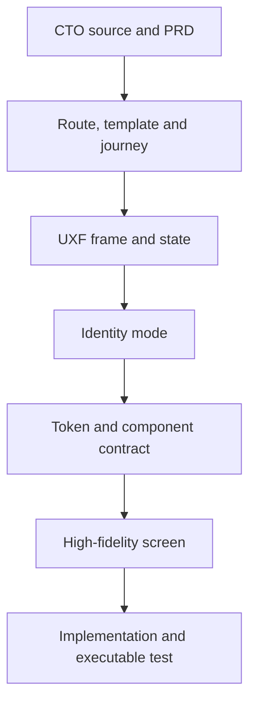

# Design-System Coverage and Traceability

**Document ID:** `SPM-DS-TRC-001`  
**Status:** `PASS_READY_FOR_GATE_7`  
**Date:** 31 July 2026

## 1. Traceability chain

Phase 07 closes the chain through token/component contract. Phase 08 supplies high-fidelity evidence; Phases 10/11 supply repository and executable-test evidence.

## 2. Template-family coverage

| Template | Design-system coverage | Status |
|---|---|---|
| `TPL-01` Global homepage | Signal hero, event rail/cards, proof, method, offer/resource previews, shell, conversion close, media fallback | `COVERED` |
| `TPL-02` Event directory | Collection grid/list, event/destination cards, filter/empty/recovery, archive/state labels | `COVERED` |
| `TPL-03` Destination | Editorial place mode, related editions, market proof, missing-stat/history-only states | `COVERED` |
| `TPL-04` Canonical event | Local shell, event facts, lifecycle exception, audience panel, proof, supporting previews, independent CTAs | `COVERED` |
| `TPL-05` Event support | Programme, participant, practical, gallery, change/withdrawal/pending states | `COVERED` |
| `TPL-06` Exhibitor editorial | Proposition, objections, method, proof, event context, progressive action | `COVERED` |
| `TPL-07` Proof hub | Proof blocks, metrics, cases, testimonials, filters, source/caveat, empty/withdrawn | `COVERED` |
| `TPL-08` Case detail | Case anatomy, approved result state, media/caption, caveat, related action | `COVERED` |
| `TPL-09` Offer comparison | Equal taxonomy, capability rows, price mode, availability, terms, mobile transformation | `COVERED` |
| `TPL-10A/B` Resources | Resource card/access, version/locale/applicability, delivery, expired/replaced/broken | `COVERED` |
| `TPL-11A/B/C` Editorial | Article cards/meta/source list, topic/index density, stale review, long sources | `COVERED` |
| `TPL-12` Visitor hub | Visitor orientation, event discovery, registration state, planned/no-event fallback | `COVERED` |
| `TPL-13` Institutional | People/partner/media records, rights/active period, missing portrait/logo, contact | `COVERED` |
| `TPL-14` Conversion/form | Form shell, fields, consent, errors, every PRD form/provider state | `COVERED` |
| `TPL-15` Confirmation/status | Durable outcome, integration delay, provider-confirmed booking, invalid direct access | `COVERED` |
| `TPL-16` Legal/policy | Dense readable type, version/update, preferences fallback, RTL and long content | `COVERED` |
| `TPL-17` System/recovery | 404/500/offline/inactive host, safe localized recovery, no leakage | `COVERED` |

Coverage result: `17/17 template families`.

## 3. Wireframe target coverage

| UXF targets | Surface | Primary component families | Status |
|---|---|---|---|
| `UXF-001`, `UXF-002`, `UXF-003`, `UXF-004` | Homepage desktop/mobile/RTL/fallback | `DSC-SHL`, `DSC-BRD`, `DSC-EVT`, `DSC-PRF`, `DSC-MED`, `DSC-ACT` | `COVERED` |
| `UXF-005`, `UXF-006`, `UXF-007`, `UXF-008`, `UXF-009`, `UXF-010`, `UXF-011`, `UXF-012` | Exhibitor/method/visibility/offers/proof | `DSC-PRF`, `DSC-OFR`, `DSC-MED`, `DSC-ACT`, `DSC-STS` | `COVERED` |
| `UXF-013`, `UXF-014`, `UXF-015`, `UXF-016`, `UXF-017`, `UXF-018`, `UXF-019`, `UXF-020`, `UXF-021`, `UXF-022`, `UXF-023`, `UXF-024` | Event discovery/destination/event/support | `DSC-EVT`, `DSC-SHL`, `DSC-STS`, `DSC-MED`, `DSC-ACT` | `COVERED` |
| `UXF-025`, `UXF-026`, `UXF-027`, `UXF-028`, `UXF-029`, `UXF-030`, `UXF-031`, `UXF-032`, `UXF-033`, `UXF-034` | Visitor, registration, enquiry, meeting | `DSC-EVT`, `DSC-FRM`, `DSC-STS`, `DSC-ACT`, `DSC-SYS` | `COVERED` |
| `UXF-035`, `UXF-036`, `UXF-037`, `UXF-038`, `UXF-039`, `UXF-040`, `UXF-041`, `UXF-042` | Resources/editorial/institutional/contact/legal | `DSC-CNT`, `DSC-FRM`, `DSC-PRF`, `DSC-SHL`, `DSC-SYS` | `COVERED` |
| `UXF-043`, `UXF-044`, `UXF-045`, `UXF-046`, `UXF-047`, `UXF-048` | Confirmation/recovery/system/locale/shell/state/preview | `DSC-FRM`, `DSC-SYS`, `DSC-SHL`, `DSC-STS` | `COVERED` |

Coverage result: `48/48 UXF targets`; the existing `144` state proofs remain controlling and are implemented through the universal, domain, form, content, locale, media, and provider-state contracts.

## 4. PRD quality-domain traceability

| PRD domain | Phase 07 control | Status |
|---|---|---|
| `SHL-*` | Global/local shell, navigation, locale, footer, mobile drawer, focus | `COVERED` |
| `HOM-*` | Signal hero, event priority, proof/media fallback, responsive state | `COVERED` |
| `EVT-*`, `EVS-*` | Canonical event components and derived lifecycle/availability matrix | `COVERED` |
| `EXP-*`, `OFR-*` | Proof/method/case/offer contracts and content truth | `COVERED` |
| `VIS-*`, `CON-*` | Visitor/exhibitor forms, durable outcome, closed/waitlist/failure behavior | `COVERED` |
| `RES-*`, `CMP-*` | Resource/editorial/institutional components and rights/freshness states | `COVERED` |
| `LOC-*` | Explicit locale/host, script-aware type, RTL, mixed-direction, incomplete locale | `COVERED` |
| `ACC-001`–`ACC-012` | Semantic, keyboard, focus, form, target, contrast, reflow, motion, media, RTL, manual QA | `COVERED` |
| `PER-001`–`PER-010` | Poster-first media, server-first content, budgets, lazy loading, fallback, motion cost | `COVERED` |
| `SEO-*` | Component metadata responsibility and preview/confirmation boundary retained | `COVERED_BY_BOUNDARY` |
| `SEC-*`, `PRI-*` | Safe component inputs, no leakage, consent/form content boundary | `COVERED_BY_UI_CONTRACT`; backend remains later phase |
| `OPS-*` | Component/visual/a11y/performance regression plan and safe error states | `COVERED_FOR_PHASE` |

## 5. Identity-invariant coverage

| Invariant | Design-system enforcement |
|---|---|
| `BRI-001` | Fixed `#EFC337`; no metallic/foil/gradient luxury treatment |
| `BRI-002` | Media roles and real-rights policy; type-led fallback over fake imagery |
| `BRI-003` | `CityEditionMark`, hero/event anatomy and responsive order |
| `BRI-004` | Proof anatomy keeps definition/source/period/caveat adjacent |
| `BRI-005` | Separate audience components and explicit state labels; no color-only distinction |
| `BRI-006` | Multilingual type roles, RTL logic, locale QA fixtures |
| `BRI-007` | Form/confirmation/outcome contracts prohibit inflated ticketing/reservation/qualification |
| `BRI-008` | House of Yellow convergence is blocked and controlled |
| `BRI-009` | One wordmark system plus city/date grammar; no city sub-logo requirement |
| `BRI-010` | Poster/type fallback and first-class reduced-motion contract |
| `BRI-011` | Black/gold permanent palette; semantic hues bounded to feedback only |

Coverage result: `11/11 identity invariants`.

## 6. Structural validation result

- 17 template families covered;
- 48 unique `UXF` targets present with no gap;
- all 11 `BRI` identity invariants covered;
- fixed black/gold digital anchors present;
- universal interaction, domain, form, content, media, locale, error, and reduced-motion states specified;
- House of Yellow measurements/components remain excluded;
- real content, source assets, repository implementation, moderated research, and executable tests remain later evidence—not falsely claimed complete here.

