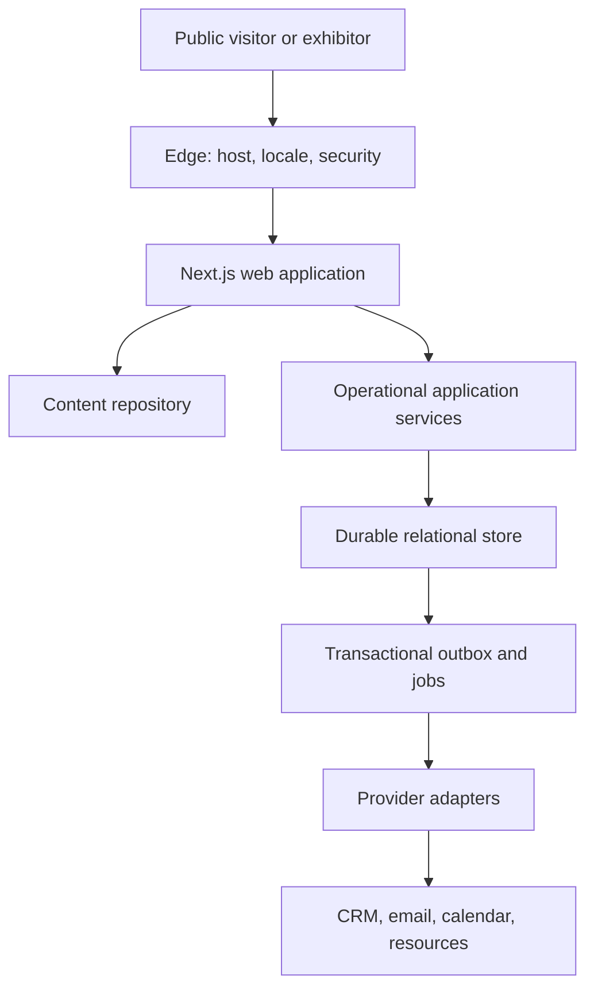

# System Architecture and Architecture Decisions

**Document ID:** `SPM-TECH-ARCH-001`  
**Status:** `APPROVED_BASELINE_PROVIDER_AND_REPOSITORY_INPUTS_PENDING`

## 1. Architecture qualities

The system must be:

- one product across parent and approved local hosts, not copied websites;
- server-first, cacheable, fast, accessible, and resilient without essential client JavaScript;
- explicit about host, locale, audience, event, offer/resource, attribution, and consent context;
- safe under provider failure: a CRM, email, calendar, media, or consent outage must not lose a valid submission;
- reversible at provider boundaries;
- compatible with the accepted House of Yellow engineering foundation without inheriting its brand or business model.

## 2. Logical topology



The public request path does not synchronously depend on downstream commercial providers. A successful public form means the canonical submission and required consent/context snapshot were committed durably. CRM sync, email delivery, resource delivery, and scheduler acceptance are separate observable outcomes.

## 3. Target layers

| Layer | Responsibility | Must not contain |
|---|---|---|
| Edge/environment | Canonical host resolution, HTTPS/security headers, preview protection, safe redirects, rate-limit entry | Business content, provider credentials in client output |
| Route/composition | Route ID, template, metadata, server composition, state selection | CMS response-shape leakage, direct CRM calls |
| Domain | Event state rules, audience availability, publishing validity, conversion semantics | Framework-specific request objects |
| Content repository | Typed reads, preview context, locale status, relations, versions | UI markup, operational lead state |
| Application services | Use cases: render page, submit enquiry, register visitor, request resource/meeting | Provider-specific field/stage names |
| Operational repository | Durable submissions, consent, attribution, assignments, outbox, audit | Public editorial content as copied blobs except required snapshots |
| Provider adapters | CRM, mail, scheduler, WhatsApp, analytics, consent, media | Public truth or canonical business state |
| Observability | Correlation, metrics, traces, sanitized logs, alerts | Full form payloads, secrets, access tokens |

## 4. Target application organization

The exact source paths are assigned after repository inspection. The logical boundary is fixed:

```text
src/
  app/                         # host/locale public routes and route handlers
  components/                  # approved DSC components and compositions
  design-system/               # tokens, primitives, motion, media contracts
  domain/                      # event/content/conversion rules and value objects
  application/                 # use cases and orchestration
  repositories/                # provider-neutral interfaces
  adapters/
    cms/
    crm/
    email/
    scheduler/
    consent/
    analytics/
    media/
  infrastructure/              # database, outbox, cache, telemetry, security
  config/                      # validated host/locale/provider configuration
  tests/                       # contract, integration, E2E, visual, accessibility
```

If the clone uses another organization, engineering maps these responsibilities into its current boundaries rather than applying a cosmetic directory rewrite.

## 5. Host and locale resolution

1. Normalize the incoming host using an allowlisted host registry.
2. Resolve `host -> site/market -> host kind (G/L1/LM) -> active locales -> default locale -> legal/contact/analytics profile`.
3. Resolve explicit locale segment; never hide crawlable alternatives through IP-only redirection.
4. Validate that the route/object is published for the resolved host and locale.
5. Build canonical and `hreflang` URLs from the same registry.
6. Unknown, inactive, or mismatched hosts return a safe host state and never fall back to another tenant.
7. Preview resolution uses signed/authorized context and cannot trigger production side effects, analytics, indexing, or delivery.

Host/locale context is immutable for one request and is passed explicitly to content queries, metadata, forms, analytics, cache tags, and audit records.

## 6. Rendering and caching

| Surface | Strategy | Invalidation |
|---|---|---|
| Indexable marketing/event/editorial | Server render or pre-render with bounded revalidation | Content webhook tags by object, host, locale, route family |
| Event lifecycle/availability | Cached server render with targeted invalidation and time-based safety refresh | Event/state tags plus anomaly monitor |
| Forms | Server-rendered form shell; server mutation/route handler; optional progressive client enhancement | Never cache personal response |
| Confirmation/status | Private/no-store or safe short-lived server state; opaque identifier | No public cache, no personal URL data |
| Preview | Dynamic, authenticated/signed, `noindex`, no analytics/side effects | No public cache |
| Legal/policy | Versioned server render | Policy/version tags |
| Error/maintenance | Host/locale-aware server fallback | Environment/host status |

Critical content and actions remain available if client hydration fails. Hero video is never the LCP element and always has a poster/type fallback.

## 7. Architecture decision records

| ADR | Decision | Status | Consequence |
|---|---|---|---|
| `ADR-001` | One host-aware Next.js/TypeScript application | `ACCEPTED` | Local experiences are configuration/content, not code forks |
| `ADR-002` | Explicit locale URL segment with true RTL | `ACCEPTED` | Route, metadata, forms, tests, and cache keys include locale |
| `ADR-003` | Server-first rendering and progressive enhancement | `ACCEPTED` | Client boundaries require a demonstrated interaction need |
| `ADR-004` | CMS accessed through typed `ContentRepository` | `ACCEPTED`; provider selection pending audit | WordPress/WPGraphQL may be retained without leaking provider shapes |
| `ADR-005` | Durable operational store is canonical for website submissions | `ACCEPTED` | CRM/calendar/email are downstream, retryable projections |
| `ADR-006` | Transactional outbox for provider work | `ACCEPTED` | No dual-write loss between submission and integration queue |
| `ADR-007` | Provider adapters and normalized status vocabulary | `ACCEPTED` | CRM/mail/calendar may change without rewriting public flows |
| `ADR-008` | Approved SPIMAR design system controls component semantics | `ACCEPTED` | Clone primitives are mapped/neutralized, never authoritative by default |
| `ADR-009` | Structured content and operational data remain separate | `ACCEPTED` | CMS does not become lead database; CRM does not render pages |
| `ADR-010` | Cache tags follow host, locale, object, and route family | `ACCEPTED` | Edits invalidate only affected surfaces |
| `ADR-011` | Environment and production side effects are isolated | `ACCEPTED` | Preview/staging use sinks/test accounts and cannot message real leads |
| `ADR-012` | Search, payments, portals, tickets, check-in, and user accounts remain excluded | `ACCEPTED_SCOPE` | Any activation reopens the PRD and threat/data model |

## 8. Default implementation technologies

These are the engineering baseline, not an assertion about the unseen clone package:

| Capability | Baseline | Repository gate |
|---|---|---|
| Web | Maintained Next.js release, React, TypeScript strict | Confirm installed versions and supported upgrade path |
| Styling | Existing clone styling neutralized and mapped to approved semantic tokens; Tailwind if already established/selected | Do not install a second styling system blindly |
| Validation | Shared schema validation at all server boundaries | Select library already compatible with repository where practical |
| Operational persistence | PostgreSQL-compatible relational store; Supabase-hosted Postgres is the preferred POC/default candidate | Production vendor, region, backup, RLS/auth, pooling, and cost ADR required |
| CMS | Existing WordPress/WPGraphQL if audit passes; otherwise approved replacement behind same interface | `ADR-004` decision worksheet |
| Jobs | Transactional outbox plus platform-compatible scheduled/queued worker | Prove retry, concurrency, dead-letter, replay, and monitoring |
| Hosting | Current Vercel foundation is preferred if repository/runtime requirements fit | Register project, environments, domains, limits, and rollback |
| Testing | Unit/component/contract/integration/E2E/accessibility/visual/performance/security | Reuse existing tooling where adequate; gaps are explicit stories |

No dependency version is fixed from memory. Phase 11 records exact installed versions from the real package/lockfile and upgrades only through an approved change.

## 9. Configuration and secrets

- validate required configuration at process start/build time;
- separate public configuration from server-only secrets;
- scope credentials by environment and provider capability;
- never use production provider credentials in preview branches;
- rotate secrets without source changes;
- allowlist callback/redirect hosts;
- record config owner and purpose without recording secret values;
- fail closed for missing host/provider configuration while keeping safe public fallback where possible.

## 10. Technical entry conditions for Phase 11

- Gate 10 approved;
- repository, branch, deployed commit, package/lockfile, build, test, environment, and worktree recorded;
- `REF-P0-001`–`003` corrected and reference parity approved or explicitly waived by owner with consequences;
- neutral primitive inventory available;
- production-provider decisions made only for stories that activate them;
- legal/privacy, retention, recipient, and consent decisions approved before real personal data is collected.

