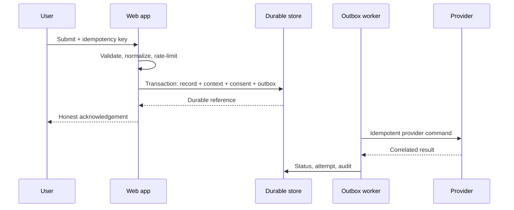

# Conversion, CRM, and Provider Integration Architecture

**Document ID:** `SPM-TECH-INT-001`  
**Status:** `NORMALIZED_CONTRACT_APPROVED_PROVIDER_SELECTION_PENDING`

## 1. Non-negotiable conversion truth

The following outcomes remain separate:

1. action clicked;
2. form started;
3. server validation accepted;
4. canonical submission durably committed;
5. CRM synchronized/assigned;
6. email or resource delivered;
7. scheduler accepted a booking;
8. human commercial qualification or attendance occurred.

Only outcome 4 authorizes the default submission-success acknowledgement. Only outcome 7 authorizes a booked meeting label and verified time.

## 2. Durable form flow



No public request attempts an unsafe database + CRM/email dual write. Provider work starts from the committed outbox.

## 3. Form command envelope

Every conversion command includes:

- purpose and audience;
- form definition/version;
- host, locale, route ID, template ID, source content version;
- event, destination, offer, resource, campaign and placement IDs when present;
- first/latest permitted attribution values;
- consent/legal-notice versions and purpose states;
- form-instance/idempotency key;
- normalized minimum contact and purpose-specific fields;
- server-observed security/risk metadata within approved privacy limits.

The server re-resolves the referenced event/offer/resource/form and availability. Client-submitted labels, recipients, prices, states, or provider IDs are never trusted.

## 4. Purpose contracts

| Purpose | Durable record | Required downstream work | Truthful public outcome |
|---|---|---|---|
| Brochure/resource | Submission + context + consent + resource version | CRM/nurture if allowed; transactional resource delivery | Request recorded; delivery shown separately |
| Exhibitor enquiry | Submission + exhibitor lead + assignment intent | CRM upsert/routing; localized acknowledgement | Qualified request received; no stand reserved |
| Meeting | Submission + appointment request | CRM/lead fallback plus scheduler command | Booked only after provider acceptance; otherwise request/fallback |
| WhatsApp | Contextual click event; optional durable lead if a form precedes it | Approved deep link and fallback | Channel opened, never message delivered/read |
| Visitor registration | Submission + visitor registration + consent/recipient contract | Transactional acknowledgement; CRM/event operations sync if approved | Pre-registration recorded; not a ticket/admission guarantee |
| Contact | Submission + explicit recipient category + assignment | Correct queue/owner and acknowledgement | Enquiry received by stated channel/queue |

## 5. Adapter contracts

| Adapter | Required normalized operations | Required evidence before activation |
|---|---|---|
| CRM | contact/account upsert, lead/activity create, assignment/queue, approved status sync | provider owner, field/stage map, dedupe, SLA, permissions, processor/retention review |
| Email | localized transactional send, delivery/bounce status, suppression check | sender/domain auth, templates, reply/owner, logs without body/PII, retry policy |
| Resource | resolve active version, protected/direct access, delivery expiry/replacement | rights, locale/version, access mode, link lifetime, failure fallback |
| Scheduler | request/slot flow, provider acceptance, cancellation/reference | owner calendars, timezone, allowlisted callbacks, fallback, privacy and expiry |
| WhatsApp | contextual approved deep link, availability/fallback | official number/owner, locale template where applicable, channel consent/response policy |
| Consent/preferences | read/store purpose states, withdraw/object, propagate suppression | actual categories/vendors, policy version, controller and legal review |
| Analytics | versioned non-PII events/properties, consent gating | measurement owner, taxonomy, data destinations, retention and QA |
| Media | responsive asset/poster delivery and status | source/rights/derivatives, failure/withdrawal contract, performance budget |

## 6. CRM normalization

Website operational state remains provider neutral:

```text
received -> queued -> assigned -> synchronized
                         \-> retrying -> failed_terminal -> manual_resolution
```

External CRM opportunity stages may be synchronized only after commercial owners approve their meaning. The website does not redefine or become the default source of truth for proposal, negotiation, won/lost, or onboarding.

Mappings must record:

- normalized field and provider field;
- direction and source of truth;
- type/format/requiredness;
- privacy class and purpose;
- transformation and default rule;
- provider stage/value mapping;
- conflict and deletion/withdrawal behavior;
- test fixture and owner.

## 7. Retry, dead-letter, and manual operations

- retry only errors classified as transient;
- use bounded exponential backoff with jitter and provider-aware rate limits;
- terminal validation/auth/configuration errors enter visible manual resolution immediately;
- every attempt retains sanitized error class, provider correlation, next action, and time;
- permissioned operators can retry, suppress, correct allowed mapping data, or reassign;
- correction never rewrites the original submission/consent audit fact;
- dead-letter age, queue age, failure rate, and zero-submission anomalies alert named owners.

Exact retry intervals and limits are provider/run-time configuration established during activation tests.

## 8. Webhooks and callbacks

- authenticate signatures/credentials and enforce allowlisted origins/hosts;
- verify timestamp/replay window where supported;
- store provider event identity for idempotency;
- acknowledge only after durable receipt or safe rejection;
- separate handler from asynchronous business processing;
- reject tenant/context mismatch;
- never include secrets or personal payloads in logs;
- contract-test version changes and unknown event types.

## 9. Confirmation/status routes

Confirmation routes use an opaque, short-lived or access-controlled reference. They must:

- return only the minimum safe state and public event/resource facts;
- use `noindex` and no shared public cache;
- handle invalid, expired, replayed, or direct access without object enumeration;
- provide route re-entry/contact fallback;
- never expose email, phone, name, consent, provider token, internal ID, or provider error.

## 10. Analytics join

The website analytics identifier and submission correlation reference may be joined to operational outcomes in a controlled data process. Direct personal data never enters the analytics event stream. Funnel reporting distinguishes form interaction, durable submission, provider result, commercial qualification, and attendance.

## 11. Activation blockers

- actual CRM/email/calendar/WhatsApp/consent/analytics/media providers;
- provider accounts, environments, owners, contracts, limits and processors;
- CRM field/stage/owner/SLA mapping;
- sender domains/templates and deliverability monitoring;
- visitor recipients/sharing rule;
- consent/legal basis/retention/privacy rights decisions;
- manual fallback queues and incident contacts.

